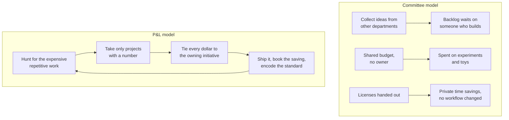
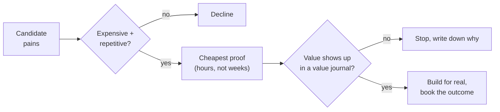
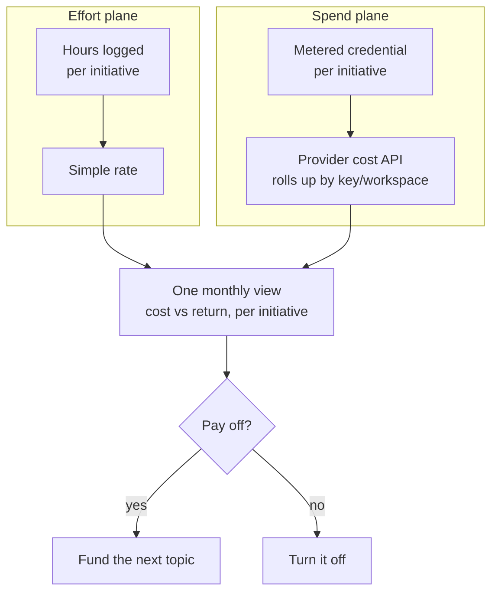

Here is a setup I have watched from close range. A roughly 2,000-person Norwegian company that makes CPR manikins and patient simulators decided, sensibly, that AI mattered and it should do something about it. So it created a dedicated Data and AI team. It put a non-technical VP in charge of that team, and gave the VP a product manager who also has no technical background. Neither has used a coding agent. The team does not build anything. Its stated goal for the year is to let other departments come and brainstorm ideas about how they might use AI.

Meanwhile, access to a capable model is handed out through a shared API key. People use it for whatever they like, a fair amount of it toy apps, and the budget runs out. The engineers, who could actually build with this, have been told to keep using the code assistant that ships with their existing tooling, and many of them have concluded AI is not worth their time because the code it writes is not good enough.

I want to be fair to the people in that story. The intent is right. Someone senior noticed that AI is going to matter and tried to get ahead of it. But the structure they built cannot produce a return, and it is worth being precise about why, because the same structure is being stood up in a lot of companies right now.

## Why the common setup cannot pay off

Reason from what each part is designed to do.

A team whose job is to collect ideas from other departments produces a list of ideas. It does not produce working software, because nobody on it builds software. The list becomes a backlog that waits on someone else to act, and the someone else is busy.

A shared budget that anyone can draw on, with no line tying spend to an outcome, gets spent the way any unowned resource gets spent: on whatever is nearest and easiest, which is experiments and toys. When it runs dry, the lesson the organisation learns is "AI is expensive," when the real lesson is "we spent it on nothing in particular."

A pile of licenses handed to people who were told to use them more produces some private time savings and a lot of tinkering. It does not change how any actual workflow runs, because changing a workflow is a project, and a seat is not a project. Industry benchmarks now put unused enterprise AI licenses at around 21% of the seats bought ([Opsera 2026](https://opsera.ai/knowledge-base/ai-code-assistant-analytics/github-copilot-vs-cursor/)). The seats that do get used mostly speed up individuals at their existing tasks rather than removing the task.

And the engineers waiting for AI to write perfect code are holding it to a standard they do not hold themselves to. No engineer has ever joined a company and found perfect code waiting for them. We all work by writing something imperfect and improving it under review. Expecting a model to skip that and emit finished, correct code on the first try, then rejecting the whole approach when it does not, is a standard we would never survive if it were applied to us. The useful question is not whether the first draft is perfect. It is whether a draft plus review is faster than writing it by hand, and for a large fraction of work it now is.

None of these failures are about the technology. They are about how the work was organised and funded.

## The reframe: give enablement a P&L

The setup that does produce a return looks different in one structural way. The team that puts AI to work is run like a small business unit with its own profit and loss, not like an overhead function.

That single change cascades into everything else. If the team has to show a return against a budget, it stops collecting ideas and starts picking the few that will pay for themselves. It stops treating spend as free and starts attributing it. It stops handing out seats and starts shipping workflows. The accountability does the organising.

To be clear about what I am not saying. This is not an argument against governance, or against training people, or against buying tools. It is an argument about where the accountability sits. A Center of Excellence, as the term is normally used, is a governance and standards body funded as a cost center ([IBM's definition](https://www.ibm.com/think/topics/ai-center-of-excellence) is representative: centralised, cross-functional, governance and standards). Useful work, but it rarely carries a number it has to hit, so it drifts toward policies and slideware. Keep the standards. Add the P&L.

The rest of this piece is the operating model that follows from that one decision. I run it for a regulated online-gaming operator as their Head of AI Automation and Enablement, with a small hands-on team, and the specifics below are drawn from that work.

## Move 1: hunt for the pains worth automating

The first job is not building. It is finding the work worth building for. This is closer to what a founder does in customer discovery than to what a traditional IT function does, except the customers are your own colleagues.

The target is expensive repetitive work: a task that people do by hand, often, that costs real hours or real money or real risk. Two filters help. The first is the one a security company I read about uses well: distinguish "AI that makes you a bit faster at a task" from "AI that takes the task off your plate entirely," and aim for the second ([Built In on Huntress](https://builtin.com/articles/how-huntress-uses-ai-support-employees-and-build-cybersecurity-products)). The second filter is where the money actually is. MIT's 2025 study found more than half of generative-AI budgets going into sales and marketing, while the largest returns were sitting in back-office automation that nobody was funding ([MIT via Fortune](https://fortune.com/2025/08/18/mit-report-95-percent-generative-ai-pilots-at-companies-failing-cfo/)). The unglamorous work is usually the profitable work.

Once you have a candidate, do not green-light a platform. Prove the value with the cheapest possible experiment first. On one internal project we wanted a shared code-knowledge graph to cut how much an agent spends rediscovering the codebase. The production version would cost roughly $63 a month to run. Before building it, we ran a one-day proof for under $5, kept a one-week journal of concrete moments where the graph beat the plain approach and the minutes each saved, and set a rule up front: if the value was not there for this team by the end of the week, we would stop. That is the discipline. The point of the proof is to earn the right to spend more, not to justify a decision already made.

## Move 2: take only projects with a number attached

The measurement side of AI has a hundred frameworks already, and I am not going to add another. The useful discipline is not a new metric. It is a gate applied before the work starts: a project does not begin until someone can name the number it will move. Hours saved per week. Cost removed per month. Pipeline or revenue contributed. Risk reduced in a way you can point at.

The gate does two things. It kills the toy projects early, because a toy cannot name its number. And it tells you when you are done, because you agreed up front what "worked" looks like. A project that cannot name its metric is not an AI project. It is someone's curiosity, which is fine on personal time and expensive on the team's.

This is also what separates the P&L model from the pilot mill that produces the headline everyone now quotes: the MIT figure that around 95% of generative-AI pilots show no measurable profit-and-loss impact ([Fortune](https://fortune.com/2025/08/18/mit-report-95-percent-generative-ai-pilots-at-companies-failing-cfo/)). Worth noting the number is contested on methodology ([Marketing AI Institute](https://www.marketingaiinstitute.com/blog/mit-study-ai-pilots)), so I would not lean my whole argument on it. But the direction is right and it matches what I see: pilots fail to show a return largely because no return was defined before they started.

## Move 3: tie every AI dollar to an initiative, from day one

This is the part most enablement efforts skip, and it is the part that makes the P&L real rather than rhetorical. If you cannot see what a given initiative costs, you cannot say whether it paid off, and the budget conversation collapses back into "AI is expensive."

The mechanism is simpler than it sounds. Give each initiative its own metered credential before the work starts: a separate API workspace, or at least a descriptively named key. The provider's own cost and usage reporting then rolls spend up by that dimension, so every dollar already carries the label of the thing that spent it. You do not reconstruct attribution later. You design it in.

On our side this runs as two planes that meet in one monthly view finance can read. Engineering effort maps to an initiative through a simple rate. AI and cloud spend maps to an initiative through the metered credential. Both land in the same report, so the question "what did this initiative cost, and what did it return" has an answer without anyone reconstructing it after the fact.

One honest wrinkle, because it changes how you set this up. Provider cost reporting often groups spend by workspace or description, not by individual key. So if you want clean per-initiative cost, you decide the workspace-and-key topology up front and give each initiative its own. Try to recover it afterwards from each key's share of total tokens and you get an estimate, not the real number. The FinOps community has been building good tooling around exactly this problem under the banner of "FinOps for AI" ([FinOps Foundation](https://www.finops.org/wg/finops-for-ai-overview/)), and it is worth borrowing from. The difference in the P&L model is only where the accountability sits: FinOps attributes spend so existing owners can see it; here the enablement team carries the number itself and only green-lights initiatives it believes will cover their own spend.

There is a phrase I keep coming back to on the cost side: the spend you cannot see is the spend you cannot cut. Every token routed through a place where it shows up in a stats view is a token you can later decide was wasted. A token spent through an anonymous shared key is gone with no lesson attached, which is exactly what happened in the Norwegian example.

## Move 4: build standards, not one-off scripts, and stop rationing seats

The instinct when AI spend climbs is to control cost by rationing tools: fewer seats, cheaper assistant, tighter approval. It is the wrong lever. It caps the upside (the workflows you never rebuild) to save a fraction of the downside (some unused seats), and it teaches your best builders that the company is not serious.

The lever that actually controls cost while raising output is standardisation. Encode how the team builds so that each new project reuses the last one instead of starting from a blank page, and so the rules that keep AI spend and behaviour in check are applied by default rather than remembered.

Concretely, on our team that means every project is self-describing in a way both people and agents can read, from a single set of templates, with a one-command setup that installs the same tools, the same guardrails, and the same cost controls for everyone. The rule we work to is that a standard only counts if it lives in the tooling, not in a document nobody opens. A guardrail written in a wiki is a suggestion. The same guardrail installed as a default is a standard. That is also how a two-person team can move like a larger one: the standards do the coordinating that meetings would otherwise have to.

Cost control then comes from engineering, not from rationing. Route the bulk, high-volume work to a cheaper model and keep the expensive frontier model plus a human for the part that gates a customer-facing change, and you take out most of the bill without taking out any capability. On coding-agent spend specifically, structural moves like prompt caching and model routing routinely remove a large share of the cost ([one team's real case went from 59% to 70% saved](https://projectdiscovery.io/blog/how-we-cut-llm-cost-with-prompt-caching); I wrote up the levers I use in [cutting a coding agent's token bill](/blog/cut-coding-agent-token-bill/)). That is a real lever. Cancelling seats is not.

## What this looks like on a real problem

Here is the shape of a typical initiative, with the details changed enough to protect the client but true to the pattern.

A marketing team runs campaigns across many brands. The campaign logic and customer journeys live in one platform (in this space that is often something like Optimove), and the email templates live in a separate tool (say Iterable). Over a couple of years, with many people editing and nobody owning a template standard, the second tool has accumulated more than 200 near-duplicate template variations. The team is drowning in it. One CRM manager has quietly built a spreadsheet-and-script contraption to generate templates faster, which is genuinely clever and solves maybe a tenth of the problem. The team is now considering moving to a cleaner tool (Customer.io is a common destination), and dreading it, because a manual migration of that mess is a large, risky project.

This is a good enablement project because it can name its number: hours the CRM team loses to template wrangling every week, plus the cost and risk of a manual migration. And it is highly automatable, because these are modern tools with APIs and webhooks. The realistic split is that AI can drive perhaps 80 to 90% of the cleanup and the migration, with a human checking and moving the last 10 to 20%, which is exactly the ratio you want: the machine does the bulk, a person validates the part that matters. The first win is not even the migration. It is the cleanup, which makes the existing tools work the way they were supposed to and makes the team's daily work lighter, and that first win is what earns the trust to take on the bigger move. I am writing that migration up as its own deep piece, because the how is worth a walkthrough.

Notice the shape. You did not hand the marketing team a license and tell them to use AI more. You found their most expensive repetitive pain, put a number on it, and rebuilt the workflow, booking the saving to the marketing budget that felt it.

## Why this is worth doing now, not later

It is easy to treat all of this as a productivity nicety. I think the ground is shifting further than that, and the enablement function is how a company keeps its footing.

There is an open dataset from the US Department of Labor called [O*NET](https://www.onetonline.org/) that maps every occupation down to its detailed work activities and tasks, paired with [wage and employment data from the BLS](https://www.bls.gov/oes/). Researchers have used it to estimate how exposed each occupation's tasks are to large language models. The headline finding from the "GPTs are GPTs" study is that around 80% of US workers have at least 10% of their tasks exposed to LLMs, and about 19% have at least half their tasks exposed, with higher-income knowledge work among the more exposed rather than less ([paper](https://arxiv.org/abs/2303.10130), published in [Science](https://www.science.org/doi/10.1126/science.adj0998); the [AI Occupational Exposure](https://papers.ssrn.com/sol3/papers.cfm?abstract_id=4414065) work points the same way). Exposure is not the same as replacement, and I want to be careful with the word: "exposed" means a task can be done meaningfully faster or differently with these tools, not that a job disappears. But even on the careful reading, the amount of white-collar work whose shape is about to change is large.

I ran into this concretely a few years ago at Bain, building an analytics product where I mapped job titles to their underlying activities using this same occupational data and scored the exposure. The share of white-collar activity with meaningful exposure came out above 90%. That number stuck with me. It says the change is not confined to a few roles; it runs through most of what knowledge workers actually spend their day doing.

The reasonable response to that is not fear and it is not a committee. It is to get good, as an organisation, at turning the exposed work into rebuilt workflows, and at bringing people along as their day-to-day changes. That capability is exactly what a real enablement function builds. The upskilling is a large part of the work, and it is the part that determines whether the technology helps your people or just unsettles them.

## The market has the pieces; almost nobody assembles them

If you go looking, you will find each piece of this argued well somewhere. The FinOps people have built real depth on attributing AI spend. The CFO and measurement writers have covered ROI frameworks thoroughly. The Center-of-Excellence literature covers standards and governance. The forward-deployed-engineer conversation covers hands-on delivery, though it is aimed at vendors selling to customers rather than at internal teams.

What I have not seen is the assembly: a small internal team that behaves like founders hunting for pain, gates every project on a number, attributes every dollar from day one, and builds standards instead of buying seats, all run as one accountable P&L. The pieces sit in different professional worlds that mostly do not talk to each other. Putting them together, and holding the result to a real number, is the whole idea.

## Key takeaways

- The common internal AI setup, a committee that collects ideas plus a shared budget plus handed-out licenses, cannot pay off, because none of those parts changes how a workflow runs or ties spend to an outcome.
- Run enablement as a small P&L instead. The accountability does the organising: it forces you to pick the few projects that will pay for themselves, attribute spend, and ship workflows rather than seats.
- Hunt for expensive repetitive work, prove value with the cheapest possible experiment before building the platform, and take only projects that can name the number they will move.
- Tie every AI and cloud dollar to the initiative that owns it by giving each initiative its own metered credential up front. You design attribution in; you cannot reconstruct it cleanly later.
- Control cost through engineering (model routing, caching, standards) rather than by rationing seats. Cancelling licenses caps your upside to save a fraction of your downside.
- The shift in white-collar work is broad, on the careful reading of the exposure research, so the ability to rebuild exposed workflows and bring people along is becoming a core capability, not a nicety.

If you are standing up an AI enablement function, or you have one and it feels like a backlog of ideas rather than a set of shipped, measured wins, I am happy to compare notes on where it is stuck. The fastest way is a short call: you can [book one here](/book/). Not a pitch, a working conversation about your specific setup.
