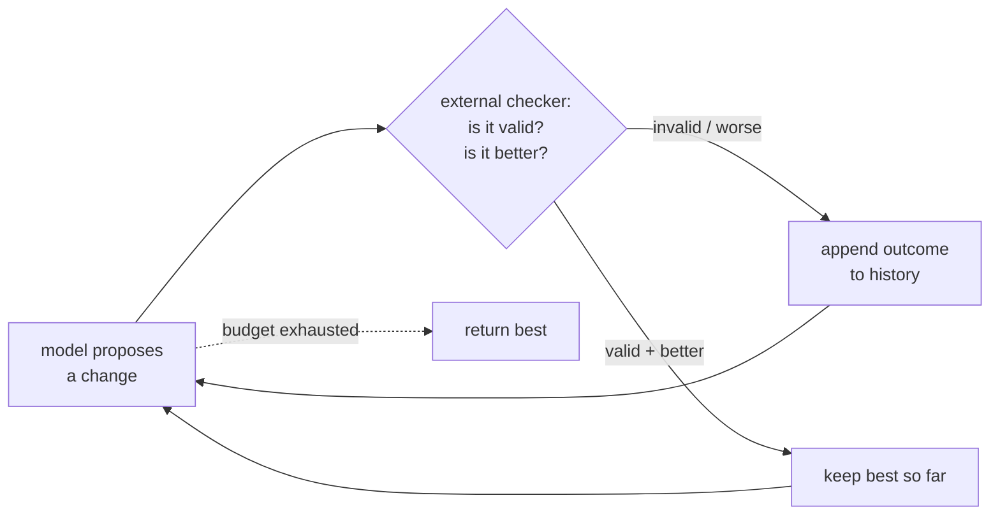
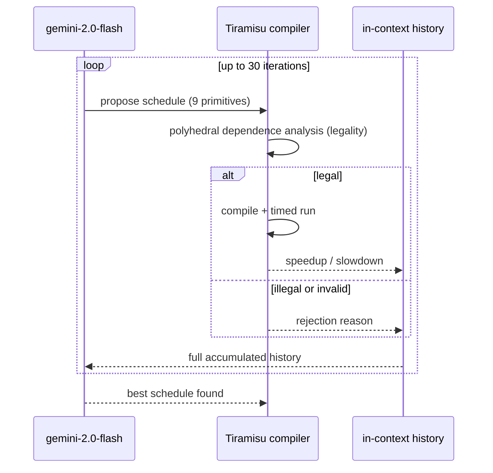
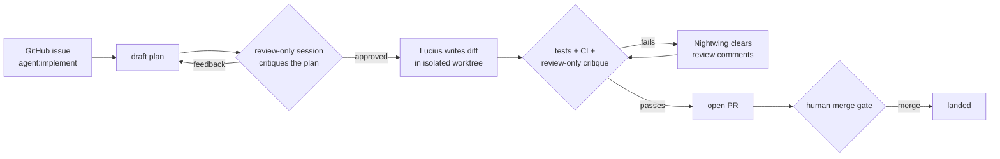

I spend my days building agents that change code. The paper I want to walk through changes loops in C, which sounds unrelated until you notice it is the same machine I build, run in a domain where everything I struggle to measure is measurable for free. So this post does two things: it explains ComPilot from first principles, with its numbers cited and attributed, and it lays Alfred's real implementation next to it to show where they agree, where they differ, and what each does that the other does not.

The paper is Merouani, Kara Bernou, and Baghdadi, "Agentic Auto-Scheduling: An Experimental Study of LLM-Guided Loop Optimization," PACT 2025, [arXiv:2511.00592](https://arxiv.org/abs/2511.00592). Every number below is from that paper. I redrew their figures as my own diagrams and tables rather than copying theirs; follow the link for the originals.

## The one idea both systems are built on

An LLM on its own is a guesser. Ask it to optimize a loop or fix a bug and it produces something plausible. Plausible is not the same as correct, and it is not the same as fast. The model has no way to know whether its guess was any good, because it never ran anything.

The fix is to put the model inside a loop with something that can tell whether the guess was good. The model proposes. An external checker grades. The grade goes back into the model's context. The model proposes again, conditioned on what just happened. You repeat until the grade is good enough or you run out of budget.

I have written about this before as [loops, harnesses, and memory](https://prasad.tech/blog/loops-harnesses-memory); ComPilot is a clean instance of it in a domain where the checker is unusually good. The shape, drawn generically:

The reason this works is the checker. A model with no checker is a brainstorm. A model with a cheap, trustworthy checker is a search procedure. The quality of the search is capped by the quality of the checker, not by the cleverness of the model. That is the thread through the whole comparison.

## ComPilot from first principles

### What problem it solves

Modern CPUs are fast only if your loops are written to suit them: data laid out so the cache is busy, iterations split across cores, inner loops shaped so the vector units fire. Rewriting a naive loop nest into that form is `loop optimization`, and doing it automatically is decades-old hard. The classical answer is the `polyhedral model`: represent the loop nest as a geometric object and search for a legal reordering of its iterations that runs faster. `Pluto` is the well-known polyhedral optimizer and the paper's main baseline.

The catch with the classical approach is that the search is driven by hand-built cost models and heuristics. ComPilot asks a different question: can a general-purpose LLM drive that search instead, with no training, if you ground it in real compiler feedback?

### The loop

ComPilot wires an off-the-shelf model to the `Tiramisu` polyhedral compiler. Per the paper, the model used is `gemini-2.0-flash`, chosen for its balance of quality and inference cost, with no task-specific fine-tuning. One iteration looks like this:

1. The LLM proposes a sequence of loop transformations, a `schedule`, emitted inside `<schedule>` tags.
2. Tiramisu parses it, runs a polyhedral dependence analysis to decide if it is legal, and if so compiles and runs the transformed program.
3. The compiler reports back one of a few outcomes: the schedule was syntactically invalid, legal-but-rejected by dependence analysis, a solver failure, a compiler crash, or a successful run with a measured speedup or slowdown.
4. That outcome is appended to the running history in the prompt. The model reads the whole accumulated history and proposes the next schedule.

The transformation vocabulary is nine primitives: loop fusion, shifting, interchange, parallelization, 2D tiling, 3D tiling, unrolling, skewing, and reversal. The model composes these into a schedule; the compiler is the judge of whether the composition is legal and whether it helped.

Two design choices matter for the comparison.

First, **the only learning is in-context.** There is no gradient step, no replay buffer, no reward model. The model gets better within a run because the prompt carries every prior attempt and its outcome. This is the same reason a person gets better at a puzzle they are allowed to keep trying with feedback, not because their brain rewired but because they remember what they already ruled out.

Second, **illegality is free to detect.** A transformation that violates a data dependency is caught by the compiler's analysis before anything runs. The model never ships a wrong answer, because the verifier refuses to let it. The paper reports that across attempts, 36.1% of proposed schedules compiled and ran, 31.4% were invalid, and 32.5% were illegal. Roughly two of three proposals are rejected, and that is fine, because rejection costs almost nothing and teaches the model something for the next attempt.

### The numbers

The evaluation is the PolyBench/C suite: 30 kernels across linear algebra, stencils, and similar domains, run at five dataset sizes for 150 instances. The headline results, from the paper:

| Setting | Geomean speedup | Over what | Source |
|---|---|---|---|
| Single run, 30 iterations | 2.66x | original code | [arXiv:2511.00592](https://arxiv.org/abs/2511.00592) |
| Best-of-5, 30 iterations | 3.54x | original code | same |
| Best-of-5 | 2.94x | Pluto optimizer | same |
| Best-of-5 | 3.23x | Tiramisu DL autoscheduler (8 kernels it supports) | same |

The `best-of-5` setting means running the whole 30-iteration loop five independent times and keeping the best schedule found. It buys most of the gap between 2.66x and 3.54x, which tells you the single-run loop has real variance: a second roll of the dice often finds a better path. The paper also notes diminishing returns past 30 iterations and that the wall-clock cost is dominated by the compiler, not the model, with roughly 77.8% of time in the backend and a run averaging about 8.9 minutes per instance.

The honest summary of the paper: an untrained, general-purpose model, grounded by a compiler that can prove legality and measure speed, beats a mature hand-built optimizer on a standard benchmark. The grounding is doing the heavy lifting.

## Alfred, in the same terms

[Alfred](https://github.com/luminik-io/alfred-os) is my open-source fleet of coding agents. It runs locally, shells out to the `claude` or `codex` CLI you already pay for, and ends every run in a real pull request rather than a chat transcript. Different domain, same loop in the paper's vocabulary.

### The loop

A host scheduler fires an agent on a timer. The agent picks up a labeled GitHub issue, proposes a code change in an isolated git worktree, and the change is checked before it can land. Mapped onto the propose-verify-iterate frame:

- **Propose:** an agent such as `Lucius` (feature development) writes a diff against the issue.
- **Verify:** a separate review-only model session critiques the work, the test suite and CI run, and a human holds the merge gate.
- **Iterate:** failures feed back. A run that hits its turn cap returns `[PARTIAL]` and resumes next firing; review comments are cleared by a dedicated agent, `Nightwing`; an optional reject-and-retry wrapper re-prompts on invalid output.

### The verifier

This is where Alfred spends its design effort, and where it differs most from the paper. ComPilot has one verifier that is both exact and cheap: a dependence proof plus a timed run. Alfred has no single equivalent, because there is no polynomial-time proof that a code change is correct. So it stacks weaker checks:

- **A plan-review gate before any code is written.** The agent drafts a short plan, then dispatches it to a separate Claude session in review-only mode with a critique prompt: find missing cases, type issues, architectural smells, simpler alternatives. The executor only ever sees the post-review plan. Alfred's docs call this the single biggest quality lever in the system, on the principle that the quality ceiling is set by the plan, not the executor.
- **Tests and CI after.** The real ground-truth signal, the closest thing Alfred has to ComPilot's timed run.
- **A second review-only critique of the implemented diff**, same uncorrelated-reviewer idea applied to code instead of plan.
- **A human merge gate.** Alfred never auto-merges by default.

The catch, which Alfred's own architecture notes call out, is that the review gate only works if the reviewer is uncorrelated with the executor. Same model, same prompt template would defeat it; a different mode, read-only and critique-focused, is enough in practice. The LLM-as-judge literature has measured the failure mode: judges show position bias, verbosity bias, and self-preference, and a NeurIPS 2024 result found a model's self-recognition correlates linearly with how much it favors its own generations (survey: [arXiv:2411.15594](https://arxiv.org/html/2411.15594v6); position bias: [arXiv:2406.07791](https://arxiv.org/abs/2406.07791)). A reviewer that is the same model grading its own work is exactly the case those biases describe. That worry has no analog in the paper, because a compiler's dependence analysis is not a second opinion that might agree with the first by accident. It is a proof.

The benchmark community treats verifier quality as a first-class problem, which backs the whole argument. SWE-bench Verified ([swebench.com/verified](https://www.swebench.com/verified.html)) is a 500-problem subset that OpenAI and the SWE-bench team built by paying humans to confirm each issue is solvable and each test is correct, precisely because the original 2,294-instance benchmark ([arXiv:2310.06770](https://arxiv.org/abs/2310.06770)) contained under-specified issues and over-specific tests that mis-graded correct solutions. The field spent human effort fixing the *grader*, not the models. That is Alfred's thesis restated as a benchmark-design decision: when the checker is wrong, nothing downstream can be trusted.

### The memory

ComPilot's memory is the in-context history within a single run. Alfred has that implicitly through the agent's turn-by-turn context, but it adds a layer the paper does not have: an optional `fleet brain` that carries lessons *across* runs. In `lib/agent_runner/orchestrator.py`, `recall_for(intent)` pulls relevant past lessons into a new prompt and `reflect(...)` writes an episodic entry after a meaningful action. The brain is deliberately optional and degrades silently if absent, so a stock install stays simple. The distinction is worth naming:

| Memory | ComPilot | Alfred |
|---|---|---|
| Within a run | in-context history of every attempt + outcome | agent's turn context; reject-and-retry via `call_with_guardrail` |
| Across runs | none (each kernel starts fresh) | optional `fleet brain`: `recall_for` / `reflect` |
| Substrate | prompt tokens | prompt tokens + local SQLite |

ComPilot does not need cross-run memory because each kernel is an independent optimization problem with a clean reward. Alfred adds it because software tasks recur and the same failure mode shows up across issues; a lesson learned fixing one repo's flaky test is worth recalling in the next.

### Best-of-N

Both systems reach for the same trick when one pass is not reliable. ComPilot's best-of-5 turns a 2.66x single-run geomean into 3.54x by running the loop five times and keeping the best. Alfred exposes the same idea through `best_of_n(agent, n)` in the orchestrator, which fans a task out into N independent attempts. The logic is identical: when a single run has variance and you have a checker that can rank outcomes, paying for more attempts and keeping the best is a straight trade of cost for quality. The difference is that ComPilot can rank its five runs by an exact measured speedup, while Alfred has to rank by a noisier signal, tests passing plus a review verdict.

This is not a niche compiler observation. The same effect shows up directly in coding agents. "Large Language Monkeys" ([arXiv:2407.21787](https://arxiv.org/abs/2407.21787)) takes `DeepSeek-Coder-V2-Instruct` on SWE-bench Lite from 15.9% of issues solved at one sample to 56% at 250 samples, past the 43% single-sample state of the art at the time. The paper is explicit that this only converts to real performance in domains like coding "where answers can be automatically verified," because you need a checker to pick the winning sample out of the pile. That is the same dependency as ComPilot's measured speedup and Alfred's tests: best-of-N is a verifier-dependent lever, not a free one. There is also a ceiling to how naively you should buy attempts. Compute-optimal test-time strategies can be roughly 4x more efficient than plain best-of-N ([arXiv:2408.03314](https://arxiv.org/abs/2408.03314)), which is part of why Alfred spends some of its budget on a plan-review gate up front rather than only on blind retries at the end.

## Where they agree, differ, and diverge

The agreements first, because they are the reusable lesson:

- **Off-the-shelf model, no training.** ComPilot uses stock `gemini-2.0-flash`; Alfred uses whatever Claude or Codex subscription you have. Neither fine-tunes. The capability comes from the loop, not the weights. The agent-benchmarking literature now measures this directly: harness effects are large enough that the same model in different scaffolding produces double-digit swings on SWE-bench-style tasks, so agent performance is best read as a property of a model embedded in an execution system, not of the base weights alone ([Harness-Bench, arXiv:2605.27922](https://arxiv.org/html/2605.27922v1)).
- **Grounded feedback is the point.** Both replace "trust the model" with "let an external checker grade every attempt."
- **In-context iteration.** Both improve within a task by feeding outcomes back into the prompt rather than updating parameters.
- **Best-of-N for variance.** Both cash out extra attempts for quality when a single pass is unreliable.

Now the differences, which all trace back to one fact: ComPilot's verifier is exact and cheap, Alfred's is approximate and expensive.

| Dimension | ComPilot | Alfred |
|---|---|---|
| Domain | loop nests in C | general code changes in real repos |
| Verifier | compiler: legality proof + timed run | tests, CI, review-only critique, human gate |
| Reward signal | exact measured speedup | tests pass + review verdict (noisy) |
| Cost of a wrong proposal | ~free, caught before it runs | real; a bad merge ships a bug |
| Iteration budget | 30 per kernel, blind retries fine | hard turn + spend caps, retries are expensive |
| Cross-run memory | none | optional fleet brain |
| Safety machinery | none needed | worktree isolation, IAM-per-agent, never auto-merge |

What Alfred does that the paper does not: everything in that last row. Because a wrong code change is not caught for free, Alfred carries machinery the paper has no reason to: each firing runs in a throwaway git worktree so concurrent runs cannot clobber each other, every AWS-touching agent has its own least-privilege IAM user so a prompt injection has a small blast radius, each agent has a hard turn cap and the fleet shares a global block when the provider rate-limits, and nothing merges without a human. ComPilot needs none of this. An illegal schedule is rejected by a proof, so there is no blast radius to contain and no budget to blow on a dangerous action.

What the paper does that Alfred cannot: trust its verifier completely. ComPilot can afford 30 blind iterations per kernel precisely because every proposal is graded exactly and cheaply, and a bad one is free. Alfred would love that. It cannot have it, because correctness for a general code change is not decidable by a fast analysis, and a timed run is not a proof of correctness. So Alfred substitutes a portfolio of weaker checks and a human at the end, and spends real effort making sure those checks are uncorrelated enough to catch each other's misses.

The propose-verify-iterate loop is the same machine in both systems. How well it works is set by how good and how cheap your verifier is. ComPilot is what this loop looks like when the verifier is perfect. Alfred is what it has to become when the verifier is not.

## Key takeaways

- **The loop is portable; the verifier is the whole game.** ComPilot and Alfred run the same propose-verify-iterate loop. ComPilot wins because a compiler grades every attempt exactly and for free. Alfred has to work harder because no such grader exists for general code.
- **Off-the-shelf models, grounded, beat trained baselines.** ComPilot's untrained `gemini-2.0-flash`, grounded in Tiramisu, beat the Pluto optimizer by 2.94x geomean best-of-5 on PolyBench ([arXiv:2511.00592](https://arxiv.org/abs/2511.00592)). The grounding did the work, not fine-tuning.
- **Best-of-N is a verifier-dependent lever.** ComPilot's best-of-5 lifted its geomean from 2.66x to 3.54x. Alfred exposes the same `best_of_n` trick, but can only rank attempts as well as its noisier checker allows.
- **A weak verifier forces extra machinery.** Because a wrong code change is not caught for free, Alfred adds a plan-review gate, isolated worktrees, IAM-per-agent, spend caps, and a never-auto-merge rule. ComPilot needs none of it.
- **Memory differs by problem shape.** ComPilot keeps only in-run history because each kernel is independent. Alfred adds an optional cross-run fleet brain because software failure modes recur.
- **Read the paper even if you never touch a compiler.** It is the clearest worked example I know of why an agentic loop lives or dies on the quality of its checker.
