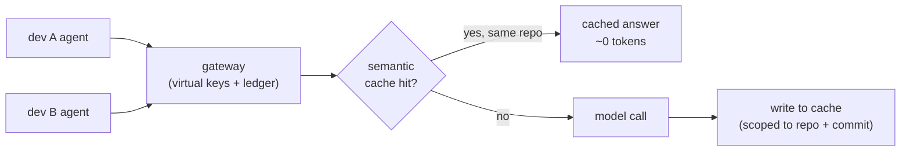

**TL;DR.** Coding agents burn tokens on naive grep-and-read loops and on dumping raw tool output back into context. Three independent levers cut the bill: a code graph for structural retrieval, compression at the tool-output boundary, and a gateway with a shared semantic cache. Only one, tool-output compression, was a reliable broad win in my runs. The lesson that outlasts the tactics: measure each lever alone behind a quality gate, or you cannot tell which one paid for itself.

If you are new to how LLMs are billed, two minutes of fundamentals make the rest of this post obvious. A token is a chunk of text, roughly three-quarters of a word, and it is the unit you pay for. Every model call has two sides. **Input tokens** are everything you send: the system prompt, the conversation so far, and every tool result you paste back in. **Output tokens** are everything the model generates: its reasoning, its tool calls, and the code it writes. You pay for both, usually at different rates, and crucially you pay for the input on every single call. An agent that takes twenty steps re-sends a growing pile of history twenty times. Think of it like a taxi meter that charges for the passengers already in the car, not only the new one you pick up: the longer the ride and the more you carry, the more each additional block costs. That is why a loop with no expensive prompt anywhere in it can still run up a bill nobody can explain.

I noticed the problem on an invoice. A small fleet of coding agents, pointed at a normal-sized repo, was spending more per resolved task than I had any model for. Nobody had written an expensive prompt. The cost was coming from the loop itself.

So I sat with a week of traces and read what the agents were doing token by token. Two patterns explained most of the bill. The first was a grep-and-read reflex: the agent would search for a symbol, get a wall of matches, then read four or five whole files to find the one function it needed. The second was that every tool result went into context raw. A 600-line `grep -rn` dump, a pretty-printed JSON response, a stack trace with forty frames of framework noise, all of it landing verbatim in the next prompt.

Neither of those is a model problem. They are plumbing problems, and plumbing is fixable.

This post is about three levers I pulled to cut that bill, what each one was worth, and the part that took me longest to accept: they are independent, they do not pay off equally, and the only way to know which one is working is to measure each one on its own. The numbers here are illustrative. I am not going to give you a vendor "10x" tagline, because when I measured honestly, nothing was 10x, and the lever I expected to win did not.

## The toy repo I will use

To keep this concrete and generic, picture a small open-source service: an HTTP API, a handful of route handlers, a service layer, a data-access layer, and tests. Call it `widget-store`. A few thousand lines, the kind of repo where an agent task is something like "add a discount field to orders and thread it through to the invoice."

That task is a good stress test because it spans layers. The agent has to find where orders are defined, where invoices are built, and what touches both. That is exactly the cross-file discovery that grep-and-read handles badly.

## Where the tokens go

Before pulling any lever, split the bill into two buckets:

- **Input you fed the model**: the system prompt, the running history, and every tool result you pasted back in.
- **Output the model generated**: its reasoning, its tool calls, and the code it wrote.

This split decides everything downstream. If a task's cost is dominated by input you control, retrieval and compression have room to work. If it is dominated by the model's own output, no amount of smarter reading will help much, because you cannot compress tokens the model has not produced yet.

I underestimated how often output dominates. On a tight task with a clear target file, the agent reads a little and writes a lot, and the input levers barely move the needle. That single fact is why the first lever is not the clean win I assumed it would be.

```
per-task token bill
├── input (you control this)
│   ├── system + instructions
│   ├── conversation history
│   └── tool results  ← grep dumps, JSON, logs live here
└── output (model controls this)
    ├── reasoning
    ├── tool calls
    └── generated code
```

## Lever 1: structural retrieval with a code graph

The idea is to stop making the model read files to discover structure. You precompute a graph of the codebase once, where nodes are files, classes, and functions, and edges are calls, imports, and definitions. Then the agent asks the graph a question and gets back the three functions that matter instead of the five files that contain them.

Off-the-shelf, you can build this with something like [code-graph-rag](https://github.com/vitali87/code-graph-rag), which parses a repo into a graph you can query, backed by a graph store such as [Memgraph](https://memgraph.com/). The agent's "find where orders connect to invoices" becomes a traversal instead of a grep plus four reads.

```mermaid
flowchart LR
    Q["agent question:<br/>what connects orders to invoices?"]
    subgraph graph["precomputed code graph"]
        O["Order"] -->|used by| S["InvoiceService.build()"]
        S -->|calls| L["lineItemsFor(order)"]
    end
    Q --> graph
    graph --> A["3 functions, ~40 lines<br/>instead of 4 files, ~600 lines"]
```

On the `widget-store` discount task, this is where the graph shines. Brute-force, the agent pulled four files into context to trace the path from order to invoice. With the graph, it pulled the three relevant functions. Illustratively, that took the discovery phase from roughly 9,000 input tokens to roughly 2,500. A real cut, and the kind of thing a vendor screenshot would stop at.

Here is the part the screenshot leaves out. I ran the graph against a set of tasks, not one, and the result was lumpy:

- On **deep cross-file discovery**, the graph won clearly. Fewer files read, less context, lower input cost.
- On **shallow tasks** with an obvious target file, the graph was **break-even**. The traversal overhead roughly cancelled the reading it saved.
- On **write-heavy tasks**, where the model's own output dominated the bill, the graph was **slightly worse**, because I was paying to build and query a graph whose savings landed on the small part of the bill.

So the honest finding is that a code graph is question-dependent. It is a sharp tool for discovery and a dull one everywhere else. If your workload is mostly small, targeted edits, the graph can cost you money. I went in expecting a flat discount and came out with a conditional one.

## Lever 2: compress at the tool-output boundary

This is the lever I almost skipped, and it turned out to be the reliable large win.

The insight is narrow on purpose. Tool output is machine-shaped and repetitive: grep results repeat paths and line numbers, JSON repeats keys, logs repeat timestamps and framework frames. A prompt compressor like [LLMLingua-2](https://github.com/microsoft/LLMLingua) is built for exactly this. It drops tokens that carry little information for the model while keeping the ones that do. On that kind of input it is lossless enough that the agent's behavior does not change.

The rule I settled on, and the one I would lead with:

> Compress tool output. Never compress source code.

Source code is the opposite of a log. Every token can be load-bearing, and the failure mode of dropping the wrong one is silent: the model gets a subtly wrong picture and writes subtly wrong code. So the compressor sits on one boundary only, the place where tool results re-enter context, and source files pass through untouched.

```python
# illustrative: compress only at the tool-output boundary
def feed_to_context(payload, kind):
    if kind in ("grep", "json", "logs", "shell_output"):
        return compress(payload, target_ratio=0.45)  # LLMLingua-2
    if kind == "source":
        return payload  # never touch source code
    return payload
```

Across the task set, this was the steadiest saver. On tool-heavy tasks it cut total input tokens by roughly 30 to 40 percent in my runs, illustratively, and the quality gate did not flinch. It does not depend on the shape of the question the way the graph does, because almost every agent task generates verbose tool output at some point.

The catch is that you have to be disciplined about the boundary. The first time I let a compressor see a file because the wiring was sloppy, the agent confidently edited a function that no longer matched what was on disk. One mislabeled payload is all it takes. Tag your payloads by kind and route on the tag, not on a guess.

## Lever 3: a gateway with virtual keys, a ledger, and a shared cache

The first two levers make each call cheaper. The third makes calls disappear.

Right now, if you have more than one engineer running agents, you probably have provider keys scattered across machines, no shared view of spend, and the same questions being answered from scratch by every person on the team. Centralize the keys behind a gateway like [LiteLLM](https://github.com/BerriAI/litellm) and three things become possible at once:

- **Per-developer virtual keys.** Everyone calls the gateway, not the provider. You can rotate, scope, and rate-limit a person without touching a provider dashboard.
- **A spend ledger.** Every call is attributed, so cost stops being a monthly surprise and becomes a number you can watch by repo and by task type. This is also how you keep the benchmarking honest later.
- **A shared semantic cache.** This is the real prize. When one engineer's agent asks "how does invoice rounding work," the answer gets cached by meaning, and the next engineer who asks a semantically similar question gets a cheap hit instead of a fresh model call. A tool like [GPTCache](https://github.com/zilliztech/GPTCache) does the embedding-and-lookup part.



A shared cache sounds like free money, and that is exactly why it is dangerous. Two governance gotchas bit me, and both are the kind you only see in production.

The first is **invalidation on code change.** A cached answer about how invoice rounding works is correct until someone changes the rounding. If the cache outlives the code it described, it starts handing out confident, stale answers. I key cache entries to the repo state, so a relevant commit invalidates the entries that depended on it. A stale cache hit is worse than a miss, because it costs nothing and lies.

The second is **per-repo scoping.** Without it, an answer derived from one project can surface as a hit in another, and the two repos do not share invariants. I scope every cache entry to its repo so answers cannot leak across projects. The savings from cross-project sharing are not worth one wrong answer in the wrong codebase.

With those two rules in place, the cache was the lever with the best ceiling, because a hit is close to free. But its value depends entirely on repetition. On a team asking overlapping questions about a shared codebase, the hit rate climbed and the savings compounded. A solo developer on a fast-changing repo would see most entries invalidated before anyone reused them.

<div class="demo-card demo-levers" data-demo-levers>
  <span class="demo-kicker">Interactive: stack the levers</span>
  <div class="lv-readout">
    <span class="lv-number" data-lv-number aria-live="polite">2,400,000</span>
    <span class="lv-unit">tokens / month (illustrative)</span>
    <span class="lv-saved" data-lv-saved>baseline</span>
  </div>
  <div class="lv-bar" role="img" aria-label="Token bill relative to baseline">
    <div class="lv-fill" data-lv-fill></div>
  </div>
  <div class="lv-levers">
    <div class="lv-row" data-lv-row="graph">
      <button type="button" class="lv-switch" data-lv-switch aria-pressed="false" aria-label="Toggle code-graph retrieval"></button>
      <span class="lv-info">
        <span class="lv-title">Code-graph retrieval</span>
        <span class="lv-desc">Pull the call graph, not whole files. Question-dependent, so the saving is smaller and variable.</span>
      </span>
      <span class="lv-delta">~ -18%</span>
    </div>
    <div class="lv-row" data-lv-row="compress">
      <button type="button" class="lv-switch" data-lv-switch aria-pressed="false" aria-label="Toggle tool-output compression"></button>
      <span class="lv-info">
        <span class="lv-title">Tool-output compression</span>
        <span class="lv-desc">Summarize logs, diffs, and command output at the boundary. The reliably-large lever.</span>
      </span>
      <span class="lv-delta">~ -45%</span>
    </div>
    <div class="lv-row" data-lv-row="cache">
      <button type="button" class="lv-switch" data-lv-switch aria-pressed="false" aria-label="Toggle semantic cache"></button>
      <span class="lv-info">
        <span class="lv-title">Semantic cache</span>
        <span class="lv-desc">A hit is close to free. A step-change, but only on repeated, overlapping questions.</span>
      </span>
      <span class="lv-delta">~ -30%</span>
    </div>
  </div>
  <p class="lv-foot">Numbers are illustrative, applied to a representative baseline for the toy repo. Real savings depend on your codebase, your questions, and your hit rate.</p>
</div>

## Attribution: the step that is easy to skip

The trap is stacking levers and measuring once. You implement all three in a weekend, you look at next month's invoice, and it is lower. You congratulate yourself and move on.

You have no idea which lever did the work.

Maybe the compressor is carrying the whole thing and the code graph is quietly costing you money on every small edit. Maybe the cache hit rate is near zero and you built infrastructure for nothing. Stacked together and measured once, the levers are indistinguishable, and you will keep paying for the ones that do not pay you back.

So I benchmarked each lever the boring way:

1. **Fix a task set.** A frozen list of representative tasks against the `widget-store` repo, run identically every time.
2. **Fix a quality gate.** Each run has to pass the same bar: tests green, the diff does what the task asked. A lever that saves tokens by producing worse code has saved nothing. This gate is non-negotiable, because every one of these levers can cut cost by quietly cutting quality.
3. **Change one thing at a time.** Baseline, then baseline plus graph, then baseline plus compression, then baseline plus cache. Never two at once.
4. **Attribute the delta.** Whatever the bill moved when you added one lever, and only that lever, is what the lever is worth. The spend ledger from lever three is what makes this measurable per run.

```
run             input Δ      output Δ    quality gate   verdict
baseline        --           --          pass           reference
+ graph         -28% disc.   ~0          pass           wins on deep discovery only
+ compression   -34% total   ~0          pass           reliable, broad
+ cache         varies       n/a         pass           best ceiling, repetition-bound
(all numbers illustrative)
```

What fell out of doing it this way is the whole point of this post. The lever I expected to be the star, the code graph, was conditional. The lever I almost skipped, tool-output compression, was the dependable win. And the lever that looked like free money, the shared cache, was only free after I paid the governance tax of invalidation and scoping.

None of that is visible if you measure the stack as a whole. It only shows up when each lever has to earn its savings alone, against a quality gate, on the same tasks every time.

## What I would do on a fresh setup

If I were starting over on a new team and a new repo, in order:

1. **Compression first.** It is the highest floor, it does not depend on the question, and the only discipline it asks is keeping source code away from the compressor. Start here.
2. **Gateway, keys, and ledger next.** Even before the cache pays off, you want attribution. You cannot run the rest of this honestly without a per-call spend number.
3. **Cache once there is repetition.** Turn it on when more than one person is asking overlapping questions about the same codebase, and turn on invalidation and per-repo scoping the same day, not later.
4. **Graph last, and only if your workload is discovery-heavy.** If your agents mostly do large cross-file investigations, build it. If they mostly do small targeted edits, skip it and save yourself the infrastructure.

The meta-lesson is the one I keep relearning in this kind of work. Independent levers have to be measured independently, behind a quality gate, or you cannot tell help from theater. The originality is never in any single trick. It is in wiring them together and being honest about what each one was worth.

## Key takeaways

- You pay for input on every call, and input grows as history grows, so a loop with no expensive prompt can still run up a large bill.
- Split every task's cost into input you control and output the model generates. The levers only work on the input side, so a write-heavy task limits how much they can help.
- A code graph wins on deep cross-file discovery and is break-even or worse on shallow or write-heavy tasks. It is question-dependent, not a flat discount.
- Compress tool output, never source code. Tool output is repetitive and machine-shaped; source code is load-bearing token by token, and dropping the wrong one fails silently.
- A shared semantic cache has the best ceiling but only after you pay the governance tax: invalidate on code change and scope per repo. A stale hit costs nothing and lies.
- Benchmark each lever alone, against the same task set, behind a fixed quality gate, changing one thing at a time. Stack-and-measure-once tells you nothing about which lever earned its keep.
- On a fresh setup: compression first, gateway and ledger next, cache once there is repetition, graph last and only if your workload is discovery-heavy.
