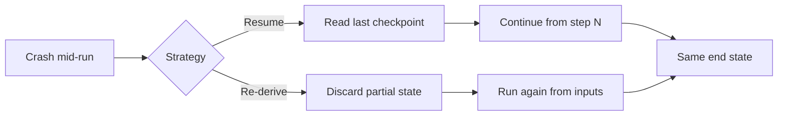
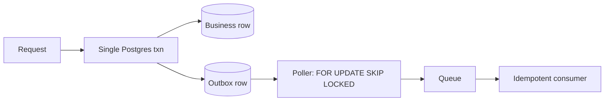
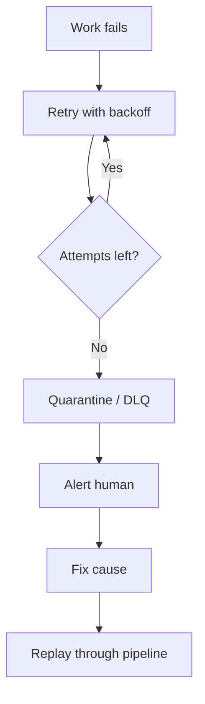

## The failure you cannot avoid

A sync pulled records from a customer's CRM, enriched each one through a provider, and ran an agent pass over the result. It worked in the demo and for two weeks. Then on a Tuesday the enrichment provider returned a 503 halfway through a batch of 4,000 records, the process retried the whole batch, and the customer woke up to duplicate work and a sync that reported "complete" after finishing a third of the job.

That is the code meeting its real environment for the first time.

The moment a workflow has more than one step, calls an external API, and runs long enough to be interrupted, it is a distributed system. The model call times out. The provider rate-limits you. The CRM returns a page and fails on the next. A deploy kills your process in the middle of step four of seven. At real volume these happen every day. **The job of a durable workflow is to make "something failed partway through" produce the same end state as "nothing failed at all."** There are two coherent ways to get there. I have built both, running side by side, and the choice between them comes down to constraints.

## Two philosophies: resume vs. re-derive

- **Resume.** Record progress as you go, and on a crash, pick up where you left off. This is what a durable-execution engine gives you. Temporal is the well-known example. The engine checkpoints each step, persists workflow state, and replays from the last durable point. You write linear code and the engine makes the linearity survive crashes. The cost: you now operate a stateful orchestration system, and your logic is shaped by its execution model.
- **Re-derive.** Make every unit of work idempotent and re-runnable from its inputs, so a crash means you run it again and get the same result. There is no saved position to resume from, because position does not matter. The work is a pure function of its inputs plus what is already in your database. The cost: you have to make that property true for every step, including the ones that touch the outside world.



Resume optimizes for not repeating work. Re-derive optimizes for not needing to remember. We run our high-volume data pipelines on re-derive, on plain Postgres and a queue, with no durable-execution engine. Parts of our agent fleet run on the same idea. The pieces below make re-derivation safe, and they are also what you need to reason about whether resume earns its weight.

## Idempotency is the load-bearing wall

Everything in the re-derive model rests on one property: running a unit of work twice has the same effect as running it once. Get this wrong and every retry becomes a source of corruption.

- **Deterministic key.** Every piece of work gets an identity computed from its inputs, not from when it ran or which worker picked it up. For a record-enrichment job, a pair like `(jobId, recordId)`. The same record in the same job always produces the same key.
- **Upsert on the key.** A second attempt overwrites the first attempt's row instead of inserting a duplicate. In Postgres, `INSERT ... ON CONFLICT (key) DO UPDATE`. The database enforces that the work lands once.
- **Guard external side effects.** A step that calls a paid provider must not pay twice on retry. Record an idempotency key for the outbound call and check for a completed result before re-issuing. Many APIs accept an idempotency key directly. Where they do not, record "about to call for key X" before and "result for key X is Y" after, so a retry sees the marker and does not fire again.

The thing I underestimated: idempotency is not a property you add to a function. It is a property of the whole path from "work selected" to "result committed," including the network call in the middle and the commit at the end. We had a step that was idempotent in its database write but issued its external call before the write committed. A crash in that gap meant the call happened and the record never showed it. We had to make the side effect re-derivable from a committed marker. Idempotency lives at the boundaries, and the boundaries are where it is easiest to forget.

## The transactional outbox

Here is a failure that looks impossible until it bites you. A request comes in, you write a row to Postgres saying "work accepted," then you publish a message to your queue. Two writes, two systems:

- Process dies between them: you have accepted work no one will do.
- Publish first and the DB write fails: you have a queued task with no backing record.

There is no safe ordering of two writes to two systems, because the crash can land in the gap.

The transactional outbox makes both writes one write. You write the business row and an outbox row in the same database transaction. Either both commit or neither does. A separate poller reads unprocessed outbox rows, publishes them, and marks them done. If it crashes after publishing but before marking, the row publishes again, which is fine because the consumer is idempotent. The only atomic operation the system depends on is a single-transaction commit, which Postgres already guarantees.



The poller has its own concurrency problem: if three workers poll at once, they must not grab the same rows. Lease-based polling with `SELECT ... FOR UPDATE SKIP LOCKED` solves it.

```sql
SELECT * FROM outbox
WHERE status = 'pending' AND available_at <= now()
ORDER BY available_at
LIMIT 100
FOR UPDATE SKIP LOCKED;
```

`FOR UPDATE` locks the selected rows. `SKIP LOCKED` tells every other poller to step over locked rows instead of blocking. Each worker gets a disjoint batch, and you have a work queue inside Postgres without a separate broker. Add a lease, an expiry, and a visibility timeout, and the same table recovers from a worker dying mid-task: the lease expires, the row becomes visible, another worker picks it up. Because the work is idempotent, the re-pickup is safe.

## Checkpoints and watermarks

Pulling from a CRM is rarely one-shot. You sync incrementally: ask for everything changed since last time, process it, and remember where you stopped. That memory is a watermark, usually a timestamp or a monotonic cursor. This is how you avoid re-pulling a million records every hour.

The watermark is where partial failure does its quietest damage. Pull a page of records modified after `T`, process some, then die. If you advance the watermark to the newest timestamp you saw before confirming every record committed, the unprocessed records fall into a gap no future run will ask for. They are silently lost. The data looks consistent. It is wrong.

- **Advance only after commit.** The watermark advances only after every record up to it is durably committed. On partial failure it stays put, and the next run re-pulls the window. Idempotent upserts make re-pulling the committed records harmless. Only the missing ones change.
- **Break timestamp ties.** Many records can share a modified-at value. A naive "greater than the watermark" query skips boundary records or reprocesses them forever. Use a `(timestamp, id)` cursor so resumption is exact even when a hundred records share a second.

A watermark is not a progress bar. It is a promise that everything before it is done.

## When work dies: dead-letter queues, quarantine, and salvage

Some work cannot be retried into success: a malformed field that crashes the parser, model output that fails validation every time, an API rejecting one specific id with a permanent error. If your retry logic treats these like transient failures, you get a poison message that fails, retries, and either spins forever or blocks the workers behind it.



- **Bound the retries.** Stop after a fixed number of attempts and move the work somewhere safe.
- **Quarantine, do not drop.** Park poison rows in a dead-letter table holding the original work, the error, the attempt count, and a timestamp. The pipeline moves on. The work is set aside with enough context to understand and replay it.
- **Alert on depth.** A quarantine table no one looks at is where work disappears quietly. Every row increments a metric that feeds an alert. When depth crosses a threshold, a human finds out.
- **Replay after the fix.** Most of what lands there is fixable: a parser handling a new shape, an input that needs sanitizing. Replay the rows back through the pipeline. Because it is idempotent, replaying the ones that would have succeeded anyway costs nothing.

Quarantine plus salvage turns "we lost a batch" into "we delayed a batch and learned something."

## Backoff, rate limits, and a fleet-wide stop

External APIs push back. The polite version is a 429 with a retry-after header.

- **Per-request: back off with jitter.** Wait a bit, then twice as long, then four times, with randomness so a thousand retrying workers do not synchronize into a thundering herd. Most HTTP clients do this for you.
- **Per-account: stop the fleet.** Most rate limits are per-account, not per-request. One API key, one quota, shared across every worker. When you hit that ceiling, individual backoff is the wrong instinct: a hundred workers each backing off is still a hundred workers slamming the same wall, burning quota on rejected calls and pushing recovery further out.

So when a shared limit is hit, we stop the whole system, not the one worker that noticed. The worker that gets the hard signal trips a fleet-wide circuit: a flag in Postgres or the cache that every worker checks before an outbound call to that provider. Until it clears, no one calls. We back off once, globally, then resume. The unintuitive part is that the cheapest way to recover faster is to do less, together, on purpose.

## Durable multi-agent orchestration

The same survival problem shows up in agent work, sharper. A multi-step agent task is a long-running workflow where the steps are non-deterministic and the failures include the model doing the wrong thing confidently. Durability here means a failed or wrong run does not corrupt anything, so re-running is always safe.

- **Wire roles at deploy time.** The set of agents, what each can touch, and how they hand off is fixed configuration, not improvised at runtime. The same task with the same inputs runs through the same wiring every time.
- **Isolate each task.** For agents that modify code, a throwaway git worktree per task: a clean checkout that lives for the run and is discarded after. One agent's work cannot stomp another's, and a failed run leaves nothing to clean up. A crashed run is a discarded worktree, and you start over from the input.
- **Gate with plan, review, execute.** The agent that proposes a change is not the agent that approves it. A separate read-only pass reviews the plan before any write. This catches the confident-but-wrong failure that retries cannot, because retrying a bad plan gives you the bad plan again, faster.

Separating the proposer from the reviewer is the agent-world version of not letting the same process both decide the work and commit it.

## Humans as a durable step

Some steps are a person deciding something. A sync wants to delete records that no longer match and a human approves. An agent drafts an outbound action and someone signs off. The naive build blocks: the workflow waits for the human. That turns a lunch break into a hung process and a transport hiccup into a lost decision.

We model human approval as a first-class workflow state, with the same durability rules as any other step.

- **Park durably.** The work sits in a pending-approval state, and the workflow is free to do other things.
- **Time out to a safe default.** If no decision arrives within the window, the step resolves to a defined outcome, usually "do not proceed," rather than waiting forever.
- **Define transport failure.** When the notification never reaches the human or their response never gets back, that resolves to an explicit verdict too, recorded durably.

A person is the flakiest external dependency you have. They deserve the most careful timeout logic, not the least.

## Choosing your strategy

Both philosophies work. I run both. The choice comes down to a handful of constraints.

Reach for a **durable-execution engine** when:

- A single logical workflow spans hours or days and fans out into many dependent steps.
- Each step accumulates state that is expensive or impossible to recompute.
- The process is approval-heavy with long waits and complex branching.
- Re-running a step has a cost you cannot make idempotent, like sending money, where you need to resume past the step rather than redo it.

Reach for **stateless re-derivation** when:

- The unit of work is small and its inputs are cheap to fetch.
- You can make each step idempotent, so it is safe to run again.
- You operate with one or two people and a ceiling on infrastructure you run yourself. The durability lives in Postgres, which you already operate, with no orchestration engine to upgrade and reason about.
- You need to scale a path horizontally, where a stateless idempotent worker is the cheapest thing to add.

The questions that decide it: how long one workflow lives and how much irrecoverable state it carries, how expensive it is to recompute a step versus resume past it, how many people operate this at three in the morning, and what your ceiling is on self-run infrastructure. Scale pushes the high-volume paths toward re-derivation. Statefulness and irreversibility push toward resume.

What does not decide it is fashion. A durable-execution engine is a second distributed system you now own. Idempotent re-derivation is a discipline you hold at every boundary, forever. We chose re-derivation for the small, re-runnable paths, and we would choose an engine the day a workflow becomes long-lived, branchy, and full of state we cannot afford to recompute. Durability is not a library you install. It is a property you decide to guarantee, and then pay for in the currency the workflow charges.
