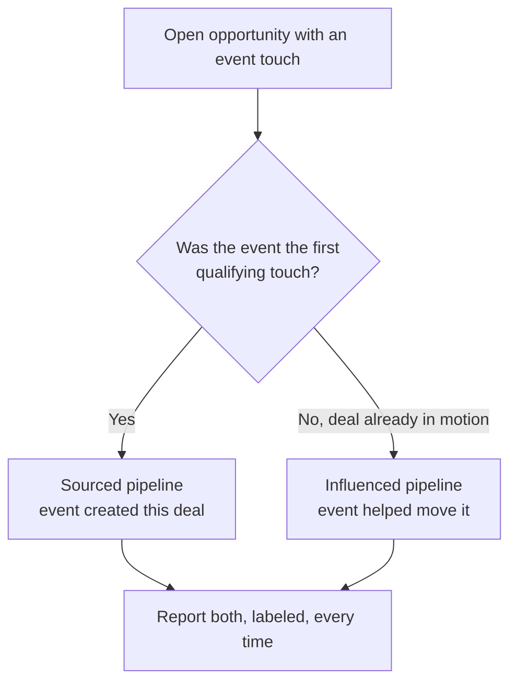
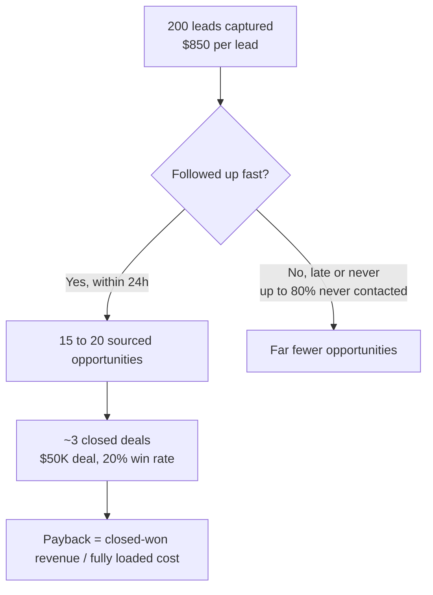

Two numbers. How much did your company spend on events last year, and how much pipeline can you attribute to that spend? Most B2B teams know the first to the dollar and can only wave at the second. That gap is expensive, because events run 10 to 20% of a B2B marketing budget, and [70% of B2B marketers report pressure to prove ROI](https://www.emarketer.com/content/b2b-marketers-under-pressure-prove-roi) they cannot currently measure.

The problem is not that events do not work. It is that most teams measure them with anecdotes, a good conversation at the booth, a logo that showed up later, a feeling that the show "went well." Anecdotes cannot be compared, budgeted against, or defended when finance asks. Here is the framework I use instead, built from first principles, with representative numbers you can swap for your own.

The core idea is that event ROI is not one number, it is four decisions made honestly: what you count as cost, what you count as pipeline, what clock you judge it on, and what unit you optimize. Get any one of them wrong and the answer is garbage, usually in the direction that makes events look worse than they are.

## Decision 1: start with fully loaded cost

You cannot compute a return without an honest denominator, and most event cost accounting is dishonest by omission. A booth at a major conference is not the booth fee. A representative breakdown looks like this.

- Booth space: \$50,000
- Booth design and build: \$30,000
- Sponsorship package: \$40,000
- Travel and accommodation, team of 8: \$25,000
- Materials and giveaways: \$10,000
- Dinners and entertainment: \$15,000
- **Total: \$170,000**

Two costs people leave out and should not. First, the team's time: eight people for a week is real salary, and if you are comparing channels it belongs in the number, because the alternative use of that time is not free. Second, the pre-event and post-event labor, the meeting-booking beforehand and the follow-up afterward, which is where most of the hidden cost hides and, as it turns out, most of the return. Use fully loaded cost as the denominator for everything that follows.

## Decision 2: report sourced and influenced pipeline separately

This is the distinction that decides whether your measurement is honest, because these two numbers answer different questions and teams constantly conflate them.

**Sourced pipeline** is opportunities whose first qualifying touch was the event. These are deals the event created that would not otherwise exist. It is the strict, conservative number, and the one to lead with because it is the hardest to argue with.

**Influenced pipeline** is any open opportunity that had at least one event touch anywhere in its history, including deals already in motion before the event. It is a larger, softer number. It is legitimate, since a booth conversation can revive a stalled deal, but it is also where teams overclaim, because a single badge scan should not get full credit for a deal that was already closing.

Report both, labeled, every time. Sourced answers "did this event create new pipeline." Influenced answers "did it help move what we already had." A team that only reports influenced is flattering itself. A team that only reports sourced is underselling events that mostly accelerate existing deals, which many enterprise events do.

## Decision 3: pick an attribution window that matches your sales cycle

The most common way teams accidentally prove events do not work is measuring on the wrong clock. If your median lead-to-close is nine months and you judge an event at quarter-end, you are counting the deals that have not had time to close yet as zeros. The event did not fail. The measurement did.

Set the attribution window to roughly your median sales cycle and report sourced pipeline at that horizon, not at the calendar boundary that happens to come next. A 90-day snapshot of a 9-month-cycle business systematically makes every event look like a failure, which then gets used to cut the events that were working. Decide the window before the event, write it down, and judge every event on the same clock so you are comparing like with like.

[Last-touch attribution](https://en.wikipedia.org/wiki/Attribution_(marketing)) makes this worse. [67% of B2B teams still credit only the final interaction](https://improvado.io/blog/b2b-marketing-attribution) before conversion, which erases the event entirely from any deal that had a later touch. If you can run multi-touch, do. Even a simple even-weighted model across touches beats last-touch for crediting events fairly.

## The funnel, with realistic numbers

Take the \$170K conference. Say you capture 200 leads, which is \$850 per lead, fine for enterprise B2B where deals are large. Then the funnel does its damage, and the damage is mostly self-inflicted.

Industry data is blunt here. [Up to 80% of trade show leads never receive any follow-up at all](https://www.integrate.com/blog/event-statistics-for-exhibitors). Of the leads that do get worked, a large share are contacted late: [roughly 38% of exhibitors take longer than six days](https://www.integrate.com/blog/event-statistics-for-exhibitors). Trade-show lead-to-opportunity conversion ranges from about 1% to 10%, and where you land in that range is decided almost entirely by follow-up execution, not by the event.

So 200 leads, worked well, become maybe 15 to 20 opportunities. Worked the industry-average way, far fewer.

At 15 sourced opportunities, \$170,000 of fully loaded cost is about **\$11,000 per opportunity**. Whether that is good depends on the deal math: at a \$50,000 average deal and a 20% win rate, those 15 opportunities yield 3 closed deals worth \$150,000, which barely covers the event before you count influenced pipeline and renewals. Move the win rate to 30% or the deal size to \$75,000 and the same event is clearly profitable. The specific numbers are representative and yours will differ. The point that does not change: the funnel, not the event, is where the return is won or lost.

## Decision 4: measure cost per opportunity, and pull the levers that move payback

Roll it into one number per event: payback. Closed-won revenue attributable to the event, sourced first and influenced as a labeled second line, divided by fully loaded cost. Track it per event so you can compare a \$170K flagship conference against a \$20K regional show on the same basis, because the small show often wins on cost per opportunity and never gets credit for it under cost-per-lead accounting.

Three levers move payback more than anything else, and the cheapest one is the one teams lose.

**Follow-up speed** is the cheapest and most effective lever in the entire funnel. Most leads are never contacted and most of the rest are contacted late, and leads contacted within 24 hours convert several times better than those contacted a week later. Draft the follow-up before the event and send it within hours. The mechanism is that intent decays fast: a badge scan is worth the most on the day it happens, when the conversation is fresh in both memories, and a follow-up six days later is competing against six days of the prospect's other priorities.

I have watched this lever move a real number. Working on the attribution side of a large security conference, a client's funnel went from tens of thousands of registered attendees to a filtered set of ICP-matched accounts, and its lead-to-opportunity rate moved from around 1.3% to about 8%, roughly a 6x, on effectively the same event spend. The event did not change. The speed and precision of what happened after the badge scan did.

**Pre-booked meetings** are the second lever. The teams with the best event ROI book a large share of their meetings before the event starts rather than hoping for booth traffic. That requires identifying which target accounts are attending and reaching out 4 to 6 weeks ahead, not 4 to 6 days. A booked calendar turns a trade show from a lottery into a scheduled set of conversations with the accounts you already wanted.

**Lead quality over lead count** is the third. Cost per lead flatters volume, and cost per opportunity rewards fit. A booth that captures 80 well-qualified leads beats one that scans 300 badges, and only the per-opportunity number shows it. Optimizing for badge count actively works against you, because it fills the follow-up queue with people who were never going to buy and buries the ones who might.

## What to instrument before the event

To run this framework you need three things wired up before the event, not improvised after.

1. A consistent way to tag every event lead at capture, so sourced and influenced are queryable later instead of reconstructed from memory.
2. An attribution window and model decided in advance and applied uniformly, so events are compared on the same clock and the same credit rules.
3. A follow-up process that starts within hours, because the measurement is only as good as the funnel it measures, and a fast funnel is the single change that most improves the number you are trying to prove.

Events deserve the same rigor as the other 80% of the budget. Most teams apply none of it, which is exactly why the ROI looks unprovable. It is not unprovable. It is unmeasured.

## Key takeaways

- Use fully loaded cost as the denominator. Booth fee plus build, sponsorship, travel, team time, and pre- and post-event labor, not just the line item on the invoice.
- Report sourced and influenced pipeline separately, labeled. Sourced answers "did the event create new pipeline," influenced answers "did it move existing deals," and conflating them either overclaims or undersells.
- Match the attribution window to your sales cycle. Judging a 9-month-cycle business at quarter-end counts deals that have not had time to close as zeros.
- Measure cost per opportunity, not cost per lead. Lead count flatters volume; per-opportunity cost rewards fit and ties directly to the deal math.
- Follow-up speed is the cheapest and most effective lever. Most leads are never contacted and many are contacted late, while leads worked within 24 hours convert several times better. Draft the follow-up before the event.
- Instrument before the event, not after: consistent lead tagging at capture, a window and model decided in advance, and a follow-up process that starts within hours.
