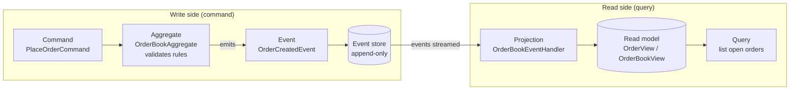
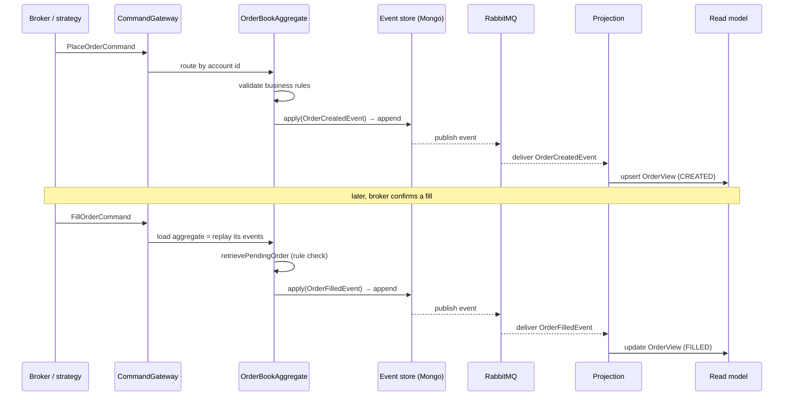
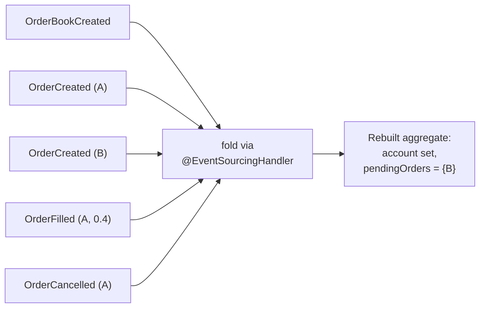

A trading engine has one question it must always be able to answer: how did this position come to be. You need every order, fill, cancel, and failure that produced it, in order, with timestamps, and not only what the position holds right now. If your database stores only the current state and overwrites it on each change, you have thrown that answer away. The row says you hold 1.5 of something; it cannot tell you it was three fills and a partial cancel, or in what order they arrived, or which strategy asked for them.

That single requirement is why I built the order book with [event sourcing](https://martinfowler.com/eaaDev/EventSourcing.html), and why the read and write paths are split with [CQRS](https://martinfowler.com/bliki/CQRS.html). This post builds both ideas up from scratch, explains why they fit trading in particular, and shows the actual aggregate, events, and projection from the engine, sanitized. The stack is the [Axon Framework](https://www.axoniq.io/) on Java and Spring, a MongoDB event store, and RabbitMQ carrying events between services.

If those terms are new, that is fine. By the end they will not be.

## The thing most systems get wrong: they store state, not facts

Start with how a normal application stores data. You have an orders table. An order comes in, you `INSERT` a row. It gets partially filled, you `UPDATE` the filled quantity. It gets cancelled, you `UPDATE` the status to `CANCELLED`. At every step the row holds the current truth, and each change overwrites the last.

This is efficient and it is what almost everything does. It also quietly destroys information. After the cancel, the row cannot tell you the order was 40% filled first. The history existed for a moment and then an `UPDATE` wrote over it. If you want the history back you bolt on an audit table, and now you have two sources of truth that can disagree.

Event sourcing inverts this. You do not store the current state and mutate it. You store the sequence of things that happened, as an append-only log, and you never overwrite anything.

```
OrderCreated   { orderId: A, side: BUY, qty: 1.0, ... }
OrderFilled    { orderId: A, filled: 0.4, remaining: 0.6, ... }
OrderCancelled { orderId: A, ... }
```

The current state, "order A is cancelled after a 0.4 fill," is not stored anywhere. It is *derived* by replaying the events from the start and folding them together. The log is the source of truth. State is a projection of the log.

This is not an exotic idea. It is how the physical world already works. Your bank account balance is not a fact that exists on its own; it is the sum of every credit and debit ever posted, and the statement is the log. Double-entry bookkeeping, which has run commerce for 500 years, is event sourcing done on paper: you never erase a transaction, you post a new one that corrects it, and the ledger is append-only on purpose. A chess game is stored as its move list, not a photo of the board, because the move list can reproduce every board that ever existed in the game and the photo cannot. Event sourcing is the move list for your domain.

The universe runs the same way. The state of a system at any moment is the accumulation of every event that led to it. You cannot read the present and recover the past, which is roughly what entropy is about. Event sourcing is choosing, in software, to keep the events so that you never lose the past.

## Why trading needs this and a CRUD table will hurt you

Event sourcing costs more than a plain table. You would not reach for it on a settings page. Trading is where it pays for itself, for three concrete reasons.

**Auditability is not optional.** A trading system has to be able to reconstruct, for any position, exactly what happened and when. Compliance asks for it. A bad day asks for it louder. With a mutable orders table you are reconstructing history from logs and hoping they agree with the database. With an event store, the complete, ordered, timestamped history *is* the database. There is no separate audit trail to keep in sync, because the events are the audit trail.

**Determinism makes bugs reproducible.** Because state is a pure function of the event sequence, replaying the same events always produces the same state. If a position looks wrong, you replay its events and watch exactly where it went wrong. Contrast a mutable table, where the bad `UPDATE` that corrupted the row is gone and you are left guessing. Determinism is also what makes backtests trustworthy, which is a whole article of its own.

**Recovery is replay, not restore.** When a read model gets corrupted or you need to change its shape, you do not have a data-loss incident. The events are intact. You clear the read model and rebuild it by streaming the history back through. The write-side state after a crash is rebuilt the same way: load the event stream, fold it, and you are exactly where you were. Losing the derived state is not losing data when the data is the log.

The tradeoff is real and worth stating plainly. You give up the simplicity of a single mutable row. You take on eventual consistency between the write side and the read side. You have to think about event schema evolution. For a trading engine those costs buy auditability, determinism, and rebuildability, which are exactly the properties the domain demands. For a CRUD form they buy nothing.

## CQRS: split the side that changes things from the side that answers questions

Event sourcing gives you a write-side log. CQRS is what makes it usable to query.

CQRS stands for Command Query Responsibility Segregation, which is a long name for a plain idea: the model you use to *change* state should be separate from the model you use to *read* state. A command ("place this order") and a query ("show me the open orders") have almost nothing in common. One has to enforce every business rule and can reject the request. The other just has to be fast and shaped for the screen or the caller. Forcing both through one model makes each worse.

So you split them.

- The **write side** takes commands, runs them through an aggregate that enforces the rules, and emits events. It optimizes for correctness and consistency. It never has to be fast to query, because you do not query it.
- The **read side** listens to those events and builds **read models**, also called projections: query-shaped tables tuned for exactly the questions callers ask. It optimizes for read performance and can hold as many differently-shaped views as you need.



The two sides are coupled only by the event stream. The write side does not know or care how many read models exist. You can add a new read model for a new dashboard a year later and rebuild it from history without touching the write path. The event store in the middle is the seam.

One consequence you have to design for: the read side is **eventually consistent**. When a command succeeds, the event is stored, but the projection that updates the read model runs a moment later. For a fraction of a second, "place order" has happened on the write side and the read model has not caught up. In a trading engine that is fine, because the write side is the authority on truth and the read model is for querying, not for deciding. You never make a trading decision by reading a possibly-stale projection; you make it by sending a command that the aggregate validates against real state.

## The write side, concretely: commands, an aggregate, events

The write side of the order book is one aggregate.

An **aggregate** is the consistency boundary for the write model. It is a single object that owns a slice of state, receives commands, checks whether they are allowed, and decides which events happen. It is the *only* thing permitted to change that state, which means every invariant for that slice lives in one place. In this engine the aggregate is the order book for a single account, and its identity is the account itself.

A **command** is a request to change state. It is imperative and it can be rejected. `PlaceOrderCommand`, `FillOrderCommand`, `CancelOrderCommand`. A command carries the intent and the data; it is not yet a fact.

An **event** is a fact that already happened. It is past tense and it cannot be rejected, because it is a record of something that occurred. `OrderCreatedEvent`, `OrderFilledEvent`, `OrderCancelledEvent`. The aggregate turns commands into events: it takes a request, validates it, and if the rules pass, it emits the corresponding fact.

In Axon this is expressed with two kinds of methods. A `@CommandHandler` receives a command, validates it, and calls `apply(...)` to emit an event. An `@EventSourcingHandler` receives an event and mutates the aggregate's in-memory state. The split matters: command handlers *decide*, event handlers *apply*. When the aggregate is loaded from the store, Axon replays its past events through the `@EventSourcingHandler` methods to rebuild its state before any new command is handled.

Here is the aggregate, sanitized down to the shape that teaches the pattern:

```java
@Aggregate
public class OrderBookAggregate {

    @AggregateIdentifier
    private Account account;
    private Map<OrderId, Order> pendingOrders;

    // Command handler that creates the aggregate itself.
    @CommandHandler
    public OrderBookAggregate(CreateOrderBookCommand command) {
        Assert.notNull(command.getAccount(), "Account cannot be null");
        apply(OrderBookCreatedEvent.builder()
                .account(command.getAccount())
                .build());
    }

    // Validate the request, then emit the fact.
    @CommandHandler
    public void handle(CreateOrderCommand command) {
        Assert.notNull(command.getOrderId(), "Order ID cannot be null");
        apply(OrderCreatedEvent.builder()
                .orderId(command.getOrderId())
                .strategyId(command.getStrategyId())
                .symbol(command.getSymbol())
                .side(command.getSide())
                .quantity(command.getQuantity())
                .build());
    }

    @CommandHandler
    public void handle(FillOrderCommand command) {
        Order pending = retrievePendingOrder(command.getOrderId()); // rule: order must exist
        apply(OrderFilledEvent.builder()
                .orderId(command.getOrderId())
                .symbol(pending.getSymbol())
                .filled(command.getFilled())
                .remaining(command.getRemaining())
                .orderStatus(command.getOrderStatus())
                .build());
    }

    // Event sourcing handlers rebuild in-memory state. No business logic here.
    @EventSourcingHandler
    public void on(OrderBookCreatedEvent event) {
        this.account = event.getAccount();
        this.pendingOrders = new HashMap<>();
    }

    @EventSourcingHandler
    public void on(OrderCreatedEvent event) {
        pendingOrders.put(event.getOrderId(),
                Order.builder()
                        .orderId(event.getOrderId())
                        .symbol(event.getSymbol())
                        .build());
    }

    @EventSourcingHandler
    public void on(OrderFilledEvent event) {
        if (event.getOrderStatus() == OrderStatus.FILLED) {
            pendingOrders.remove(event.getOrderId());
        }
    }

    private Order retrievePendingOrder(OrderId orderId) {
        Order pending = pendingOrders.get(orderId);
        if (pending == null) {
            throw new IllegalArgumentException("Order does not exist in pending orders");
        }
        return pending;
    }
}
```

Look at `handle(FillOrderCommand)`. It does not blindly emit a fill. It first calls `retrievePendingOrder`, which throws if the order is not in the aggregate's pending set. That is a business rule enforced at the one place that owns the state. You cannot fill an order the book does not know about. The `pendingOrders` map that the check reads was itself rebuilt by replaying `OrderCreatedEvent` and `OrderFilledEvent` through the `@EventSourcingHandler` methods when the aggregate loaded. Validation reads replayed state; the decision produces a new event.

The `@AggregateIdentifier` is `Account`, and `Account` is itself a small composite: a user, an exchange, and which broker the orders go to. That makes the account the consistency boundary: all commands for one account's order book route to one aggregate instance, are handled one at a time, and see a consistent view. Two accounts are independent and scale independently.

The broker part of that identity matters, because it is the seam that lets the same engine run against a live exchange, a simulator, and a backtest. The aggregate and the events do not care which broker an account uses. A separate adapter, chosen by the broker type, is what actually talks to the outside world: a real exchange in production, a simulated fill engine in a backtest. The write model is identical across all three. That single abstraction is what makes a backtest run the exact same code as live trading, which is the load-bearing property behind any trustworthy backtest.

The event itself is a plain, immutable-in-spirit data carrier. Past tense, all the fields needed to reconstruct what happened, nothing behavioral:

```java
public class OrderCreatedEvent extends OrderEvent {
    private BigDecimal quantity;
    private Side side;
    private BigDecimal limit;
    private OrderType orderType;
    private BigDecimal filled;
    private BigDecimal remaining;
    // ... plus orderId, strategyId, symbol, timestamp from OrderEvent
}
```

Prices and quantities are `BigDecimal`, never `double`. In a system that moves money, binary floating point is a bug waiting for a rounding error. That is not an event-sourcing rule, it is a money rule, but the events are where the money lives so it shows up here.

## The event store

Where do the events go. In this engine, MongoDB, wired through Axon's storage engine:

```java
@Bean
public EventStorageEngine eventStore() {
    return new MongoEventStorageEngine(
            serializer(),               // Jackson JSON
            NoOpEventUpcaster.INSTANCE,  // schema-evolution hook, no-op for now
            axonMongoTemplate(),
            new DocumentPerEventStorageStrategy());
}
```

Three things worth pulling out.

The **storage strategy** is document-per-event: each event is one document, appended, never updated. That is the append-only log made concrete. The events for one aggregate share its identifier and a monotonically increasing sequence number, so loading an aggregate is "fetch all events for this id, in sequence order, and fold them."

The **serializer** is Jackson JSON. Events are stored as JSON, which keeps them human-readable in the store, which matters the day you are staring at production trying to understand a position.

The **upcaster** is the schema-evolution hook. Events are permanent, so the day you add a field or rename one, old events in the store still have the old shape. An upcaster transforms an old event's serialized form into the new shape as it is read, so new code can replay old history. It is `NoOpEventUpcaster` here because the schema has not needed it yet, but the seam is in place. This is the one piece of event sourcing you have to plan for from day one: your events are a persistent contract, and you evolve them forward-compatibly, never by rewriting the past.

## The read side, concretely: projections and read models

The aggregate's job ends at "emit event." It never builds a queryable view. That is the read side's job, and it is a separate class listening to the same events.

A **projection** is an event handler that folds events into a read model. In Axon it is a `@Component` with `@EventHandler` methods, grouped into a named processing group. Here is the projection that maintains the order views:

```java
@Component
@ProcessingGroup("orderBookView")
public class OrderBookEventHandler {

    private final OrderRepository orderRepository;          // read-model store
    private final OrderBookRepository orderBookRepository;

    @EventHandler
    public void on(OrderCreatedEvent event) {
        OrderView view = OrderView.builder()
                .orderId(event.getOrderId())
                .symbol(event.getSymbol())
                .side(event.getSide())
                .quantity(event.getQuantity())
                .orderStatus(OrderStatus.CREATED)
                .build();
        orderRepository.save(view);

        orderBookRepository.findById(event.getAccount())
                .ifPresent(book -> {
                    book.addPendingOrder(view);
                    orderBookRepository.save(book);
                });
    }

    @EventHandler
    public void on(OrderFilledEvent event) {
        orderRepository.findById(event.getOrderId()).ifPresent(view -> {
            view.setFilled(event.getFilled());
            view.setRemaining(event.getRemaining());
            view.setOrderStatus(event.getOrderStatus());
            orderRepository.save(view);
        });
        if (event.getOrderStatus() == OrderStatus.FILLED) {
            removeFromPendingOrders(event.getAccount(), event.getOrderId());
        }
    }
}
```

`OrderView` is a flat, query-friendly record with exactly the fields a caller wants to read. It is deliberately denormalized. The read model is allowed to duplicate data and shape itself for reads, because it is disposable, it is rebuilt from events, and its only job is to answer questions fast. If tomorrow you need a different view, "all fills for a strategy grouped by symbol," you write a second projection that folds the same events into a second table. The write side does not change at all.

That is what the split buys you. One event stream, any number of read models, each optimized for its own queries, all rebuildable from the log.

## Putting the pieces in motion

Trace one order all the way through, so the flow is concrete.



A command enters through Axon's `CommandGateway`, which routes it to the right aggregate instance by the aggregate identifier, the account. The aggregate is loaded by replaying its stored events, so it sees consistent state. It validates, and on success appends a new event to the Mongo event store. That event is published, and because this is a multi-service system, RabbitMQ carries it. The projection, subscribed to the event, updates the read model. When the broker later confirms a fill, a `FillOrderCommand` comes in, the aggregate is reloaded by replay, the rule check runs against the rebuilt `pendingOrders`, and an `OrderFilledEvent` is appended and projected.

RabbitMQ is worth one sentence of context. Because market data ingestion, the strategies, and the trading engine are separate services, events have to cross process boundaries. AMQP is the transport that carries them, so a projection in one service can consume events produced by an aggregate in another. Within a single service Axon can dispatch events in-process; across services the message bus is the wire.

## Replay: rebuilding state from the log

Everything above converges on one capability: replay. Because the events are the source of truth and state is derived, you can always rebuild state by folding the events again.

This shows up in two places.

**Rebuilding an aggregate.** Every time a command arrives, Axon loads the aggregate by reading its event stream and running it through the `@EventSourcingHandler` methods. The aggregate's in-memory state after a crash is not restored from a snapshot of state; it is *recomputed* from facts. That is why a process can die mid-flight and come back correct: it does not remember state, it re-derives it.



**Rebuilding a read model.** When a projection's shape changes, or a read model gets corrupted, you reset it: clear its tables, reset its tracking token to zero, and let the event processor stream the entire history back through the projection. The read model is disposable precisely because it can always be regenerated from the log. A corrupted read model is an inconvenience, not an incident, because no truth lived there. The truth is in the event store, and the read model is just the latest fold of it.

Snapshotting is the one optimization this design invites. Replaying thousands of events to load a hot aggregate gets slow, so Axon can periodically store a snapshot of aggregate state and replay only the events after it. The snapshot is a cache of a fold, never the source of truth. You can delete every snapshot and lose nothing but time.

This is the same idea as [durable-by-design](/blog/durable-by-design): a system survives failure either by resuming from a checkpoint or by re-deriving state from durable inputs. Event sourcing is re-derivation taken to its logical end. The durable input is the full event log, and the state is always a pure function of it. A crash means you fold the log again and land exactly where you were.

## Key takeaways

- Storing current state and overwriting it on each change destroys history. Event sourcing stores the ordered facts as an append-only log and derives state by replaying them, so the history is never lost. It is the move list, not the photo of the board.
- Trading needs this for three concrete reasons: auditability (the event log *is* the audit trail), determinism (state is a pure function of events, so bugs and backtests are reproducible), and recovery (a lost read model is a replay, not a data-loss incident).
- CQRS splits the write model from the read model. The write side is an aggregate that validates commands and emits events; the read side projects those events into query-shaped read models. They are coupled only through the event stream, so you can add read models without touching the write path.
- The aggregate is the consistency boundary. `@CommandHandler` methods decide and validate; `@EventSourcingHandler` methods apply events to rebuild in-memory state. Business rules live in one place, and the account as `@AggregateIdentifier` makes each account's order book independent.
- The event store is append-only, document-per-event, JSON-serialized, with an upcaster seam for schema evolution because events are a permanent contract. Use `BigDecimal`, never `double`, wherever money lives.
- The read side is eventually consistent, and that is acceptable because the write side, not the projection, is the authority on truth. You decide with commands the aggregate validates, and query with read models.
- Replay is why the extra cost pays off. Aggregates rebuild from their event stream after a crash, and read models rebuild from the whole log after a schema change. The events are the source of truth; everything else is a fold you can always recompute.
