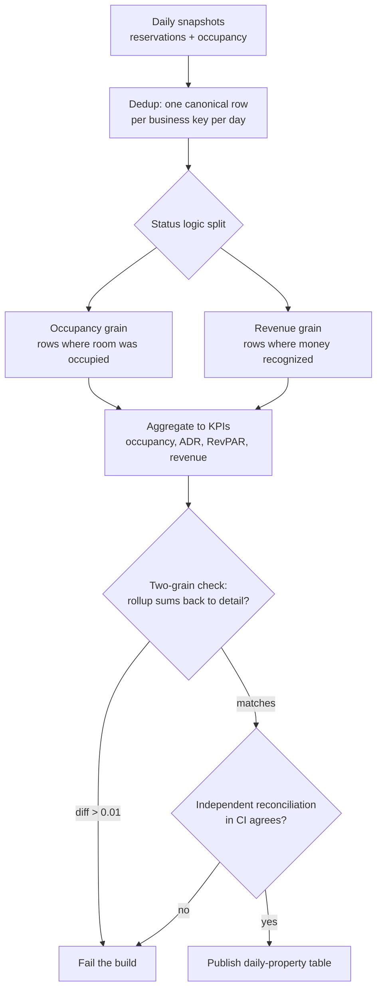
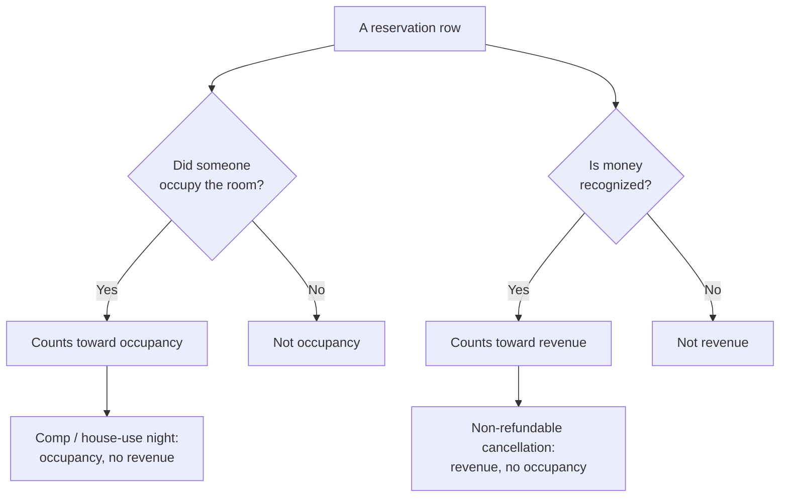

A daily hotel-performance pipeline looks simple until the snapshots start repeating. You pull reservation and occupancy data every day, compute the KPIs a revenue manager looks at, occupancy, ADR, RevPAR, revenue by date, and publish a table. The trap is that the inputs are snapshots, not events, and the same reservation shows up again tomorrow, and the day after, and sometimes twice in one day. Aggregate naively and every duplicate quietly inflates the number.

This is a writeup of a daily KPI pipeline built on [dbt](https://docs.getdbt.com/docs/introduction) and [DuckDB](https://duckdb.org/why_duckdb), an [ELT](https://en.wikipedia.org/wiki/Extract,_load,_transform) design where raw data lands first and the transforms run in the warehouse. Five decisions keep it correct: dedup before you aggregate, treat occupancy and revenue status asymmetrically, validate at two grains, build byte-reproducibly, and gate CI on an independent reconciliation.

`DuckDB` because the working set fits in process and a local engine makes the build fast and the tests free. `dbt` because the transforms want to be versioned SQL with lineage and tests attached.



## Snapshots repeat, so dedup before you aggregate

The first thing I got wrong on a pipeline like this years ago, in a different domain, was assuming the source gave me events. It gave me state. Each daily extract is a photograph of the world as of that day, and a reservation that spans a week appears in seven photographs. A source can also re-emit the same row inside one day after a retry or a backfill.

If you `SUM(revenue)` over the raw extract, you are summing the same booking many times. The KPI goes up, looks like growth, and is wrong. The fix is an ordering discipline, not a heroic one: collapse to a single canonical row per business key per snapshot date first, then aggregate the deduped rows.

```sql
-- one canonical row per reservation per day, newest wins
with ranked as (
  select *,
    row_number() over (
      partition by reservation_id, snapshot_date
      order by updated_at desc, ingest_seq desc
    ) as rn
  from {{ ref('stg_reservations') }}
)
select * from ranked where rn = 1
```

The `updated_at desc` picks the latest version of a reservation within the day. The `ingest_seq desc` is the tie-break, and it is not optional: when two rows share an `updated_at` down to the second, which they will, `row_number()` has to break the tie deterministically or your dedup is a coin flip that changes between builds. Get the count right by construction here and every downstream aggregate inherits it.

## Occupancy and revenue status are not symmetric

The instinct is to apply one status filter to the whole pipeline: drop cancelled reservations, keep the rest, compute everything from that. That is wrong, because occupancy and revenue answer different questions about the same cancellation.

A room held under a non-refundable rate and then cancelled produces revenue, because the hotel keeps the money, but it does not produce occupancy, because nobody sleeps there. A complimentary or house-use night is the mirror image: it produces occupancy but no revenue. A no-show often counts as revenue and, depending on the property's rules, sometimes as occupancy too. Run one status filter and you will either undercount revenue by dropping kept-money cancellations or overcount occupancy by counting them as stays.

So I split the status logic. Occupancy counts rows where someone physically occupied the room. Revenue counts rows where money is recognized, on whatever the property's recognition rule is. The two sets overlap heavily but are not equal, and modeling them as one set is a correctness bug that hides as a rounding discrepancy until someone reconciles against the `PMS` and finds the gap.



## Validate at two grains

The bugs in an aggregation pipeline are almost always a join that fans out or a dedup that drops too much, and both are invisible at a single grain. So I validate the same quantity at two levels and require them to agree.

Compute total revenue at the reservation grain, one number per reservation per day. Then compute it again at the daily-property grain, the published rollup. The rollup must sum back to the reservation-level total, exactly. If it does not, the difference tells you the direction: rollup higher than detail means a join multiplied rows somewhere between the two; rollup lower means a transform dropped rows it should have kept. Either way the mismatch localizes the bug to the transforms between the two grains instead of leaving you to bisect the whole DAG.

```sql
-- two-grain assertion: rollup must reconcile to detail
with detail as (
  select sum(revenue) as total from {{ ref('fct_reservation_daily') }}
),
rollup as (
  select sum(revenue) as total from {{ ref('fct_property_daily') }}
)
select detail.total, rollup.total, detail.total - rollup.total as diff
from detail, rollup
where abs(detail.total - rollup.total) > 0.01
```

Any row returned is a failure. The `0.01` tolerance is for float cents, not for "close enough."

## Build byte-reproducibly

A reconciliation diff only means something if the same inputs always produce the same output. If your build is nondeterministic, a diff is noise and you will learn to ignore it, which is worse than not having it. So I make the build byte-reproducible by removing every source of nondeterminism:

- **Pin the inputs.** A build runs against a fixed snapshot date, not "today." The same date always reads the same rows.
- **Make every ordering total.** Any `order by`, `row_number()`, or `distinct on` that can see equal values must have a tie-break key, like the `ingest_seq` above. Equal sort keys with no tie-break are free to reorder between runs, and on a `qualify rn = 1` that silently changes which row survives.
- **Ban wall-clock and random.** No `current_timestamp`, no `random()`, no `uuid()` inside models. If you need a run timestamp, inject it as a pinned variable so the value is recorded, not generated.
- **Pin the engine.** Fix the DuckDB and dbt versions. Aggregation and float behavior can shift across versions, and an unpinned engine turns a clean diff red for no real reason.

Once the build is byte-reproducible, a diff between two builds is signal: either the inputs changed or the code changed, and never the dice.

## Gate CI on an independent reconciliation

This is the part that catches the bugs that reach production. dbt tests are good and I use them: not-null, unique, accepted-values, relationship tests. But a dbt test checks the pipeline against assumptions the pipeline's author wrote, and the dangerous bug is the one where the transform and its test are wrong in the same direction. A `sum` that double-counts and a test that asserts the double-counted total both pass.

So CI runs an independent reconciliation: a second computation of the headline KPIs, written separately from the dbt models, that recomputes occupancy, revenue, ADR, and RevPAR straight from the raw deduped inputs and asserts they match the published table within tolerance. Different code, same inputs, same answer required. When the two disagree, one of them is wrong and you find out in CI instead of in a revenue manager's dashboard. It is the same instinct as separating the agent that proposes a change from the agent that reviews it: the check has to be independent of the thing it checks, or it just agrees with the mistake.

> A test the author wrote can be wrong in the same direction as the code it tests. An independent recomputation cannot.

## Where this discipline comes from

None of this is hotel-specific. It is the residue of years spent on data that lies in characteristic ways.

I spent a long time on price-intelligence systems that scraped competitor pages and matched products across retailers, and the failure modes rhyme. Back in the PhantomJS era, the scrapers were XPath-bound: a retailer changed their page layout, the XPath stopped matching, and the extract silently went empty or, worse, half-empty, which is the snapshot-repeats problem wearing a different mask. You cannot trust that today's pull is shaped like yesterday's.

Matching products across retailers was the SKU-matching problem, and it is exactly the occupancy-vs-revenue asymmetry in another costume: a generalist retailer and a specialist apparel retailer can list the same physical product under different identifiers, and if you match apples to oranges your comparison is confidently wrong. The thing you measure has to be the thing you think you are measuring.

And the metric that ran the whole operation was freshness: the refresh rate at which you could restate prices, measured in minutes, because a stale price is a wrong price. A KPI pipeline has the same property. A daily table that is silently a day behind, or that double-counts a snapshot, is not a smaller version of correct. It is wrong with a confident face, which is the only kind of wrong that survives to production.

The five rules above are how you keep the confident face honest: dedup before you aggregate, split the status logic by what each KPI measures, validate at two grains, build byte-reproducibly, and let an independent check have the last word.

## Key takeaways

- Snapshots are state, not events. The same reservation shows up every day it is open, so collapse to one canonical row per business key per snapshot date before any `SUM`, or every duplicate inflates the KPI.
- A dedup tie-break is not optional. When two rows share an `updated_at` to the second, you need a second key like `ingest_seq` or `row_number()` becomes a coin flip that changes between builds.
- Occupancy and revenue are not the same filter. A non-refundable cancellation is revenue without occupancy; a comp night is occupancy without revenue. One status filter undercounts one of them.
- Validate at two grains and require exact agreement. If the daily rollup does not sum back to the reservation-level total, the sign of the gap tells you whether a join fanned out or a dedup dropped rows.
- Byte-reproducibility is what makes a diff mean something. Pin inputs and engine versions, make every ordering total, ban wall-clock and random in models.
- Gate CI on an independent recomputation, not just dbt tests. A test the author wrote can be wrong in the same direction as the code; a second computation from the raw inputs cannot.
- The full pipeline is open source at [prasadus92/hotel-kpi-elt-pipeline](https://github.com/prasadus92/hotel-kpi-elt-pipeline).
