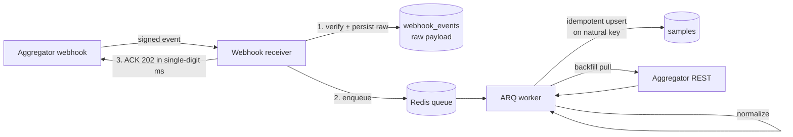
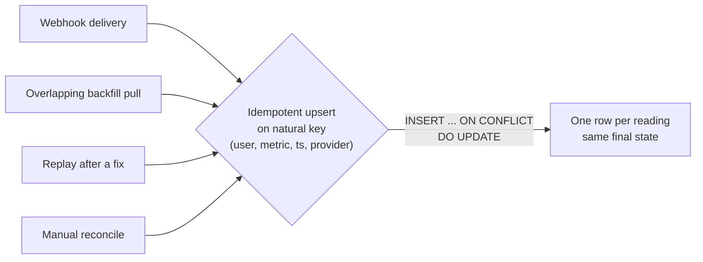

If ["idempotent"](/glossary) is a new word, here is the whole idea in one image. A light switch is idempotent in the "on" position: flip it to on once or flip it to on five times, the light is on either way. A doorbell is not: press it five times and five chimes ring. When you cannot control how many times an event reaches you, you want every operation to behave like setting the switch to on, not like ringing the bell. The rest of this post is that idea applied to data you do not own. The math word for it is a function where `f(f(x)) = f(x)`: applying it again changes nothing.

I built a wearables data platform last year. The whole job, stripped down, was to take heart rate, HRV, breathing rate and blood oxygen out of WHOOP, Oura, Garmin and Apple Watch and put clean time series in front of a user. I did not talk to those devices directly. I went through an aggregator that normalizes the vendor APIs and pushes data to me over webhooks. Open-source equivalents do the same job now.

I spent the first week trying to make the incoming data clean. That was the wrong week. You do not get to make other people's data clean. You get to decide whether your system is correct regardless of how dirty the delivery is. The primitive that buys you that is idempotency, and once I put it at the center instead of the edge, most of the problems I had been treating as separate turned out to be the same problem.

## You control none of the delivery semantics

Here is what I do not control when I depend on a vendor's webhooks and APIs.

- Delivery count. The aggregator delivers [at least once](https://en.wikipedia.org/wiki/Reliability_(computer_networking)). The same event arrives twice when an ack is slow.
- Ordering. An `updated` event can land before the `created` it updates.
- Completeness. A `historical.data` event is a notification with no data in it. I have to go pull the data myself over REST.
- Timing. Late events show up hours after the reading they describe.
- Replay. There is no button on the vendor side that says "send me last Tuesday again." If I lose an event, it is gone.

The receiver has a hard constraint on top of all that. The aggregator retries 8 times with a 15 second timeout and disables an endpoint that keeps failing. So I cannot do real work in the request. If I try to parse a multi-megabyte heart-rate batch inline, I miss the window, the retry doubles my load, and eventually the endpoint goes dark and I stop receiving anything.

The instinct is to fight each of these. Order the events. Detect duplicates. Wait for completeness. I tried. Every guard I wrote assumed something about delivery that the next provider broke. WHOOP reports sleep differently from Oura. A real ring delivers heart rate inside a nightly sleep summary; the demo data delivers it as a standalone resource. The delivery shape is not a thing you can pin down, because there is no single sender.

So I stopped trying to make delivery clean and made correctness invariant to it instead.

## The shape: persist raw, ack in milliseconds, process async

The architecture is three moves.



The receiver verifies the `Svix` signature, writes the raw event to a table, enqueues a job, and returns `202`. That is it. It runs in single-digit milliseconds because it does no parsing. Parsing the heart-rate batch happens later, in a worker, on the queue's clock instead of the vendor's.

The dedupe on the receive step is one unique constraint on the `Svix` message id. A retried delivery hits the constraint, gets recognized as already-seen, and still acks fast. That handles the duplicate-on-the-wire case cheaply.

But the receiver dedupe is the fast path, not the guarantee. The guarantee lives on the write.

## Idempotency belongs on the write, keyed by the data

First, what a natural key is, because the whole design hangs on it. A natural key is an identity the data already has in the real world, as opposed to one you invent. A heart-rate reading is, by its nature, "this user's heart rate, at this instant, from this device." Two records with that same tuple are not two readings; they are the same reading, however many times it shows up. A surrogate key like an auto-incrementing row id is the opposite: it gives the same reading a fresh identity every time it arrives, which is exactly what you do not want when the same reading arrives three times. Pick the key that matches reality and duplicates collapse on their own.

A sample is one biometric reading: a user's heart rate at a timestamp from a provider. The natural key of that reading is exactly that tuple. So the write is an upsert on it. An upsert is "insert if new, update if it already exists," decided atomically by the database against that key.

```python
stmt = pg_insert(Sample).values(chunk)
stmt = stmt.on_conflict_do_update(
    index_elements=["user_id", "metric", "ts", "provider"],
    set_={
        "value": stmt.excluded.value,
        "value_secondary": stmt.excluded.value_secondary,
        "unit": stmt.excluded.unit,
    },
)
await session.execute(stmt)
```

This is the load-bearing line in the whole system. Apply the same reading once or five times and the table lands in the same state. That single property is what makes everything upstream allowed to be sloppy.

It makes at-least-once delivery safe, because a duplicate event writes the same rows. It makes overlapping work safe, which matters more than the duplicate case and is the part I underestimated. When a device connects, I do not wait for the vendor to backfill history. I enqueue my own backfills immediately, pulling every metric over 31 days and sleep summaries over 180. Those backfill ranges overlap with the live webhooks arriving at the same time. Without the upsert that overlap is a duplication bug. With it, the overlap is free. The same row written by a webhook and by a backfill converges.

The reason to put idempotency here and not only on the receiver is that the receiver only knows about one path. The natural-key upsert does not care which path produced the row. Webhook, backfill, replay, manual reconcile: they all funnel through the same conflict clause and converge to the same state. You get correctness once, for every producer, instead of writing a new dedupe guard per producer.



One subtlety that took me a while to see. A vendor resource is an input shape, not a metric. A sleep summary from Oura or WHOOP carries heart rate, HRV and breathing rate inside it. The parser fans one sleep session out into up to three samples stamped at wake time.

```python
candidates: list[tuple[Metric, object, str]] = [
    (Metric.heartrate, heartrate, "bpm"),
    (Metric.hrv, sleep.get("average_hrv"), "ms"),
    (Metric.respiratory_rate, sleep.get("respiratory_rate"), "breaths/min"),
]
return [
    NormalizedSample(metric=metric, ts=ts, value=float(value), ...)
    for metric, value, unit in candidates
    if value is not None
]
```

A pipeline tested only against demo data, where those metrics arrive as standalone resources, ingests nothing from a real device and you do not find out until a real user connects one. The natural-key write is what lets the fan-out be safe: each of the three samples has its own key, so re-processing the same sleep summary is still idempotent.

## The raw-event table earns its storage three times

The thing I would tell anyone building this: the raw-event table earns its keep, and it took doing it to believe it. It does three jobs at once: idempotency ledger, audit trail, and replay buffer.

It is the idempotency ledger. The `Svix`-id unique constraint lives here, so the receiver's dedupe is a property of this table.

It is the audit trail. Every inbound event is here with its payload. When a user asks why a number looks wrong, or when I need to prove what a provider sent versus what I rendered, the answer is a row, not a guess. Events that reference a user I do not know yet are parked as failed rather than dropped, so I never silently lose data because of an ordering race.

It is the replay buffer, and this is the one that paid for the whole table. I shipped a normalizer bug once. The sleep parser was preferring the wrong heart-rate field, charting an average where the device's own app showed the resting number, so every comparison a user made against their ring looked off. The vendor has no sandbox to recreate that. There is no "resend last month's sleep events" button. If raw events were not stored, the only fix would be telling users their history is wrong and moving on.

Because the raw payloads were in the table, the fix was: correct the parser, re-run the affected events through the same idempotent pipeline, and let the upserts overwrite the bad rows in place. No duplicates, because of the natural key. No data loss, because the source of truth was my own table, not the vendor's memory. The replay is only safe because the write is idempotent. The two decisions are the same decision viewed from two angles.

## What I underestimated: the parameter cap is part of the design

I treated batching as a free optimization. Group the samples for an event into one multi-row insert, done. Then the first dense intraday device showed up. An Apple Watch reporting every few minutes produces a backfill page with thousands of readings, and at 8 bind parameters per row a single statement blew straight through the `Postgres` wire-protocol cap of `32767` parameters. It failed in production, on the first real high-frequency backfill, not in any test.

The fix is to chunk, and the part worth copying is that the chunk size is clamped so no config override can recreate the failure.

```python
# Postgres caps a statement at 32767 bind parameters; at 8 per row a dense
# intraday backfill blows through it in one page. Chunked upserts keep every
# batch under the cap, and the natural-key conflict clause keeps any chunk's
# retry safe.
chunk_size = min(max(get_settings().sample_upsert_chunk_rows, 100), 4000)
for start in range(0, len(rows), chunk_size):
    chunk = rows[start : start + chunk_size]
    stmt = pg_insert(Sample).values(chunk).on_conflict_do_update(...)
    await session.execute(stmt)
```

The lesson is not "remember the 32767 number." It is that when you ingest other people's data, the volume is set by them, not by you. A vendor can decide to send you a year of minute-level data in one page and your batching has to survive it. The cap is a property of the input you do not control, so it belongs in the design from the start, at the one choke point both the webhook and backfill paths share.

## The dilemma that cost me a day: how coarse can a dedupe id be?

The same idempotency instinct that saves you on writes can quietly break you on jobs, and the two pull in opposite directions.

My job runner, `arq`, refuses to enqueue a job id while it still holds a result for that id, including a `FAILED` result. That is the runner being idempotent on the job, which is what you want for webhook-driven backfills: a vendor sends the same fixed date range a few times, the retries collapse into one job, good.

Then I keyed user-initiated syncs the same coarse way, by user and resource. A user's first sync failed for an unrelated reason. They tapped sync again. Nothing happened, because the runner still held the `FAILED` result for that id and would not re-enqueue. The dedupe that was correct for the vendor's retries was wrong for the user's intent. The vendor retrying the same window wants collapse. The user re-syncing wants a fresh run.

The fix was to fold the full date range into the backfill job id. Vendor-fixed ranges still collapse, because the range is identical across retries. User-initiated syncs always run, because each one carries its own intent in the key. The rule I wrote down afterward:

> Never key a dedupe id coarser than the retry intent.

Idempotency on the write wants the key as tight as the data: one reading, one row. Idempotency on the job wants the key as tight as the intent: this run, not the last one that failed. Same primitive, and you have to choose the grain deliberately at each layer or it bites you in a way that looks like nothing happening.

## What stays constant

I have a scaling path that swaps `Redis` for `Kafka`, `Postgres` for a dedicated time-series store, and a single region for cells. Almost everything in that document changes. Four things do not.

1. Verify the signature, persist raw, ack fast, process async.
2. Idempotent writes on natural keys.
3. Server-side bucketing, so clients never get the raw firehose.
4. A provider-agnostic normalized model, so the next wearable is a parser, never a schema migration.

The reason those four survive every tier is that they do not depend on the delivery being clean. They make the application correct no matter how the data arrives. That is the whole thesis. Stop negotiating with the sender. Put idempotency on the write, store the raw payload, and let every messy path converge to the same state.

The platform this is drawn from is on GitHub if you want to see the receiver, the worker, and the upserts in context: [github.com/prasadus92/wearables-data-platform](https://github.com/prasadus92/wearables-data-platform).

## Key takeaways

- You control none of the delivery semantics from an external vendor: count, ordering, completeness, timing, replay. Do not try to. Make correctness invariant to delivery instead.
- Idempotency is the load-bearing primitive. Applying the same data twice lands the same state as applying it once, like setting a switch to on rather than ringing a bell.
- Put idempotency on the write, keyed by the natural key of the data, not only on the receiver. The receiver dedupe knows about one path; the natural-key upsert covers every path, webhook, backfill, replay, and reconcile alike.
- Persist the raw event before you process it. It is your idempotency ledger, your audit trail, and your replay buffer, and the vendor has no resend button.
- Volume is set by the sender, so input-shaped limits like the `Postgres` parameter cap belong in the design at the one choke point every path shares.
- Choose the dedupe grain per layer. Writes want the key as tight as the data; jobs want it as tight as the intent. Never key a dedupe id coarser than the retry intent.
