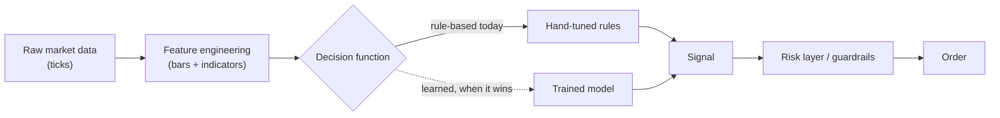
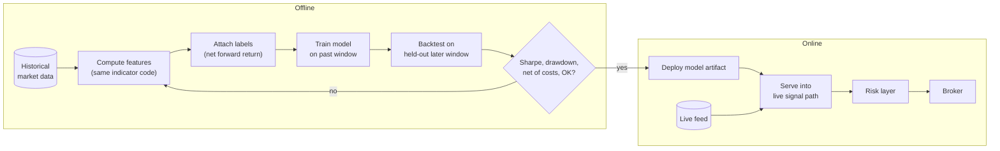
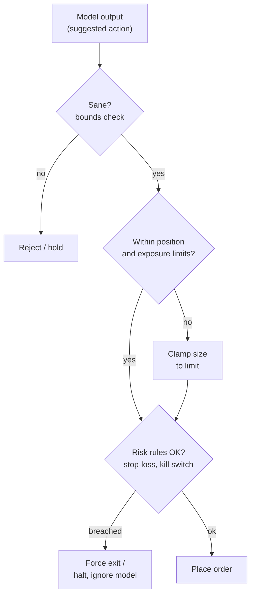

Most writing about "AI in trading" spends its time on the model and almost none on the system the model has to live inside. That is backwards. The model is the easy part and the smallest part. What decides whether a learned strategy makes money or quietly loses it is everything around the model: how raw market data becomes features, how you define what the model is even predicting, whether your backtest tests the code that will actually trade, how the model's output reaches an order without blowing your latency budget, and what stops a confidently wrong model from taking the account down.

I built a quantitative trading engine that is rule-based today. Its strategies compute technical indicators over price bars and apply deterministic rules. There is no neural network in it. But the architecture *is* an ML pipeline, because a rule-based systematic strategy and a machine-learned one need the same machinery. The indicator layer is feature engineering. The backtester is the offline evaluation loop. The signal-to-order path is model serving. The risk layer is the guardrail. Swap the hand-tuned rule for a learned function and the rest of the system does not change.

So this post uses that engine as the concrete substrate to explain, from scratch, where ML actually fits in a strategy trading system. Features, labels, the train-backtest-serve loop, and guardrails. No strategy parameters, no signal thresholds, nothing that reads as "here is a money-making strategy." Just the patterns, which are the part worth teaching.

You do not need deep learning to trade systematically. Rule-based technical analysis is a real, proven approach, and it is what my engine runs. The point of this piece is not "add a neural net." It is "here is the pipeline a strategy needs, and here is the exact seam where a model slots in when a learned function beats a hand-tuned rule."

## The mental model: a strategy is a function from market history to an action

Strip a trading strategy to its essence and it is a function. It takes the history of the market up to now and returns an action: buy this much, sell this much, or do nothing.

```
action = strategy(market_history_up_to_now)
```

A rule-based strategy implements that function with human-written logic: if trend strength is high and price broke above a resistance level, buy. A machine-learned strategy implements it with a trained model: feed the same market history in as numbers, get a prediction out, turn the prediction into an action. Same signature. The difference is only in how the middle is filled.

That framing matters because it tells you the model is one component with a fixed interface, not the whole thing. The market history has to be turned into numbers before the function can consume it. The action has to be turned into an order and checked before it reaches the exchange. Those two boundaries are the same whether the middle is a rule or a model. Build them well and you can swap the middle freely.



The dotted line is the whole story of ML in trading. Everything else on the diagram exists regardless.

## Features: raw ticks are unusable, so you engineer them

A model cannot learn from raw market data. A tick is a single trade: a timestamp, a price, a quantity. They arrive irregularly, at wildly varying rates, and any one of them is mostly noise. If you fed a raw tick stream to a model it would drown. Feature engineering is the work of turning that stream into a small vector of numbers that carries signal in a stable, aligned form.

The first step is aggregation. You bucket ticks into **bars**: for a fixed time window, the open (first price), high, low, close (last price), and total volume. A bar is a lossy summary of a window of ticks, and that loss is the point. It regularizes the stream into evenly spaced, comparable units.

```java
// A bar accumulates ticks over a time window into O/H/L/C/V.
class Bar {
    double open, high, low, close, volume;

    void addTick(double price, double qty) {
        if (open == 0) open = price;   // first tick sets the open
        high = Math.max(high, price);
        low  = Math.min(low, price);
        close = price;                 // last tick wins
        volume += qty;
    }
}
```

In my engine this is what the bar-rolling indicators do: they consume the tick feed and roll it up into hourly and daily bars, keeping a circular buffer of the most recent N bars per symbol. That buffer is the raw material for every feature.

On top of the bars you compute **indicators**, and indicators are features. Each indicator collapses a window of bars into one number that describes a property of the market:

- **Volatility** measures how much price is moving. Average True Range is one common form. High volatility means bigger swings, which changes how much you should risk on a position.
- **Trend strength** measures whether the market is directional or chopping sideways. The Average Directional Index is one measure. A signal that works in a trend can lose in a range, so knowing the regime is itself a feature.
- **Momentum** measures the recent rate and direction of change. It answers "is this thing accelerating."
- **Distance from a level** measures how far price is from a recent support or resistance, extremum points the market has respected before.
- **Risk-adjusted return** measures return per unit of downside volatility. The Sortino ratio is one form, penalizing only the downside, which is closer to how a trader actually experiences risk.

Each of those is one component of a feature vector. The indicator layer computes them incrementally as each new bar arrives, so the feature vector for "right now" is always available in O(1) rather than recomputed from scratch. Many of them are thin wrappers over a battle-tested technical-analysis library rather than hand-rolled math, because getting an indicator subtly wrong is a silent way to poison every downstream decision.

```java
// A feature vector for one symbol at one instant, assembled from indicators.
double[] features = {
    volatility.value(),       // e.g. ATR-style
    trendStrength.value(),    // e.g. ADX-style
    momentum.value(),
    distanceFromResistance.value(),
    riskAdjustedReturn.value()
};
```

For a rule-based strategy those numbers feed an `if` statement. For a model they are the input tensor. Identical numbers, different consumer. This is why I say the indicator layer is feature engineering: it already does the hard part, turning a noisy tick stream into a clean, aligned, incrementally-updated feature vector.

One property to guard fiercely: a feature must only use information available at the moment it represents. If your "feature for time T" accidentally peeks at a bar from T+1, you have leaked the future into the input, and your model will look brilliant offline and fail live. Incremental indicators that update strictly forward in time, one bar at a time, make this leakage hard to introduce by construction.

## Labels: the hardest number to define

A supervised model learns to map features to a **label**: the thing you are trying to predict. In trading the label is almost always some form of forward return, what the price does after the moment the features describe.

The obvious choice is the raw forward return over a horizon: given features at time T, the label is the percentage change in price from T to T plus one hour, or one day. Then you can pose it as regression (predict the number) or classification (bucket it into up, down, or flat and predict the bucket).

```python
# Illustrative label construction. Horizon is a design choice, not alpha.
def make_label(prices, t, horizon):
    forward_return = (prices[t + horizon] - prices[t]) / prices[t]
    # Discretized version for classification:
    if forward_return >  band: return "UP"
    if forward_return < -band: return "DOWN"
    return "FLAT"
```

That looks trivial. It is the single easiest place to fool yourself in the whole pipeline, for reasons that all come down to the label quietly not meaning what you think.

**The horizon is a modeling decision, not a detail.** Predicting the next hour and predicting the next week are different problems with different signal and different noise. Choose it deliberately.

**Costs and slippage belong in the label, or your target is fiction.** A raw forward return of 0.1% might be pure profit or might vanish entirely once you subtract the spread you cross and the slippage you eat getting filled. If your label is gross return, you are training the model to chase moves that do not survive execution. The honest label is net of realistic costs, which means you have to model those costs before you can even define the target.

**Overlapping windows leak information across your train and test split.** If you label every bar with its next-24-hour return, consecutive labels share 23 hours of the same future. Rows that should be independent are not, and naive splitting lets the model see, through overlap, data that belongs to the test period. You handle it with purging and embargoing around the split, or with non-overlapping labels. Skip it and your offline accuracy is inflated by leakage you cannot see.

The reason this matters so much: **the label is the definition of the task, and the model chases whatever the label measures.** This is the same lesson I hit writing a reward function for [agent reinforcement learning](/blog/verifier-design-agent-rl): the reward function *is* the specification of correctness, and if you write it carelessly you teach the policy the wrong thing while every metric still looks fine. A label is a reward function for supervised learning. The code to compute it is a few lines. Getting it to mean what you intend is most of the work.

## The train, backtest, serve loop

With features and a label, you have a supervised learning problem. The loop has three stages, and in a trading system they are bound together more tightly than in most ML.



**Train** is the most standard stage and the least trading-specific. You take a window of history, compute features and labels over it, and fit a model. The one non-negotiable rule is time ordering: you train on the past and validate on the future, never the reverse, and never with a random shuffle that lets future data inform past predictions. Markets are a time series; respecting the arrow of time in your splits is the difference between a real result and a fantasy.

**Backtest** is where trading diverges from ordinary ML, and where most systems lie to themselves. A backtest replays historical market data through the strategy as if it were happening live, and measures what would have happened. The central design decision is this:

> The backtest must run the exact same strategy code that runs live. Any divergence is a place the backtest can lie.

My engine gets this right in a way I want to spell out, because it is the most important architectural idea in the whole pipeline. The strategy is one class with one method that reacts to a market event. In live trading, the events come from a real-time feed and orders go to a real broker. In backtesting, the *same strategy class* is fed events from a historical replay client, and its orders go to a simulated execution engine instead of a broker. The strategy does not know or care which mode it is in.

```java
// The SAME strategy class runs in both modes.
// Only the market-data source and the order sink change.

// Live: events from the real-time feed, orders to the broker.
strategy.onMarketEvent(liveFeedEvent);        // -> real order

// Backtest: events from historical replay, orders to a simulator.
strategy.onMarketEvent(historicalReplayEvent); // -> simulated fill
```

Because the decision code is identical, a good backtest is genuine evidence about the live system, not a separate program that happens to resemble it. The backtester feeds bars and ticks in chronological order, the strategy computes indicators and emits orders exactly as it would live, and a simulated order execution engine decides how those orders fill: a market order at the next available price, a limit order only if price actually crossed the limit during the bar, a stop order when price breaches the stop. Then it applies slippage, because a fill in the real world is never exactly at the quoted price.

This is the same determinism argument from [event sourcing](/blog/event-sourcing-cqrs-trading-engine): if state is a pure function of the inputs, replaying the inputs reproduces the state. A backtest that reuses live code and replays historical inputs is deterministic and trustworthy. A backtest that reimplements the strategy is a second, unvalidated program.

What you measure at the end is not accuracy. It is portfolio performance, computed from the equity curve. My engine tracks **net asset value** over time, cash plus the market value of open positions, sampled as the backtest runs, and derives the metrics that matter:

- **Total and annualized return**, the headline growth.
- **Sharpe ratio**, return per unit of total volatility, the standard risk-adjusted measure.
- **Maximum drawdown**, the worst peak-to-trough fall, which is what actually gets a strategy switched off in real life.
- **Calmar ratio**, annualized return over max drawdown, rewarding smooth growth over jagged growth.
- **Sortino ratio**, return per unit of *downside* volatility, since upside volatility is not a risk anyone complains about.

A model with high classification accuracy and a terrible drawdown is a bad strategy. You optimize the loop against the portfolio metrics, net of costs, on held-out future data, not against how often the model guessed the direction.

**Serve** is putting the trained model into the live signal path. The model artifact is loaded, and at each market event the same feature vector that the backtest computed is computed live and passed to the model, whose output becomes the signal. Two things make this stage its own discipline.

The first is **latency**. The path from a market event to a placed order has a budget. Feature computation has to be incremental, which it already is if your indicators update per bar. Model inference has to fit the budget, which shapes what models are viable: a lightweight model that infers in microseconds is often the right call over a heavier one that predicts marginally better but blows the budget. In an event-driven engine, a slow model handler backs up the whole event queue.

The second is **train-serve skew**, the classic production-ML failure. If the features are computed one way in training and a subtly different way in serving, the model sees inputs it was never trained on and quietly degrades. The defense is to compute features with the *same code* in both places, exactly as the backtest reuses the live strategy code. One feature implementation, used offline and online. The moment you have two, they drift, and the drift is invisible until it costs you.

## Guardrails: the model proposes, the risk layer disposes

A model output is a suggestion. It is never allowed to become an order on its own. Between the model and the exchange sits a risk layer whose job is to be able to override the model, and this is the part that keeps a confidently wrong model from taking the account down.

The principle is one sentence: **the model can propose but never bypass the risk layer.** Concretely:



- **Sanity bounds.** Reject outputs that are absurd on their face: a size larger than the whole account, a nonsensical price. A model with a bug or a bad input can emit garbage, and the first gate is refusing to act on garbage.
- **Position and exposure limits.** Cap how large any single position and the total book can get, and clamp the model's suggested size down to the limit rather than trusting it. The model optimizes for return; the limits enforce survival.
- **Risk rules that can override the model.** A stop-loss forces an exit when a position moves against you past a threshold, whether or not the model wants to hold. The model does not get a vote on this. This is deliberately a separate, simple, deterministic rule sitting on top of the model, because the whole point is that it fires precisely when the model is most wrong.
- **A kill switch.** One control that halts all new orders and optionally flattens the book, for when something is clearly broken. It has to be simple enough to trust at three in the morning.

None of this is machine learning, and that is deliberate. The learned component sits inside a set of deterministic rules it cannot override. The sophistication goes into the model; the safety goes into boring, auditable logic a human can reason about under stress. Letting a model reach the exchange unchecked is how systematic strategies blow up.

This is also why event sourcing underneath matters. Every order the model proposes, every clamp the risk layer applies, every forced exit becomes an event in an append-only log. When something goes wrong, and it will, you replay the events and see exactly what the model suggested, what the guardrails did, and why. The model is opaque; the log around it is not.

## Where the model earns its place

So when is the learned function worth the trouble over a hand-tuned rule. The honest answer is: when the relationship you are modeling is genuinely too complex or too high-dimensional to hand-tune, and you have enough clean, non-leaked data to learn it, and the edge survives costs in a backtest that reuses live code. That is a high bar, and plenty of durable systematic trading clears it with rules instead, including the engine this post is built on.

But the pipeline is the same either way, and that is the takeaway. If you build the features, the honest labels, the code-sharing backtest, the low-skew serving path, and the guardrails, then the decision function in the middle becomes a swappable part. You can run a rule today, drop in a model tomorrow, and A/B them against each other on the same portfolio metrics, because everything around the decision is shared. That surrounding system is the hard, durable part. The model is the easy, swappable piece.

## Key takeaways

- A strategy is a function from market history to an action. The model, when you use one, is only the middle of that function. The boundaries, features in and guarded orders out, exist whether the middle is a rule or a model, so build them well and the middle becomes swappable.
- Raw ticks are unusable. Aggregate them into bars, then compute indicators over the bars. The indicator layer of a trading engine is feature engineering, and it must only ever use information available at the moment it represents, or you leak the future and fail live.
- The label is the definition of the task. Choose the horizon deliberately, put costs and slippage into the target or it is fiction, and handle overlapping windows so future information does not leak across your split. The code is a few lines; making it mean what you intend is most of the work.
- The backtest must run the exact live strategy code, changing only the market-data source and the order sink. Reusing the code makes the backtest genuine evidence; reimplementing it tests a different program. Measure portfolio metrics net of costs on held-out future data, not classification accuracy.
- Serving has two disciplines of its own: fit the latency budget from event to order, and eliminate train-serve skew by computing features with one shared implementation used both offline and online.
- The model proposes, the risk layer disposes. Sanity bounds, position limits, stop-loss rules that can override the model, and a kill switch form a deterministic cage the learned function cannot escape. The sophistication goes in the model; the safety goes in boring, auditable rules.
- You do not need deep learning to trade systematically; rule-based technical analysis is a real, proven approach. A model earns its place only when the relationship is too complex to hand-tune, the data is clean and non-leaked, and the edge survives a faithful backtest. Even then, the system around it is what matters most.
