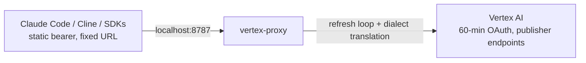
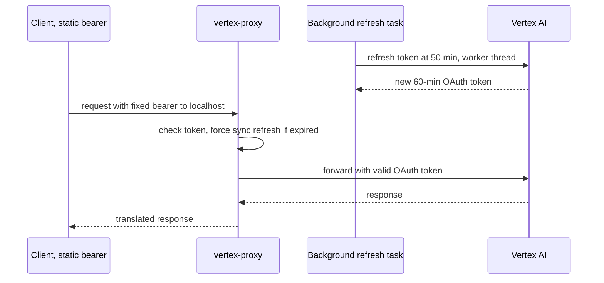
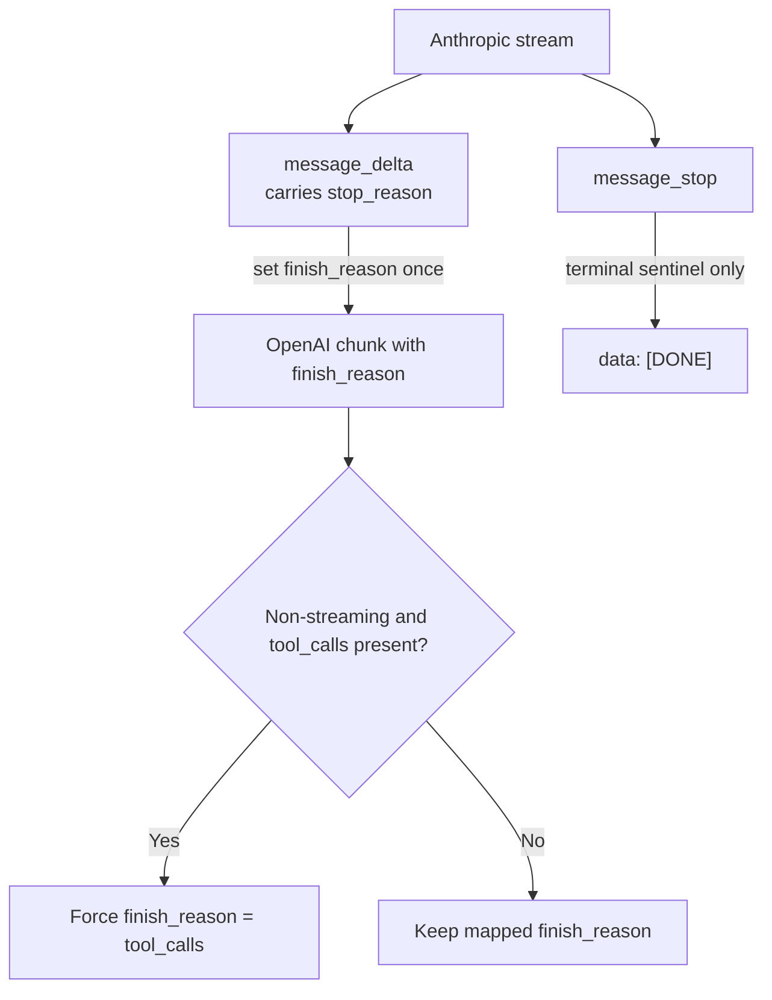

Two terms first, if they are new. A **proxy** is a program that sits between a client and a server, receives the client's request, and forwards it on, often changing something in the middle. It is a translator standing between two people who each speak a slightly different dialect: both think they are speaking the same language, and most of the time they are, until a word means something different to each and the translator has to bridge it. The other term is the auth mismatch at the center of this. A **static bearer token** is a fixed password you put in a header and never change. An **[OAuth](https://oauth.net/2/) access token** is a temporary pass that expires, here after 60 minutes, and has to be refreshed. The clients I use only know how to send a fixed password. Vertex only accepts the expiring pass. Neither side will move, so something in the middle has to hold both.

I wanted Claude Code to run against Vertex AI instead of the public Anthropic API. Same model, different billing, higher quota. I figured it was a one-line `base_url` change.

It was not. The client expects a static `Authorization: Bearer xxx` header that never changes. Vertex hands you an OAuth access token that expires in 60 minutes. There is no field in Claude Code, or Cline, or the OpenAI SDK, where you tell it "go refresh this credential every so often." The auth models do not match, and neither side is going to move.

So I wrote a small proxy that sits in the seam: [vertex-proxy](https://github.com/prasadus92/vertex-proxy). It runs on `127.0.0.1:8787`, owns the token-refresh loop, and translates between the Anthropic Messages, Gemini, and OpenAI Chat Completions dialects and Vertex's publisher-model endpoints. The client sends one unchanging header to localhost and never learns that anything underneath is rotating.

The reason I am writing this up is that the auth bridge took an afternoon. The translation layer took two weeks, and almost all of that time went into edge cases where two "compatible" APIs disagree on something small enough that the docs never mention it. That is the part worth sharing.

## The shape of the problem

Most of what I do in AI infra is impedance matching. Two systems each have an API. On paper they describe the same thing: send messages, get a completion back. In practice they disagree on auth, on URL structure, on how a stream terminates, on which fields are allowed. The work is bridging gaps that are too small to be features and too real to ignore.

Here the gap has two halves.



Half one is auth: a static-token client talking to a short-lived-token backend. Half two is dialect: three request and response shapes that all claim to be interchangeable and are not. The proxy is the only place that knows about both.

## Half one: the refresh loop belongs server-side

Vertex access tokens live 60 minutes. The fix is to refresh ahead of expiry, on a background task, so the foreground request always sees a valid token. I refresh at 50 minutes, which leaves a 10-minute margin for clock skew and a slow refresh call.

```python
# config.py
# Access tokens live 60 minutes. Refresh at this interval to stay ahead.
token_refresh_seconds: int = 3000  # 50 minutes
```

The first thing I got wrong: google-auth's `credentials.refresh()` is a blocking synchronous call. Drop it straight into an async handler and it stalls the event loop, so every other in-flight request to the proxy freezes for the duration of the network round-trip. The refresh has to go to a worker thread.

```python
# auth.py
async def _do_refresh(self) -> None:
    """Run the blocking google-auth refresh in a worker thread."""
    def _sync_refresh() -> None:
        request = GoogleAuthRequest()
        self._credentials.refresh(request)

    await asyncio.get_running_loop().run_in_executor(None, _sync_refresh)
```

The background loop is a plain `asyncio.Task` that sleeps on a stop event with a timeout. If the wait times out, it is time to refresh. If the wait returns early, shutdown was requested and it exits. The detail I underestimated is the failure path: a refresh can fail transiently, and if that failure kills the loop, the token quietly goes stale and every request 401s an hour later with no obvious cause. So the loop swallows the exception, logs it, and tries again next interval.

```python
# auth.py
except TimeoutError:
    # Normal path: time to refresh.
    try:
        await self._do_refresh()
    except Exception as exc:  # noqa: BLE001
        logger.error("token refresh failed: %s", exc, exc_info=True)
        # Don't crash the loop; try again next interval.
```

There is a belt-and-suspenders guard on top: the foreground `get_token()` checks `credentials.expired` and forces a synchronous refresh if the background loop ever fell behind. Most of the time it does nothing. It exists for the one time the loop is wedged and a request comes in anyway.



The right place to put a stateful concern is the one place that can be stateful. The client cannot run a loop, so the proxy runs it for everyone.

## Half two: where compatible breaks down

This is where the time went. Three things bit me, and none of them showed up in a non-streaming test.

### `finish_reason` must be emitted exactly once

OpenAI streams a sequence of `chat.completion.chunk` objects. Exactly one of them carries a non-null `finish_reason`, and it marks the end of the turn. Anthropic streams differently: a `message_delta` event carries the stop reason, and then a separate `message_stop` event closes things out.

My first translator mapped each Anthropic terminal event to an OpenAI chunk with a `finish_reason`. That meant two chunks carried a finish reason: one for `message_delta`, one for `message_stop`. The stream parsed as malformed, and the symptom was the client hanging or truncating with no error, because a second `finish_reason` is not something OpenAI clients are written to expect.

The fix is to treat `message_delta` as the single source of `finish_reason` and treat `message_stop` as a terminal sentinel only.

```python
# openai_anthropic_bridge.py
elif event_type == "message_stop":
    # Terminal sentinel only. finish_reason was already emitted on the
    # preceding message_delta chunk; emitting it here too would be a
    # second (invalid) finish_reason. Just close the stream.
    return b"data: [DONE]\n\n"

elif event_type == "message_delta":
    # Carries the final stop_reason (and usage). This is the single chunk
    # that sets finish_reason for the whole OpenAI stream.
    stop_reason = data.get("delta", {}).get("stop_reason", "end_turn")
```

The non-streaming path has the mirror version of the same trap. In a one-shot response, `finish_reason` and the `tool_calls` array have to agree: if there are tool calls, the finish reason must be `tool_calls`, regardless of what Anthropic's `stop_reason` said. So the translator forces it.

```python
# openai_anthropic_bridge.py
finish_reason = finish_reason_map.get(stop_reason, "stop")
if tool_calls:
    finish_reason = "tool_calls"
```



### streamed tool calls cannot be translated statelessly

I wanted the OpenAI bridge to handle tool use end to end. I could not make the streaming case work without giving up the property I cared about most, which was a stateless line-by-line translator.

Anthropic streams a tool call as `content_block_start` followed by a run of `input_json_delta` events, each carrying a fragment of the JSON arguments. To turn that into OpenAI's streamed `tool_calls` format you have to accumulate the fragments across events, track which content block index you are on, and emit the reassembled call at the end. That is stateful by definition, and my translator processes one [SSE](/glossary) line at a time with no memory.

I had two options. Make the translator stateful and carry a per-stream accumulation buffer, or accept that streamed tool calls are text-only and document it loudly. I chose the second, because the stateful version doubles the surface area where a malformed stream can corrupt state, and tool-using clients can fall back to non-streaming requests where the whole response is available to translate in one pass.

```python
# openai_anthropic_bridge.py (module docstring)
# Limitation: streaming tool calls are not translated. Anthropic streams tool
# use as content_block_start + input_json_delta events, which require stateful
# accumulation the stateless line translator does not do; those events are
# skipped. Non-streaming requests return tool calls correctly. Use a
# non-streaming request when you need tool_calls back.
```

A documented limitation is a decision; one you discover in production is a bug. Streaming tool calls stay text-only, and tool-using clients fall back to non-streaming requests.

### clients invent URLs you did not design

OpenAI-style clients do not let you specify the full request URL. They take the `base_url` you configure and append a fixed suffix: `/chat/completions` for inference, `/models` for discovery. You hand them a prefix and they construct the rest.

That breaks the obvious mental model. Someone who wants Gemini traffic sets `base_url` to `.../gemini`, which seems right. But `/gemini` is my native `generateContent` route, so the appended `/chat/completions` lands on a path that does not exist and 404s. The client reports "could not reach the model" and the user has no idea why.

The routing does not need the URL. `_handle_openai` keys off the `model` field in the request body and ignores the prefix entirely. So the fix is to mount the same handler under every prefix a client might construct.

```python
# main.py
_chat_alias_paths = (
    "/openai/chat/completions",
    "/gemini/v1/chat/completions",
    "/gemini/chat/completions",
)
for _path in _chat_alias_paths:
    app.add_api_route(
        _path,
        openai_chat_completions,
        methods=["POST"],
        dependencies=[Depends(require_api_key)],
    )
```

I mounted the model-discovery endpoints the same way, under eight path variants, because some clients refuse to dispatch until a `/models` probe returns a catalog. A 404 there is not a soft failure for those clients, it is a hard stop. The cheapest fix is to answer everywhere they might knock.

### the fields that did not exist yet

The one that taught me the most was not in any of my code when I started. Claude Code v2.1 began sending a `context_management` field in the request body. Vertex's Anthropic endpoint does not know that field and rejects the whole request with a 400. The client was correct by the public Anthropic schema. Vertex was correct by its own schema. They had drifted, and my proxy was the only thing standing where the drift showed up.

The fix is a small set of fields to strip before forwarding upstream.

```python
# main.py
# Anthropic-on-Vertex wants `anthropic_version` and removes `model`.
# Also strip fields that Vertex doesn't support but some clients send
# (e.g. Claude Code's `context_management`).
_VERTEX_ANTHROPIC_STRIP = {"model", "context_management"}
upstream_body = {k: v for k, v in body.items() if k not in _VERTEX_ANTHROPIC_STRIP}
upstream_body.setdefault("anthropic_version", "vertex-2023-10-16")
```

What I underestimated was the maintenance shape of this. The strip set is not a one-time fix, it is a standing obligation. Every client release can add a field, and every backend lags the public schema by some amount, so the set grows over time. A translation layer between two systems you do not control is a thing you keep up, not a thing you finish.

## The map between the dialects

To keep the edge cases above honest, here is the actual translation surface. The values are real, copied from the config, because the gaps are concrete and the abstraction hides them.

| Concern | OpenAI shape | Anthropic shape | What the proxy does |
|---|---|---|---|
| System prompt | `messages[role=system]` | top-level `system` string | Collects system messages, joins with blank lines |
| Tool result | `role: tool` message | `tool_result` content block | Remaps role and wraps content |
| Stop reason | one `finish_reason` chunk | `message_delta` then `message_stop` | Emits finish once on `message_delta` |
| Model id | `claude-sonnet-4-5-20250929` | `claude-sonnet-4-5@20250929` | Alias table rewrites the id |
| Auth | static bearer | 60-min OAuth | Background refresh loop |

That last model-id row is its own small swamp. Vertex changed its naming convention across model generations. Pre-4.6 Claude models use an `@date` suffix on Vertex (`claude-sonnet-4-5@20250929`), so the alias maps the client's hyphenated id onto it. The 4.6 generation and later are dateless, and appending `@date` to those 404s. There is no rule I could derive; I keep an explicit table and add a row when a model ships.

```python
# config.py
anthropic_model_aliases: dict[str, str] = {
    # Opus 4.6 (dateless; do NOT append @date or it 404s)
    "claude-opus-4-6": "claude-opus-4-6",
    # Sonnet 4.5 (pre-4.6 -> Vertex uses '@' before the date)
    "claude-sonnet-4-5": "claude-sonnet-4-5@20250929",
    "claude-sonnet-4-5-20250929": "claude-sonnet-4-5@20250929",
}
```

I keep the table explicit on purpose. A regex that guesses the suffix would be shorter and would silently route to the wrong place the first time the convention shifts again. With a table, an unknown model fails loud with the list of known aliases, which is the behavior I want when a client asks for something I have not mapped.

## What I would tell myself before starting

Three things, in priority order.

- The auth bridge is the easy half. Budget your time for the translation layer, which is where the systems disagree in ways no schema documents.
- Streaming is where compatibility claims go to die. The terminal-event semantics, the once-only `finish_reason`, the stateful tool accumulation: every one of those bit me, and none showed up in a non-streaming test.
- A translation layer is a maintenance commitment, not a build. The `context_management` field did not exist when I started. Something like it will land again.

The proxy is about 1,500 lines of Python across the package, and almost all of the hard thinking lives in two files: `main.py`, which routes and does the strip-and-forward, and the 276-line `openai_anthropic_bridge.py`, which is the dialect translator. The dependency footprint fits in one sitting. The code is compact because the difficulty is in the edge cases, and the edge cases are the whole point. If you want the details, it is all in the repo: [github.com/prasadus92/vertex-proxy](https://github.com/prasadus92/vertex-proxy).

Most AI infra work looks like building a feature and turns out to be reconciling two systems that almost agree. The proxy is one small instance of that. The afternoon I spent on auth was the part I expected. The two weeks on the dialects were the part that taught me anything.

## Key takeaways

- Much of AI infra is impedance matching: two APIs that agree on paper and disagree on auth, URL shape, and streaming in ways no schema documents.
- A proxy is the right place for a stateful concern the client cannot hold. The client cannot run a token-refresh loop, so the proxy runs it once for everyone, refreshing ahead of expiry on a background task.
- Run blocking refresh calls in a worker thread so they do not stall the event loop, and never let a transient refresh failure kill the loop, or the token goes stale and every request 401s an hour later.
- Streaming is where compatibility claims break. Emit `finish_reason` exactly once, and accept that streamed tool calls need stateful accumulation a line-by-line translator should not take on.
- Clients construct URLs you did not design by appending fixed suffixes to `base_url`. Mount the same handler under every plausible prefix and route off the request body, not the path.
- A translation layer between two systems you do not control is a standing maintenance commitment, not a finished build. Clients add fields and backends lag the schema, so the strip set and the model-id alias table grow over time.
