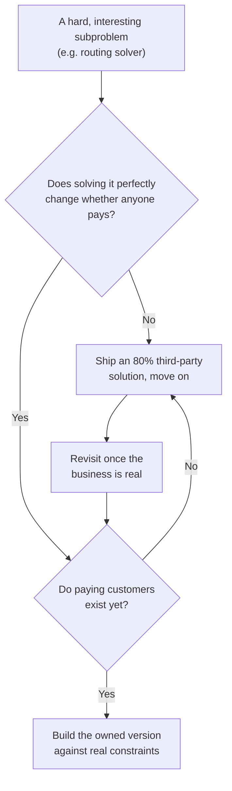
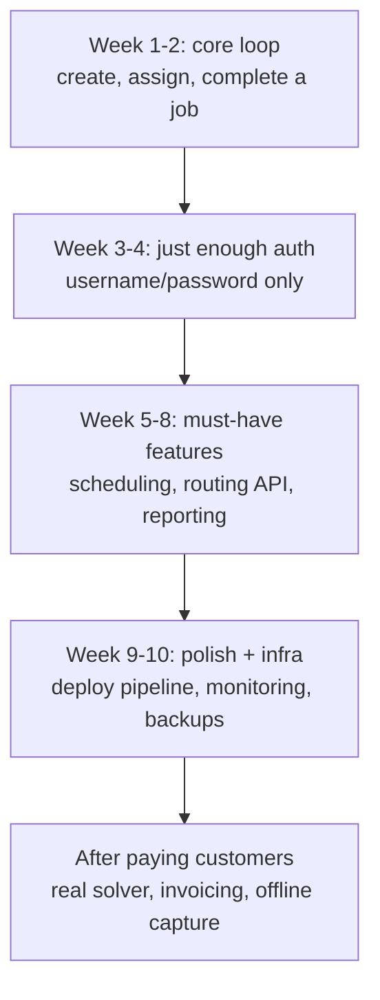

In early 2021 I left my job to build a CRM for maintenance companies in Europe: HVAC technicians, plumbers, electricians. Three months later I had a working product and paying customers. The work I did in that period, alongside my co-founder, helped raise a \$2.7M seed round.

This is not a story about 16-hour days. It is about the one skill that decides whether a solo MVP ships, which is deciding what not to build, and about the one time I ignored my own rule and lost two sprints to it.

## First principles: an MVP exists to answer one question

An MVP is not a small version of the product. It is an experiment with one job: answer the single riskiest question about the business as fast and as cheaply as possible. For us that question was whether maintenance companies would pay for a better way to run their daily jobs. Everything that does not help answer that question is, at MVP stage, a distraction wearing the costume of progress.

Maintenance businesses are genuinely complex: scheduling, dispatching, inventory, invoicing, quotations, customer communication, reporting. A complete solution is years of work. I had three months and one pair of hands. So I asked one question obsessively. What is the one thing that, if it works, proves the business is viable? For us it was job management: create a job, assign it to a technician, capture what happened, mark it complete. If that loop earned money, everything else could come later.

Everything else went onto a written won't-have list, and that list ran past 40 items. Every time a prospect mentioned a feature, it went on the list instead of the roadmap, which let me hear the need without committing to build it. The list is the real artifact of a solo MVP: it is a promise to yourself not to get distracted, and having it in writing is what makes the promise stick when a prospect is enthusiastic about something shiny.

## The routing detour that cost me two sprints

Field-service software lives or dies on routing: which technician goes to which job, in what order, given where they are and when the customer is free. I knew the computer science cold. This is [vehicle routing with time windows](/glossary), a variant of the [traveling salesman problem](https://en.wikipedia.org/wiki/Travelling_salesman_problem), and it is [NP-hard](https://en.wikipedia.org/wiki/NP-hardness), meaning there is no known algorithm that solves it optimally at scale in reasonable time. It is exactly the kind of problem an engineer wants to own.

So my instinct was to build a custom solver. The Java ecosystem has good open-source tooling for it: `OptaPlanner`, now `Timefold`, for the constraint solving, and `GraphHopper` for the routing graph. I started scoping a real solver, because it was the most interesting problem in the product and I wanted my hands on it.

Then someone challenged the premise, and they were right. We did not need to solve technician routing perfectly to find out whether anyone would pay. A decent 80% route was more than enough for a first version, because the customer does not experience the optimality gap on a six-job day. They experience whether the tool exists at all. The perfect solver would have answered a question no one was asking yet.

So I dropped the custom solver and shipped the MVP on a third-party routing API from a Canadian provider. Plug it in, get back an ordered route, move on. The detour cost roughly two weeks, two full sprints, of work that did not move the product forward. In the early days of a company two weeks is real. It was the clearest case I have of my technical intuition being wrong: I optimized for the interesting problem instead of the question that mattered, which was whether the business existed at all.

The lesson generalizes well past routing, into a rule I now apply to any hard, interesting subproblem. Solving it well is only worth the time if two things are true: solving it perfectly changes whether anyone pays, and paying customers already exist to justify it. If either is false, buy an 80% version and move on.

I come from an infrastructure and backend background, so my other reflex is to front-load monitoring and observability. Sometimes that is right. At MVP stage it is the same mistake in a different costume: build the minimal version first, then instrument once there is something worth observing.

## What I built after the routing API, in order

Sequencing matters as much as scope. Get the order wrong and you spend weeks on infrastructure before there is anything to show a customer. The order that worked was strict: the thing that proves the hypothesis first, the things that make it reliable last.

- **Week 1-2, the core loop.** Create a job, assign it, mark it complete. Hardcoded test user, no migrations, basic `try-catch`. By the end of week 2 I could demo the flow to customers. It was ugly and broke in dozens of ways, and it was enough to get real feedback, which is the only point of week 2.
- **Week 3-4, just enough auth.** Username and password on `Spring Security`, the simplest config that works. No `OAuth`, no social login, no password reset. I reset passwords by hand in the database. Auth is the classic place a solo founder over-engineers, because it feels like the responsible thing to do. It is not, yet.
- **Week 5-8, the must-have features.** Customer and technician management, scheduling with a calendar view, status workflows, the routing API wired in, simple reporting. Each got the simplest version that solved the problem, then feedback, then iteration only if the feedback demanded it.
- **Week 9-10, polish and infrastructure.** Deployment pipeline, monitoring, backups. Only in the final weeks, and only because by then there was something worth running reliably.

Roughly 300 hours of focused coding over the three months, protected in fixed morning blocks. If a customer wanted to talk at 9am I offered 2pm. The constraint made me more responsive in the afternoons, not less, because people learned exactly when they could reach me.

What I deliberately skipped: extensive unit tests on code that would be rewritten anyway, documentation for a team of one, performance work for a handful of users, mobile responsiveness, and internationalization in a single-language market. Each matters eventually. None of it helps answer the one question in the first three months.

## The real routing system came later, and that order is the point

Once paying customers were on the product, the 80% routing API became the thing worth replacing. We built the real solution on `GraphHopper`, adapted from generic vehicle routing to technician dispatching, which has constraints a delivery-van model does not: service time at each site (where the technician is working, not driving), waiting windows when a customer is only available in a slot, and callout and emergency reroutes, where an urgent job lands mid-day and the whole afternoon recomputes around it.

The hard, owned version of routing earned its build time only after the business was real, which is exactly the rule from earlier applied in the right order. With the foundation proven, the product expanded the same way: invoicing, order handling, quotations, a customer-facing UI, units management, and offline capture of machine details for technicians working in basements and plant rooms with no signal. None of that belonged in the first three months, and putting any of it there would have delayed the only answer that mattered.

## Tech stack: boring on purpose

When you build alone, the temptation to reach for new technology is strong, and it is a trap. This is not the time to learn Rust.

I chose the most boring stack I knew well: `Spring Boot` with `Spring Data JPA`, `PostgreSQL`, server-rendered templates with JavaScript for the frontend, `Kubernetes` on Google Cloud, `GitHub Actions` for deploys. I picked `Spring Boot` because I had used it for years and could estimate features accurately and debug in minutes instead of hours. Some founders questioned `Kubernetes` as overkill for an MVP, and maybe it was, but I could stand up a cluster and deploy faster than I could configure a `VM` by hand, because I had done it dozens of times. The rule underneath: choose technology by your speed with it, not its theoretical fit. A tool you know deeply beats a better tool you do not.

## Sell while you build

A common failure mode for technical founders is building in isolation for months, then discovering they built the wrong thing. The fix is to close the loop early. I started talking to maintenance companies in week 3, before the product really worked, with a simple ask: I am building a tool for businesses like yours, can I show you what I have and get your feedback? People rarely say no to a request for advice.

Talking was not enough on its own, so I went to where the work happened. I rode along on real maintenance calls. At a small elevator-maintenance company in Oslo a technician named Jonas took me to a training center with real lift cars, and I stood on top of an elevator car in safety gear watching them work. I learned that every building has a dedicated elevator room with the controller and electrical circuits, the kind of thing you cannot learn from a requirements doc. I also got Knut Tore Haugen, the operations manager at StartupLab, the Oslo startup hub, to let me run an early IoT prototype from a vendor called LiftInsight on about eight of their elevators to collect real data. You design a very different product after you have stood on the equipment than you do from a whiteboard.

Those conversations validated the problem, shaped the product, and seeded a pipeline at the same time. The first company to run the product in the real world was a roughly 15-technician service company in Berlin, and the Oslo elevator company, run by Lian Heis, was both a development partner and an early adopter. The trick was honesty about the product's state. I told prospects exactly what worked and what did not, fixed things fast when they broke, and gave them my phone number. Early customers do not expect perfection. They expect to be heard, and to see you close the loop when something breaks.

The work behind that honesty was unglamorous. On our v1 launch day I was up until 6am importing customer data with Python scripts and back at it by 10am, because a customer onboarding cannot wait.

## What I would change

- **Start customer conversations in week 1, not week 3.** They would have shaped the architecture, and might have saved me the routing detour, because a customer would have told me an 80% route was fine before I scoped a solver.
- **Build analytics from day one.** I added usage tracking late and could not see how customers actually used the product exactly when I most needed that to prioritize.
- **Price with more nerve.** I underpriced from a lack of confidence. Customers who would have paid more were happy to pay less, which made the unit economics look worse than they were.
- **Find a middle ground on error handling.** Skipping it saved time up front and cost more later. Somewhere between perfect and none would have been the smarter call.

## The point of solo building

Building an MVP solo is not about proving you do not need help. It is about moving fast in the one phase where speed matters most, before you know what you are building or why, when a second opinion on every decision would slow you down more than it would improve the decisions. Once the concept is proven, that inverts, and you build the team. I co-founded Mainteny and we grew to about fifteen people across five countries. The second brain mattered most after zero to one, not during it.

Three months, one person, one core workflow, and the first companies running it in the real world. That was enough to prove the idea was worth pursuing. The routing detour was the one stretch where I forgot my own rule, and it cost two sprints.

## Key takeaways: the solo MVP playbook

1. An MVP exists to answer one question. Build the workflow that proves people will pay, and write everything else onto a won't-have list.
2. Do not build the perfect version of the hard part. An 80% third-party solution ships the MVP. Build the real one only after customers exist and only if optimality changes whether they pay.
3. Core loop first, infrastructure last. Sequence by what proves the hypothesis, not by what feels responsible.
4. Use boring technology you can write in your sleep. Speed with a tool beats the theoretical fit of a better one.
5. Start customer conversations before you write code, and go to where the work happens.
6. Add co-founders and own the hard problems after validation, not before.

Building something in a complex domain and unsure what to cut? Reach out. I am happy to compare notes.
