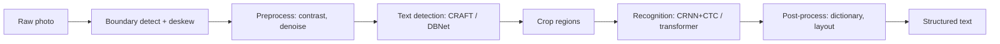
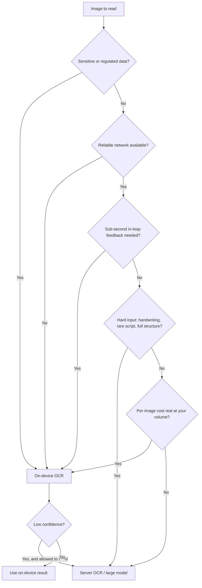

I will keep the product out of this. The lessons are generic and the sources are public.

## What OCR is

Optical character recognition turns pixels of text into characters you can store, search, and compute on. A photo of a receipt is, to a computer, a grid of brightness values. OCR is the function that maps that grid to the string `TOTAL 42.50`.

The naive mental model is one step: look at the image, output the text. The real pipeline is two stages, and the split matters for everything that follows.

- **Detection** finds *where* the text is. It draws boxes around the regions that contain characters and ignores the logo, the watermark, the coffee stain. Common detectors are `CRAFT`, which classifies pixels as character regions and handles curved or irregular text, and `DBNet`, a segmentation detector. Older regression detectors like `EAST` predict boxes directly and are faster but weaker on curved text.
- **Recognition** reads *what* each box says. It takes a cropped region and emits a character sequence. The classic architecture is `CRNN` plus `CTC`: convolutional layers pull visual features, recurrent layers model the sequence, and `CTC` (connectionist temporal classification) lets you train without labeling exactly which pixel column maps to which character. Newer recognizers use a transformer decoder with attention over the visual features instead of an LSTM.

So a faithful pipeline is closer to: find the document edges, deskew, clean up the image, detect text regions, recognize each region, then post-process. Here it is end to end.

Two facts fall out of this diagram. First, **errors cascade**. Each stage feeds the next, so a 2% character error rate per stage does not stay 2%; on receipts it compounds to something like 15 to 20% information-extraction failure by the end. Second, the diagram explains the 2023 to 2026 shift: vision-language models collapse all of this into a single forward pass, reading the page as one object the way a literate person does, with layout and language considered at once. That is genuinely better on complex documents. It is also why the offline question gets interesting, because that single pass is expensive on a phone. More on that below.

## Why it is harder than it looks

The reason OCR feels solved is that the demo is always clean: black text, white page, one font, dead level, good light. Move one variable and accuracy falls off a cliff.

- **Fonts and styling.** A recognizer trained on body text meets a stylized logo, condensed all-caps, or a dot-matrix receipt printer and misreads it. The space of glyph shapes is much larger than any training set.
- **Scripts.** Latin is the easy case. Arabic is cursive and context-dependent, the same letter changes shape by position. Devanagari and Tamil stack marks above and below a baseline. Chinese has thousands of classes. An engine tuned on Latin has no reason to handle these well, and mostly does not.
- **Skew and perspective.** A phone photo is rarely flat-on. Text curves over a bent receipt, runs up a perspective-distorted ID held at an angle. Detection has to find it; recognition has to read it pre-rectification or after a warp.
- **Lighting and capture.** Glare from a laminated card, a shadow across half the page, motion blur, low resolution, JPEG artifacts. Each one erases the fine strokes that distinguish `0` from `O` or `1` from `l`.
- **Handwriting.** No two people write the same, there are no clean glyph boundaries, and letters connect. Even in 2026 handwriting sits around 3 to 5% CER on good systems against under 1% for clean print.
- **Mixed and structured content.** A real form is printed labels plus handwritten values plus checkboxes plus a table. Reading the characters is not enough; you have to know that `Smith` is the value for the `Last name` label, which is layout understanding, not just recognition.

The hard inputs are exactly the ones a real product cares about: receipts, IDs, forms, the field photo taken one-handed in bad light. The clean cases are the ones the benchmarks are full of.

## The dataset problem

Models are only as good as what they learned from, and OCR training data has two structural gaps.

**It is Latin-heavy and clean-heavy.** The large public sets are dominated by English and Latin script. An engine can top a public leaderboard and still fail on the scripts most of the world reads. The clearest evidence is zero-shot LLM OCR: a frontier model gets near-perfect character error rate on English and Albanian, both Latin and well-represented in pretraining, then degrades to 0.13 CER on Urdu and 0.05 on Tajik. Same model, same prompt, the only difference is how much of that script it saw in training. Low-resource scripts pay twice, scarce data and visually complex glyphs.

**Domain data is scarce and cannot be scraped.** You can download a billion web images. You cannot download a million real driver's licenses, because they are private by definition. Same for medical forms, bank statements, and most receipts. The data that matters for a real product is exactly the data you are not allowed to have. And the structure is harder to label: a form that mixes printed labels with handwritten values needs print regions and handwriting regions annotated separately under a mixed-content protocol, which is slow expert work, not crowd work.

**Synthetic data helps, to a point.** You can render text in a target script over varied backgrounds with randomized fonts, blur, skew, and lighting, and that genuinely bootstraps a script with no annotated corpus. Recent multilingual efforts go large, one public set spans 50 languages and over 50 million image-text pairs. But synthetic corpora have to be designed to capture real-world complexity, and if your synthetic blur does not look like real phone blur, the model learns to read your renderer and not the world. Synthetic narrows the gap on coverage; it does not close the gap on realism.

The practical consequence: for any non-trivial domain or non-Latin script, you will be collecting and labeling your own representative data, and your accuracy number on a public benchmark will overstate what you get in the field.

## Why offline and on-device matters

It would be easy to send every image to a cloud OCR API and be done. For a lot of real products you cannot, for five concrete reasons.

- **Connectivity.** The photo is taken in a warehouse basement, a rural clinic, a moving vehicle, an airplane. If OCR only works with signal, it does not work when the user needs it.
- **Privacy and compliance.** An ID, a medical form, a bank statement. Sending that to a third-party server is a data-protection decision, sometimes a regulatory blocker. Reading it on the device means the sensitive pixels never leave.
- **Latency.** A capture loop that previews the read in real time, the box that turns green when the number is in frame, needs sub-second feedback. A network round trip per frame cannot do that.
- **Cost.** Per-image cloud OCR is cheap per call and expensive at scale. At high volume the unit economics push work back onto the device the user already paid for.
- **Reliability.** A server-only feature inherits the server's outages, rate limits, and regional availability. On-device keeps working when your backend or your vendor does not.

None of these is absolute. Plenty of products are fine going server-only. But if any of connectivity, privacy, latency-in-loop, or per-image cost is real for you, on-device stops being a nice-to-have.

## The on-device constraint

This is easy to overstate in either direction, so take both wrong versions first.

**The strong version, which is wrong:** "you cannot run any modern model on a phone, so on-device OCR is stuck with old tech." Not true. Quantized vision-language models in the 1B to 2B parameter range do run on recent flagship phones, and there are OCR-specific small VLMs aimed precisely at this, `PaddleOCR-VL` ships a sub-1.3B model that tops document benchmarks on vendor-reported scores. A 1B model in 4-bit fits in phone memory.

**The other wrong version:** "small VLMs run fine on phones, so just put one on-device and skip the OCR engine." Also not true, and the reasons are physical, not temporary.

- **RAM.** After OS overhead you often have under 4GB to work with. That caps model size and rules out architectures like mixture-of-experts, where every expert still has to be loaded even if only some activate.
- **Memory bandwidth, the real bottleneck.** Decoding is bandwidth-bound, not compute-bound. Mobile devices have 50 to 90 GB/s of memory bandwidth; data-center GPUs have 2 to 3 TB/s. That 30 to 50x gap dominates real throughput. The phone's NPU is not the limit, feeding it is.
- **Quantization is mandatory, and it costs accuracy.** Going from 16-bit to 4-bit gives roughly 4x less memory traffic per token, which is what makes a VLM run at all. But the vision encoder is a big share of the parameters, `InternVL3-1B` has a 304M-parameter ViT inside a 938M model, and squeezing that hurts exactly the visual fidelity OCR depends on.
- **Battery and thermals.** Rapid battery drain or thermal throttling kills products. The viable pattern is bursty inference that finishes fast and returns to low power, which fights against running a heavy VLM over a full multi-region document on every capture.

Put together: a small VLM on-device is great for reading *one cropped field* fast, and increasingly viable for light document parsing on high-end hardware. It is not yet the cheap, reliable, runs-on-everything way to OCR a full structured document offline across the device range a consumer app has to support. So **production offline OCR in 2026 still leans on classical and CNN/transformer engines built for the edge**:

- **`Tesseract`** owns the low end: about a 10MB binary, runs on a Raspberry Pi, roughly 0.77s on CPU. Deterministic, air-gappable, no GPU. Weaker on noisy real-world photos, strong for clean high-throughput scans.
- **Apple `Vision` / `VisionKit`** is the default on iOS. Native Swift API, no extra dependency, fast and good on device. If you are on Apple hardware, this is the baseline to beat.
- **Google `ML Kit`** is the Android counterpart: on-device text recognition with script-specific models, tuned for mobile.
- **`PaddleOCR`** is the CPU-friendly accuracy middle ground, near-zero character errors without a GPU, and its 2026 `PaddleOCR-VL` line is where the small-VLM path is opening up if you want to experiment with the single-pass approach on capable devices.

So the framing holds, with one refinement: it is not that VLMs cannot run on phones, it is that the *full single-pass VLM read of a complex document* is not yet the dependable offline default, and the edge engines above still carry production. The right architecture today usually uses both.

## When to do what

The decision is about your data and your network, not about which approach is newest.

The hybrid pattern in the bottom of that diagram is where most real apps land:

- **Capture and first read on-device.** Use the platform engine (`Vision` on iOS, `ML Kit` on Android, `Tesseract` or `PaddleOCR` cross-platform) for the real-time loop and the common case. The user gets instant feedback and the sensitive pixels stay local.
- **Escalate the hard cases to a server**, when the on-device confidence is low *and* the data is allowed to leave the device. Handwriting, rare scripts, and full document structure are where a large server model or a cloud API (Google Cloud Vision, AWS Textract, Azure AI Document Intelligence) earns its cost.
- **Gate the escalation on confidence and consent**, not on convenience. If the data is regulated, the answer to "send it up?" is no, and you eat the harder on-device case instead.

This is the same shape as a lot of edge AI: a cheap fast path that handles most traffic locally, an expensive accurate path for the tail, and a confidence signal deciding between them. The engineering is in the gate and in measuring it honestly.

## How to evaluate

Pick metrics that match what an error costs you, and test on your own images.

- **Character error rate (CER).** The edit distance between prediction and ground truth over the number of reference characters:

  $$\text{CER} = \frac{S + I + D}{N}$$

  where `S`, `I`, and `D` are the substitutions, insertions, and deletions, and `N` is the number of reference characters. Clean printed text comes in under 1%; handwriting is 3 to 5%. Use CER when a single character matters, serial numbers, product codes, financial fields, anything where `0` versus `O` changes the meaning, and where word boundaries may not exist.
- **Word error rate (WER).** The same idea at word granularity. One wrong character ruins the whole word, so WER runs higher than CER, a 5% CER can read as 25% WER. WER is more intuitive for "did this line come out usable."
- **Test on representative data, not a leaderboard.** A public benchmark is Latin-heavy and clean-heavy, so it overstates field accuracy. Build a small held-out set of your real inputs, your scripts, your lighting, your devices, and measure on that. The on-device caveat applies here too: an underpowered device can tile a large image and miss text at the seams, or drop to lower resolution under memory pressure, so benchmark on the actual hardware floor you ship to, not just your dev machine.
- **Measure the system, not the stage.** Because errors cascade, a great recognizer behind a weak detector still fails. Score end to end, image in, structured fields out, which is the number the user feels.

## Key takeaways

- **OCR is two stages, detection then recognition, and errors cascade.** Clean printed English is close to solved; receipts, IDs, handwriting, and non-Latin scripts are not.
- **The datasets are skewed.** Public OCR data is Latin-heavy and clean-heavy, domain data (IDs, receipts) is private and scarce, and synthetic data bootstraps coverage but not realism. Expect to collect and label your own.
- **On-device matters for connectivity, privacy, latency, cost, and reliability.** If any of those is real for you, server-only is not an option.
- **The on-device framing, corrected and confirmed:** small quantized VLMs (1B to 2B, including OCR-specific ones like `PaddleOCR-VL`) do run on phones, but under-4GB RAM and a 30 to 50x memory-bandwidth gap mean a full single-pass VLM read of a complex document offline is not yet the dependable default. Production offline OCR still leans on `Tesseract`, Apple `Vision`/`VisionKit`, Google `ML Kit`, and `PaddleOCR`.
- **Go hybrid.** Capture and first read on-device, escalate hard cases to a server gated on confidence and consent.
- **Measure with CER and WER on your own representative images and on your real hardware floor**, not on a public leaderboard, and score the whole system end to end.

Sources: [On-Device LLMs in 2026 (Edge AI and Vision Alliance)](https://www.edge-ai-vision.com/2026/01/on-device-llms-in-2026-what-changed-what-matters-whats-next/), [On-Device LLMs: State of the Union 2026](https://v-chandra.github.io/on-device-llms/), [Best OCR Model 2026 (CodeSOTA)](https://www.codesota.com/ocr), [PaddleOCR vs Tesseract (CodeSOTA)](https://www.codesota.com/ocr/paddleocr-vs-tesseract), [The Definitive Guide to OCR in 2026: From Pipelines to VLMs](https://slavadubrov.github.io/blog/2026/03/04/the-definitive-guide-to-ocr-in-2026-from-pipelines-to-vlms/), [Multilingual OCR: Methods and Challenges (EmergentMind)](https://www.emergentmind.com/topics/multilingual-optical-character-recognition-ocr), [Deciphering the Underserved: Benchmarking LLM OCR for Low-Resource Scripts (arXiv)](https://arxiv.org/pdf/2412.16119), [Efficient Deployment of VLMs on Mobile Devices (arXiv)](https://arxiv.org/html/2507.08505v1), [Comparing CER and WER (Medium)](https://medium.com/@tam.tamanna18/deciphering-accuracy-evaluation-metrics-in-nlp-and-ocr-a-comparison-of-character-error-rate-cer-e97e809be0c8), [Technical Analysis of Modern Non-LLM OCR Engines (IntuitionLabs)](https://intuitionlabs.ai/articles/non-llm-ocr-technologies).
