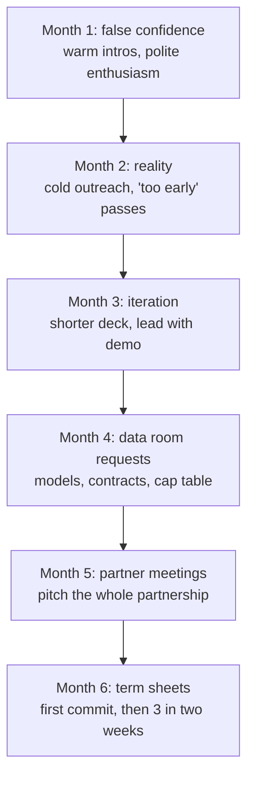

Most fundraising advice comes from people who raised money in 2021, when VCs handed out [term sheets](https://en.wikipedia.org/wiki/Term_sheet) freely. That advice is useless now.

I co-founded Mainteny and was the CTO through our seed raise. The process took six months, 87 investor conversations, and more rejections than I want to count. The work my co-founder and I did in that period helped raise a \$2.7M seed. I ran the technical half of it: the product demo, the technical due diligence, and the "why this team can build it" story. Here is what I learned.

## The time cost

Fundraising consumed 60% of my time for six months. As the person who was supposed to be building the product.

A typical week during our raise:

- **Monday-Tuesday:** 4-6 investor calls per day
- **Wednesday:** Follow-ups, deck updates, data room prep
- **Thursday-Friday:** Product work, team meetings, fires
- **Weekend:** Everything that slipped through the cracks

The hardest part is context-switching. One hour you are explaining unit economics to a skeptical investor. The next you are debugging a production issue. Then back to a pitch. Your brain never commits to anything.

Block entire days for investor work. Block entire days for product work. The context-switching tax is real.

## Cold outreach that works

Unless you went to Stanford, worked at a FAANG, or have a successful exit, you probably do not have warm intros to most investors. We did not.

Our cold email response rate was 15%. Industry average is 2-5%. Here is why.

The raise was a funnel. Researched outreach fed conversations, a fraction of those asked for the data room, fewer still went to a partner meeting, and the term sheets came at the very end.

### Research each investor

The worst thing you can do is send the same email to 200 investors. They can smell a mail merge.

What have they invested in? What do they write about? What is their thesis? Connect those dots.

An email that worked:

Subject: Vertical SaaS in Europe's largest underserved market

Hi \[Name\],

I noticed your investment in \[similar company\] and your recent post about European B2B markets. We are building something adjacent.

\[Company\] is a CRM for maintenance companies. 500B EUR market in Europe with zero modern software players. Our 47 customers grew 3x in 8 months because the alternative is paper and Excel.

Would you be open to a 20-minute call next week?

This shows you did homework, connects to their interests, gives one concrete number that creates curiosity, and asks for a small commitment.

### LinkedIn works better

LinkedIn had a 20% response rate. It feels more personal.

Connect first with a non-pitchy message:

"Hi \[Name\], I have been following your work on European B2B. Building something in the space and would like to connect."

No pitch. No ask. Once they accept, then send the actual message.

### Timing

We tracked everything. The data:

- Tuesday and Wednesday mornings had 2x the response rate
- Emails sent Friday afternoon never got responses
- Subject lines under 7 words outperformed longer ones
- Follow-ups sent 4-5 days after initial email converted best

## What investors evaluate

After 87 conversations, patterns emerge.

### Market understanding

Every pitch deck has a TAM slide with a big number. Investors know this number is fiction.

What they care about: do you understand the market deeply enough to have a contrarian insight?

The investors who got excited were not impressed by our TAM number. They were impressed that we could explain market dynamics better than they had heard before. We knew the customer because we had spent months talking to them.

### Team

At seed stage, investors evaluate founder-market fit. Why are you the person to solve this problem? What unfair advantage do you have?

Questions that came up most:

- How did you meet your co-founder?
- What happens when you disagree?
- Why did you leave your previous job for this?
- What is the hardest thing you have built together?

These questions surface dysfunction. Investors have seen founding teams implode. They are pattern-matching for red flags.

### Product demo

The most effective thing we did: demo the product. Not a slide about the product. The actual product.

Ten minutes of watching a real workflow communicated more than any slides. It showed we could build. It showed we understood the user. It showed the problem was real because the solution was specific.

One investor told us: "I see 20 decks a week. Maybe 2 include a product demo. You should always demo."

The reason this works is first-principles simple. A deck is a claim. A working product is evidence. At seed stage an investor is mostly underwriting two risks, whether you can build and whether anyone wants it, and a live demo of a tool real customers already use collapses both risks in ten minutes. I demoed the actual production app, logged in as a real customer account with real jobs in it, not a sandbox. The few times a feature was rough, I said so on the spot, which bought more credibility than a clean script would have.

## The timeline

The six months had a shape. Each month moved the process one stage further, and the work changed at each step.

### Month 1: false confidence

Warm intros. Friends of friends, former colleagues who knew investors. Conversations went well. Lots of enthusiasm. Lots of "we should stay in touch."

We mistook politeness for interest.

### Month 2: reality

Warm intros dried up. Started cold outreach. Response rates lower than expected. Conversations ended with "you are too early" or "we do not invest in this vertical."

Doubt creeps in. Are we fundable? Is the market real?

### Month 3: iteration

Refined the pitch based on feedback. Shortened the deck. Led with the demo. Got better at handling objections. Response rates improved.

Still no term sheet. Lots of "interested but need more traction."

### Month 4: data room requests

A few VCs asked for our data room. Financial models, customer contracts, team backgrounds, [cap table](https://en.wikipedia.org/wiki/Capitalization_table). This felt like progress. It was also more work.

### Month 5: partner meetings

Two firms invited us to partner meetings. You pitch to the entire partnership, not just one investor.

One meeting went poorly. We went too deep on technical details and lost the non-technical partners. They passed.

The other went well. Follow-up questions. Then more questions. Then a reference call with one of our customers.

### Month 6: term sheet

The second firm sent a term sheet. This created urgency with two other investors who had been sitting on the fence. Within two weeks, we had three term sheets.

Fundraising is feast or famine. No one wants to be first, but everyone piles on once someone commits.

## Mistakes we made

### Started too early

We started with 12 customers. By close, we had 47. If we had waited three more months, the process would have been faster. Better metrics mean higher response rates, shorter due diligence, better terms.

### Wrong investors

We wasted weeks on investors who would never have invested. US firms with no European presence. Generalists who had never done vertical SaaS. Late-stage funds doing "seed investments" that were options on Series A.

Better targeting would have saved 30% of our time.

### No data room ready

When the first investor asked for due diligence materials, we scrambled. Financial models, contracts, cap table, team CVs, customer references. It took a week.

Have your data room ready before you start. Good opportunities move fast.

### Underestimating the emotional cost

50+ rejections over 6 months takes a toll. There were days when I questioned everything. Having a co-founder helped. When one of us was down, the other kept momentum.

## The CTO's role

What should a technical co-founder do during a raise?

**Run the demo.** Shows the technical co-founder can communicate. Lets the CEO handle business questions while you handle technical ones.

**Handle technical due diligence.** Some investors bring in advisors to evaluate your architecture. If you cannot answer deep technical questions, it raises red flags.

**Articulate the "why you" story.** Why is your technical approach differentiated? Why can you build faster than competitors? Investors want a CTO with opinions about technology, not just skills.

**Keep the product alive.** I stopped building new features during the intense months. Focused on stability and quick wins that improved metrics for investor conversations.

## Balancing building with fundraising

Accept that building slows down during fundraising. Be strategic about what you continue.

What we prioritized:

- **Bug fixes affecting retention:** A churned customer mid-raise shows up directly in the metrics investors are watching.
- **Features that improved metrics:** These numbers show up in investor conversations.
- **Nothing speculative:** No exploratory work, new integrations, or experiments. Only high-certainty, high-impact work.

## Raise vs bootstrap

Should you raise at all?

**Raise if:**

- Speed to market is critical (network effects, winner-take-most)
- You need significant upfront investment before revenue is possible
- Competitors are well-funded and moving fast
- The product requires scale to work at all

**Bootstrap if:**

- You can get to profitability with minimal capital
- The market rewards depth over breadth
- You want to maintain control
- Your financial situation allows for the slower path

The hidden cost of venture capital: once you raise, you are on a trajectory. You need to grow fast enough to raise again, or achieve profitability at scale. The comfortable middle ground of a small, profitable business is no longer available.

## What I would tell a first-time founder

**1. It takes longer than you think.** Double your estimate. Then add a month.

**2. Rejection is data.** When an investor passes, ask why. Do not take it personally, but take it seriously.

**3. The best investors add more than money.** Their expertise can be worth more than better terms elsewhere.

**4. Fundraising is a skill.** You will be bad at it initially. The first 20 pitches are warmup.

**5. Your co-founder relationship will be tested.** Fundraising stress reveals cracks in the partnership. Better now than after you have employees.

**6. Do not optimize for valuation alone.** A higher valuation with worse terms or worse investors is not a win.

**7. Market conditions matter.** You cannot control them, but be aware of them.

## The real lesson

Fundraising is a filter, not an accomplishment.

The hard part is not raising money. The hard part is building something worth investing in. If you have built real value, you will find capital. If you have not, no fundraising tactics will save you.

The best thing you can do to make fundraising easier is to spend less time thinking about fundraising and more time building something people want.

## Key takeaways

- Treat fundraising as a filter, not a trophy. If you have built real value you will find capital; if you have not, no tactic saves you.
- Research every investor before you send anything. That discipline is why our cold response rate was 15% against a 2 to 5% industry norm.
- Demo the live product, not a slide about it. Evidence beats claims, and it collapses the two risks an investor underwrites at seed: can you build, and does anyone want it.
- Block whole days for investor work and whole days for product work. The context-switching tax between the two is the hidden cost of a raise.
- Have the data room ready before you start. Good opportunities move fast, and scrambling for contracts and a cap table mid-process loses a week you do not have.
- Term sheets cluster. No one wants to be first, so the first commit creates urgency and the rest pile on within weeks.
- As the technical co-founder, your job in the raise is to run the demo, own technical due diligence, and tell the "why this team can build it" story while keeping the product stable.

If you are currently fundraising or thinking about it, I am happy to chat. Reach out on LinkedIn.
