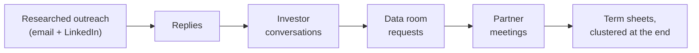
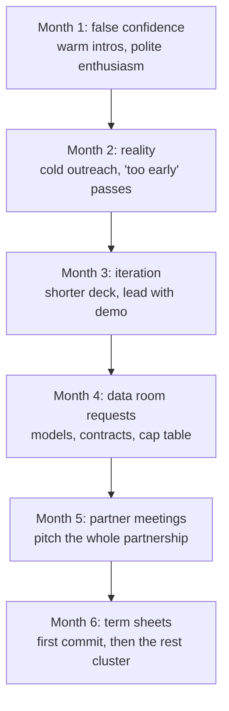

Most fundraising advice comes from people who raised money in 2021, when VCs handed out [term sheets](https://en.wikipedia.org/wiki/Term_sheet) freely. It does not transfer to a tighter market.

I co-founded Mainteny and was the CTO through our seed raise. The process took six months and more rejections than I want to count. The work my co-founder and I did in that period helped raise a \$2.7M seed. I ran the technical half of it: the product demo, the technical due diligence, and the "why this team can build it" story. Here is what I learned.

I have since gone through the other side of this again, raising for the company my co-founder and I are building now. Some of the outreach in this post is from that raise, lightly anonymized. The mechanics are the same; only the market changed.

## The time cost

Fundraising consumed 60% of my time for six months. As the person who was supposed to be building the product.

A typical week during our raise:

- **Monday-Tuesday:** 4-6 investor calls per day
- **Wednesday:** Follow-ups, deck updates, data room prep
- **Thursday-Friday:** Product work, team meetings, fires
- **Weekend:** Everything that slipped through the cracks

The hardest part is context-switching. One hour you are explaining unit economics to a skeptical investor. The next you are debugging a production issue. Then back to a pitch. Your brain never commits to anything.

Block entire days for investor work. Block entire days for product work. The context-switching tax is real.

## Cold outreach that works

Unless you went to Stanford, worked at a FAANG, or have a successful exit, you probably do not have warm intros to most investors. We did not.

The raise is a funnel. Researched outreach feeds conversations, a fraction of those ask for the data room, fewer still go to a partner meeting, and the term sheets come at the very end. The only lever you fully control at the top of that funnel is how well you researched the person you are writing to.

### Research each investor

The worst thing you can do is send the same email to a list of investors. A mail merge is obvious to them within the first line.

What have they invested in? What do they write about? What is their thesis? Connect those dots, and then give them one specific hook and a small ask.

Here is a cold email that got a same-day reply. The partner had written back to me once on LinkedIn, so this is barely warm, but the structure is the same one I use cold.

**Subject:** 5 design partners, ~$8K MRR: data infra without a DevOps hire

Hi \[Name\],

You back a lot of data companies, so you have seen how much DevOps time teams still burn just to keep their stack observable, governed, and under control on cost. That is the gap we close: one AI command center that gives a data team cost control, observability, and governance with ready-made integrations, no DevOps hire needed.

Where we are:

- Early design partners, with roughly \$8K in likely MRR
- Prototype live and in their hands
- My co-founder and I have built this kind of thing before: I founded Mainteny and led ventures at Bain's incubator; he was an early architect on a large SaaS data-lake team he helped grow from 3 to 50 engineers

We are raising \$500K pre-seed to reach more than \$20K MRR in 15 months. Both of us are technical, so the place your read would help most is GTM and founder-led sales.

Deck attached. Worth a 20-minute call to see if it fits your thesis?

Prasad

He replied the same day: one of his portfolio founders had gone through his accelerator, he wanted to learn more, and he sent his calendar link.

Why it works. The subject leads with two numbers a data investor cannot skim past. The first line is about him and his portfolio, not us, and it names a problem his companies actually have. The "where we are" block is three honest facts, not a pitch. The ask is small, and it hands him a role beyond writing a check: tell us where the GTM is weak. No hype, no fake urgency, no flattery he would see through.

### LinkedIn often works better

LinkedIn tends to feel more personal than email, and a good message there can outperform a cold email to the same person.

Connect first with a non-pitchy message:

"Hi \[Name\], I have been following your work on European B2B. Building something in the space and would like to connect."

No pitch. No ask. Once they accept, send the real message, structured like the email above: one researched hook, a few honest facts, a small ask.

### Timing

I tracked when replies came back. Tuesday and Wednesday mornings did clearly better than any other slot, Friday afternoons were close to dead, short subject lines beat long ones, and a single follow-up a few days after the first email caught people who meant to reply and forgot. None of this moves the needle if the message itself is generic, but on a good message it is free upside.

## What investors evaluate

After dozens of conversations, patterns emerge.

### Market understanding

A pitch deck has a TAM slide with a big number, and investors discount it on sight.

What they care about: do you understand the market deeply enough to have a contrarian insight?

The investors who got excited were not impressed by our TAM number. They were impressed that we could explain how maintenance companies actually work, day to day, better than they had heard before.

That came from going to the field. Early on I rode along on real maintenance calls. At a small Oslo elevator-maintenance company, a technician named Jonas took me to a training center with real lift cars, and I stood on top of an elevator car in safety gear watching the work. I learned that buildings have a dedicated elevator room with the controller and the electrical circuits, the kind of detail you only get by being there. Lian Heis, who ran the company, became one of our development partners. When an investor asked how technicians really spend their day, I was not guessing.

### Team

At seed stage, investors evaluate founder-market fit. Why are you the person to solve this problem? What unfair advantage do you have?

Questions that came up most:

- How did you meet your co-founder?
- What happens when you disagree?
- Why did you leave your previous job for this?
- What is the hardest thing you have built together?

These questions surface dysfunction. Investors have seen founding teams implode. They are pattern-matching for red flags.

### Product demo

The most effective thing we did: demo the product. Not a slide about the product. The actual product.

Ten minutes of watching a real workflow communicated more than any slides. It showed we could build. It showed we understood the user. It showed the problem was real because the solution was specific.

One investor told us: "I see 20 decks a week. Maybe 2 include a product demo. You should always demo."

The reason this works is first-principles simple. A deck is a claim. A working product is evidence. At seed stage an investor is mostly underwriting two risks, whether you can build and whether anyone wants it, and a live demo of a tool real customers already use collapses both risks in ten minutes. I demoed the actual production app, logged in as a real customer account with real jobs in it, not a sandbox. The few times a feature was rough, I said so on the spot, which bought more credibility than a clean script would have.

## The timeline

The six months had a shape. Each month moved the process one stage further, and the work changed at each step.

### Month 1: false confidence

Warm intros. Friends of friends, former colleagues who knew investors. Conversations went well. Lots of enthusiasm. Lots of "we should stay in touch."

We mistook politeness for interest.

### Month 2: reality

Warm intros dried up, so we started cold outreach. Response rates came in lower than expected. Conversations ended with "you are too early" or "we do not invest in this vertical."

Doubt creeps in. We started asking ourselves whether we were fundable and whether the market was real.

### Month 3: iteration

We refined the pitch based on feedback, shortened the deck, and led with the demo. We got better at handling objections, and response rates improved.

Still no term sheet. Lots of "interested but need more traction."

### Month 4: data room requests

A few VCs asked for our data room. Financial models, customer contracts, team backgrounds, [cap table](https://en.wikipedia.org/wiki/Capitalization_table). This felt like progress. It was also more work.

### Month 5: partner meetings

Two firms invited us to partner meetings. You pitch to the entire partnership, not just one investor.

One meeting went poorly. We went too deep on technical details and lost the non-technical partners. They passed.

The other went well. Follow-up questions. Then more questions. Then a reference call with one of our customers.

### Month 6: term sheet

The second firm sent a term sheet. That single commitment created urgency with the investors who had been sitting on the fence, and more term sheets followed within a couple of weeks.

Fundraising is feast or famine. No one wants to be first, but everyone piles on once someone commits.

## Mistakes we made

### Started too early

We opened the raise with early traction and closed it with meaningfully more. If we had waited a few more months to start, the process itself would have been faster. Better metrics mean higher response rates, shorter due diligence, and better terms. The raise is easier the less you need it.

### Wrong investors

We wasted weeks on investors who would never have invested. US firms with no European presence. Generalists who had never done vertical SaaS. Late-stage funds doing "seed investments" that were really options on a future Series A.

Tighter targeting up front would have saved a large chunk of the time. The signal is in their actual portfolio, not their website: a fund that has never written a check into your stage, geography, or category is a polite no dressed up as a meeting.

### No data room ready

When the first investor asked for due diligence materials, we scrambled. Financial models, contracts, cap table, team CVs, customer references. It took a week.

Have your data room ready before you start. Good opportunities move fast.

### Underestimating the emotional cost

Months of rejection take a toll. There were days when I questioned everything: the market, the product, whether I was fundable at all. Having a co-founder helped more than any tactic. When one of us was down, the other kept momentum, and we split the emotional load without ever agreeing to.

## The CTO's role

What should a technical co-founder do during a raise?

**Run the demo.** Shows the technical co-founder can communicate. Lets the CEO handle business questions while you handle technical ones.

**Handle technical due diligence.** Some investors bring in advisors to evaluate your architecture. If you cannot answer deep technical questions, it raises red flags.

**Articulate the "why you" story.** Why is your technical approach differentiated? Why can you build faster than competitors? Investors want a CTO with opinions about technology, not just skills.

**Keep the product alive.** I stopped building new features during the intense months. Focused on stability and quick wins that improved metrics for investor conversations.

## Balancing building with fundraising

Accept that building slows down during fundraising. Be strategic about what you continue.

What we prioritized:

- **Bug fixes affecting retention:** A churned customer mid-raise shows up directly in the metrics investors are watching.
- **Features that improved metrics:** These numbers show up in investor conversations.
- **Nothing speculative:** No exploratory work, new integrations, or experiments. Only high-certainty, high-impact work.

## Raise vs bootstrap

Should you raise at all?

**Raise if:**

- Speed to market is critical (network effects, winner-take-most)
- You need significant upfront investment before revenue is possible
- Competitors are well-funded and moving fast
- The product requires scale to work at all

**Bootstrap if:**

- You can get to profitability with minimal capital
- The market rewards depth over breadth
- You want to maintain control
- Your financial situation allows for the slower path

The hidden cost of venture capital: once you raise, you are on a trajectory. You need to grow fast enough to raise again, or achieve profitability at scale. The comfortable middle ground of a small, profitable business is no longer available.

## What I would tell a first-time founder

**1. It takes longer than you think.** Double your estimate. Then add a month.

**2. Rejection is data.** When an investor passes, ask why. Do not take it personally, but take it seriously.

**3. The best investors add more than money.** Their expertise can be worth more than better terms elsewhere.

**4. Fundraising is a skill.** You will be bad at it initially. The first 20 pitches are warmup.

**5. Your co-founder relationship will be tested.** Fundraising stress reveals cracks in the partnership. Better now than after you have employees.

**6. Do not optimize for valuation alone.** A higher valuation with worse terms or worse investors is not a win.

**7. Market conditions matter.** You cannot control them, but be aware of them.

## The real lesson

Fundraising is a filter, not an accomplishment.

The hard part is not raising money. The hard part is building something worth investing in. If you have built real value, you will find capital. If you have not, no fundraising tactics will save you.

The best thing you can do to make fundraising easier is to spend less time thinking about fundraising and more time building something people want.

## Key takeaways

- Treat fundraising as a filter, not a trophy. If you have built real value you will find capital; if you have not, no tactic saves you.
- Research every investor before you send anything. One specific hook tied to what they actually fund, a few honest facts, and a small ask will out-reply any mail merge, warm or cold.
- Demo the live product, not a slide about it. Evidence beats claims, and it collapses the two risks an investor underwrites at seed: can you build, and does anyone want it.
- Block whole days for investor work and whole days for product work. The context-switching tax between the two is the hidden cost of a raise.
- Have the data room ready before you start. Good opportunities move fast, and scrambling for contracts and a cap table mid-process loses a week you do not have.
- Term sheets cluster. No one wants to be first, so the first commit creates urgency and the rest pile on within weeks.
- As the technical co-founder, your job in the raise is to run the demo, own technical due diligence, and tell the "why this team can build it" story while keeping the product stable.

If you are currently fundraising or thinking about it, I am happy to chat. Reach out on LinkedIn.
