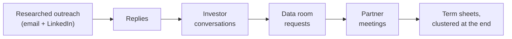
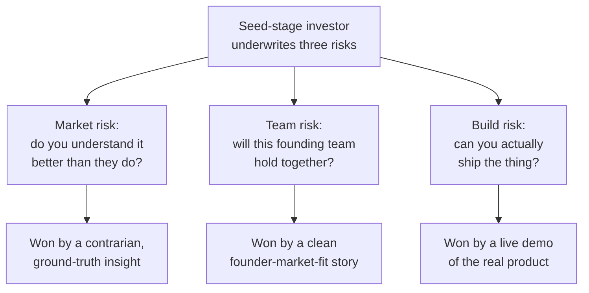
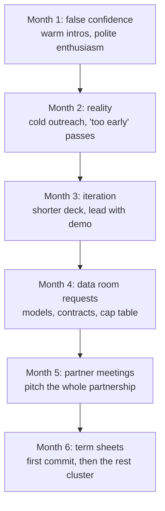

Most fundraising advice you will read comes from people who raised in 2021, when [term sheets](https://en.wikipedia.org/wiki/Term_sheet) were handed out freely. Almost none of it transfers to a tight market, where an investor needs a reason to say yes and is looking for reasons to say no.

I co-founded Mainteny, a CRM for maintenance companies in Europe, and was the CTO through our seed raise. The process took six months and more rejections than I want to count. The work my co-founder and I did in that period helped raise a \$2.7M seed. I ran the technical half of it: the product demo, the technical due diligence, and the "why this team can build it" story. I have since been through the raise again for the company I am building now, so some of the outreach examples here are from that second raise, lightly anonymized. The market changed between them. The mechanics did not.

This is the playbook from first principles. What a raise actually is, why the parts work the way they do, and the specific mistakes that cost us weeks.

## First principles: a raise is a funnel, and you control one input

Strip fundraising down and it is a conversion funnel with a long cycle. Researched outreach produces replies. A fraction of replies become real conversations. A fraction of those ask for the data room. Fewer reach a partner meeting. And the term sheets arrive at the very end, clustered, because of a dynamic I will come back to.

Seeing it as a funnel tells you where your effort has leverage. Most of the funnel is out of your hands in any given week: an investor's thesis, their fund timing, whether they already backed a competitor. The one input you fully control at the top is how well you researched the person you are writing to. So that is where the disproportionate effort goes.

## The time cost nobody prices in

Fundraising took 60% of my time for six months, and I was the person supposed to be building the product. A representative week during the raise looked like this.

- **Monday to Tuesday:** four to six investor calls a day.
- **Wednesday:** follow-ups, deck updates, data-room prep.
- **Thursday to Friday:** product work, team, and whatever caught fire.
- **Weekend:** everything that slipped.

The expensive part is not the hours, it is the context-switching. One hour you are explaining unit economics to a skeptical partner, the next you are debugging a production issue, then back to a pitch. Your brain never fully commits to either, so both get a degraded version of you. The fix that worked was blunt: block whole days for investor work and whole days for product work. The context-switching tax between the two is the real hidden cost of a raise.

## Cold outreach that gets a reply

Unless you went to Stanford, came out of a FAANG, or have an exit behind you, you do not have warm intros to most investors. We did not. That makes cold outreach the top of the funnel, and the quality of the research is the whole game.

The worst thing you can do is send the same email to a list. A mail merge is obvious inside the first line, and an investor reads dozens a day. The work is to answer, before you write: what have they actually invested in, what do they write about, what is their thesis? Then give them one specific hook tied to that, a few honest facts, and a small ask.

Here is a cold email that got a same-day reply. This one was barely warm, the partner had replied to me once on LinkedIn, but the structure is the one I use cold.

**Subject:** 5 design partners, ~$8K MRR: data infra without a DevOps hire

Hi \[Name\],

You back a lot of data companies, so you have seen how much DevOps time teams still burn just to keep their stack observable, governed, and under control on cost. That is the gap we close: one AI command center that gives a data team cost control, observability, and governance with ready-made integrations, no DevOps hire needed.

Where we are:

- Early design partners, with roughly \$8K in likely MRR
- Prototype live and in their hands
- My co-founder and I have built this kind of thing before: I founded Mainteny and led ventures at Bain's incubator; he was an early architect on a large SaaS data-lake team he helped grow from 3 to 50 engineers

We are raising \$500K pre-seed to reach more than \$20K MRR in 15 months. Both of us are technical, so the place your read would help most is GTM and founder-led sales.

Deck attached. Worth a 20-minute call to see if it fits your thesis?

Prasad

He replied the same day, said one of his portfolio founders had been through his accelerator, and sent his calendar link.

Why it works comes down to who each part is about. The subject leads with two numbers a data investor cannot skim past. The first line is about him and his portfolio, not us, and names a problem his companies actually have. The "where we are" block is three honest facts, not a pitch, including an honest "\$8K in likely MRR" rather than a rounded-up claim. The ask is small, and it hands him a role beyond writing a check: tell us where the GTM is weak. There is no hype, no fake urgency, and no flattery he would see through in a second.

### LinkedIn often beats email

A message on LinkedIn tends to feel more personal than a cold email, and a good one can outperform the same message sent by email. The move is to connect first with something that is not a pitch, "Hi \[Name\], I have been following your work on European B2B, building something in the space and would like to connect", then, once they accept, send the real message built the same way as the email above: one researched hook, a few honest facts, a small ask.

### Timing is free upside on a good message

I tracked when replies came back. Tuesday and Wednesday mornings beat every other slot, Friday afternoons were close to dead, short subject lines beat long ones, and a single follow-up a few days later caught the people who meant to reply and forgot. None of this rescues a generic message. On a good one, it is free upside.

## What investors are actually underwriting

After enough conversations, the patterns are clear. At seed stage an investor is mostly underwriting a small set of risks, and each part of the process is aimed at one of them.

### Market: a contrarian insight, not a TAM slide

Every deck has a TAM slide with a big number, and investors discount it on sight. What they care about is whether you understand the market deeply enough to have a view they do not already hold. The investors who leaned in were not impressed by our TAM. They were impressed that we could explain how maintenance companies actually work, day to day, better than they had heard it explained before.

That came from going to the field, not from a desk. Early on I rode along on real maintenance calls. At a small Oslo elevator-maintenance company a technician named Jonas took me to a training center with real lift cars, and I stood on top of an elevator car in safety gear watching the work. I learned that buildings have a dedicated elevator room with the controller and the electrical circuits, the kind of detail you only get by being there. When an investor asked how technicians really spend their day, I was not guessing.

### Team: they are pattern-matching for cracks

At seed stage, investors evaluate founder-market fit and, just as much, whether the founding team will survive contact with stress. The questions that came up most were about exactly that: how did you meet your co-founder, what happens when you disagree, why did you leave your last job for this, what is the hardest thing you have built together. These surface dysfunction. Investors have watched founding teams implode and are scanning for the early signs.

### Build: a demo is evidence, a deck is a claim

The single most effective thing we did was demo the real product. Not a slide about the product, the actual thing. Ten minutes of watching a real workflow said more than any set of slides, because it collapsed two of the three risks at once. It showed we could build, and it showed the problem was real, because the solution was specific enough that we could only have built it by understanding the user.

One investor put it plainly: "I see 20 decks a week. Maybe two include a product demo. You should always demo." I demoed the production app logged in as a real customer account with real jobs in it, not a sandbox. The few times a feature was rough I said so on the spot, which bought more credibility than a clean scripted demo would have.

## The six-month shape

The raise had a shape, and knowing it in advance would have saved me some despair. Each month moved the process one stage, and the work changed at each step.

**Month 1, false confidence.** Warm intros through friends and former colleagues. Conversations went well, lots of enthusiasm, lots of "we should stay in touch." We mistook politeness for interest.

**Month 2, reality.** The warm intros dried up, so we went cold. Response rates came in lower than expected, and conversations ended on "you are too early" or "we do not do this vertical." Doubt creeps in here, about whether you are fundable and whether the market is real.

**Month 3, iteration.** We refined the pitch from the feedback, shortened the deck, and led with the demo. We got better at objections and response rates rose. Still no term sheet, and a lot of "interested but need more traction."

**Month 4, data-room requests.** A few firms asked for the data room: financial models, customer contracts, team backgrounds, the [cap table](https://en.wikipedia.org/wiki/Capitalization_table). Progress, and more work.

**Month 5, partner meetings.** Two firms invited us to pitch the full partnership, not one investor. One went badly, we went too deep on technical detail and lost the non-technical partners, and they passed. The other went well, through follow-up questions and a reference call with one of our customers.

**Month 6, term sheets.** The second firm sent a term sheet. That one commitment created urgency with the investors who had been sitting on the fence, and more term sheets followed within a couple of weeks.

That last step is the clustering, and it has a clean explanation. Fundraising is feast or famine because no investor wants to be first into a deal, but few want to miss one that is closing. The first term sheet is a costly signal that someone with money did the work and decided yes. So the first commit converts fence-sitters, and the rest pile on. The practical consequence: do not read a quiet middle as failure. You are working toward the one yes that unlocks the others.

## The mistakes that cost us weeks

**We started too early.** We opened the raise with early traction and closed it with meaningfully more. Had we waited a few months to start, the process itself would have been faster, because better metrics mean higher response rates, shorter diligence, and better terms. The raise is easier the less you need it, which is the uncomfortable paradox at the center of fundraising.

**We chased the wrong investors.** We burned weeks on firms that were never going to invest: US funds with no European presence, generalists who had never done vertical SaaS, late-stage funds doing "seed" that was really an option on a future Series A. The signal is in a fund's actual portfolio, not its website. A fund that has never written a check into your stage, geography, or category is a polite no dressed up as a meeting. Tighter targeting up front would have given us back a large chunk of the six months.

**We had no data room ready.** When the first investor asked for diligence materials we scrambled, and assembling models, contracts, cap table, CVs, and references took a week. Have the data room built before you start. Good opportunities move fast, and a week of scrambling in the middle is a week you do not have.

**We underestimated the emotional cost.** Months of rejection take a toll, and there were days I questioned the market, the product, and whether I was fundable at all. Having a co-founder helped more than any tactic. When one of us was down the other kept momentum, and we split the emotional load without ever agreeing to.

## The technical co-founder's job in a raise

If you are the technical co-founder, your role in the raise is specific. Run the demo, which shows you can communicate and frees the CEO to take the business questions while you take the technical ones. Own the technical due diligence, because some investors bring in advisors, and not being able to answer deep questions about your own architecture raises flags. Tell the "why you" story: why your technical approach is differentiated and why you can build faster than competitors, since investors want a CTO with opinions, not only skills. And keep the product alive. I stopped shipping new features during the intense months and focused on stability and quick wins that improved the metrics investors were watching, because a customer who churns mid-raise shows up directly in those numbers.

## Should you raise at all?

Raising is not free even when it succeeds. Once you take venture money you are on a trajectory: you have to grow fast enough to raise again or reach profitability at real scale, and the comfortable middle of a small, profitable business is no longer on the table. So the question is worth asking honestly before you start.

Raise when speed to market is decisive (network effects or winner-take-most), when you need real upfront investment before revenue is even possible, when competitors are well-funded and moving, or when the product only works at scale. Bootstrap when you can reach profitability on little capital, when the market rewards depth over land-grab, when control matters to you, and when your finances allow the slower path. Luminik, the company I am building now, is bootstrapped, for exactly these reasons.

## Key takeaways

- Treat fundraising as a filter, not a trophy. If you have built real value you will find capital. If you have not, no tactic saves you.
- Research every investor before you send anything. One specific hook tied to what they actually fund, a few honest facts, and a small ask will out-reply any mail merge, warm or cold.
- Demo the live product, not a slide about it. A demo is evidence and a deck is a claim, and the demo collapses two of the three risks an investor underwrites: can you build, and does anyone want it.
- Block whole days for investor work and whole days for product work. The context-switching tax between them is the real hidden cost of a raise.
- Have the data room ready before you start. Good opportunities move fast, and scrambling for contracts and a cap table mid-process costs a week you do not have.
- Term sheets cluster because no one wants to be first. The first commit is a costly signal that converts fence-sitters, so a quiet middle is not failure.
- As the technical co-founder, run the demo, own technical due diligence, tell the "why this team can build it" story, and keep the product stable through the raise.

If you are raising now or about to, I am happy to compare notes. Reach out on LinkedIn.
