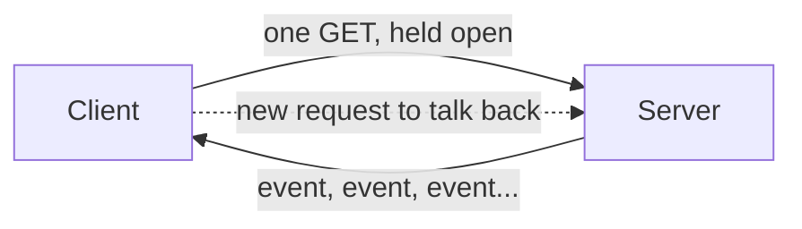
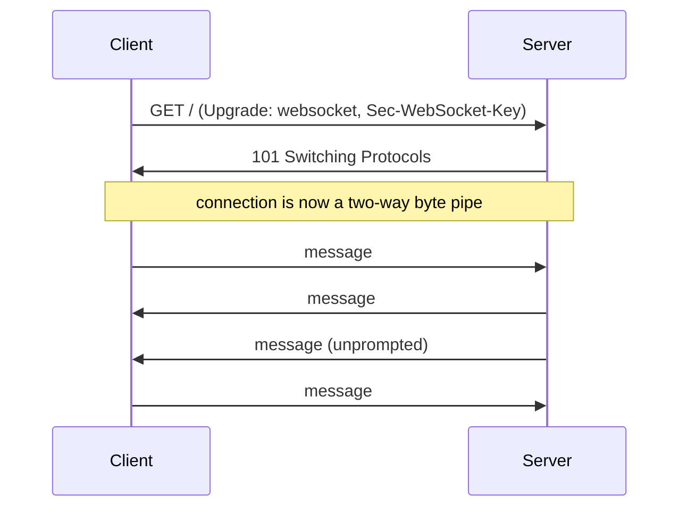
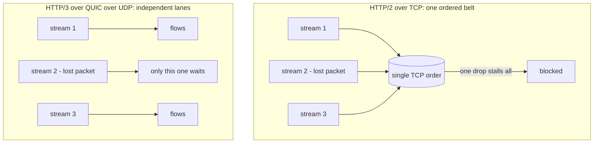

I want to derive these from the problem, not list them as features. So start with the constraint the web was born with.

## The web's starting constraint: the client always speaks first

The web began as request-response. The browser asks (`GET /page`), the server answers, the connection closes. The whole model assumes the client always speaks first and the server only ever replies.

That is fine for documents. It breaks the moment you want the server to tell the client something **the client did not just ask for**:

- a new chat message arrived
- a stock price moved
- a long job finished
- another user moved their cursor

In pure request-response, the server has no way to reach a client that is not currently asking. The server knows something; the client is not on the line.

Real-world analogy: the original web is **postal mail**. You send a letter, you wait, a reply comes back, the exchange ends. If the post office learns something urgent after your letter is sealed, it cannot reach you. It has to wait for you to write again. Everything below is the web growing a phone line.

The first hack was **polling**: the client asks `"anything new?"` every few seconds. It works and it is wasteful. Most requests answer `"no"`, you trade latency (the gap between events and the next poll) against load (poll more often, hammer the server harder). Polling is calling the post office every five minutes to ask if mail came. The protocols below are all attempts to do better than that.

## The transport underneath: TCP

Before the application protocols, the layer they ride on, because `HTTP/3` is a story about replacing it.

`TCP` is the reliable, ordered byte stream that `HTTP/1` and `HTTP/2` run on. It guarantees two things:

- **Reliable.** Lost packets are retransmitted; nothing is silently dropped.
- **Ordered.** Bytes arrive in the order they were sent.

You get those guarantees through a handshake (the famous `SYN`, `SYN-ACK`, `ACK` three-step) that costs a network round-trip before any data moves, plus a `TLS` handshake on top for `https`, costing more round-trips. Hold the ordering guarantee in mind. It is a feature for one stream and, as we will see, a curse for many.

Real-world analogy: `TCP` is a **single-file conveyor belt** where items must come off in the exact order they went on. If the third item jams, everything behind it waits, even if items four through ten are ready. That jam has a name, and `HTTP/3` exists largely to fix it.

## SSE: the server gets a one-way megaphone

The smallest possible upgrade to request-response: the client makes one normal request, and the server **never closes the response**. It holds the connection open and keeps writing into it as events happen.

That is **Server-Sent Events** (`SSE`). It is plain HTTP with `Content-Type: text/event-stream`. The browser reads it with the built-in `EventSource`, or by reading a `fetch` response body as a stream.

On the wire it is text events separated by a blank line:

```
event: price
data: {"sym": "ACME", "px": 41.20}

event: price
data: {"sym": "ACME", "px": 41.18}

```

What you get nearly for free:

- **One-directional, server to client.** The server can push anytime once the stream is open. The client cannot send on it; to say something back, it makes a new ordinary request.
- **Automatic reconnection.** If the connection drops, `EventSource` reconnects on its own and can send a `Last-Event-ID` header so the server resumes from where it left off. You did not write that loop; the browser did.
- **Plain HTTP all the way down.** Proxies, CDNs, load balancers, and auth middleware already understand it because it is just a long HTTP response.



Real-world analogy: `SSE` is a **radio broadcast you tuned into**. The station transmits continuously and you receive; you cannot talk back on the same channel. If you want to call in, you pick up a different phone. That asymmetry is the whole point, and it is a perfect fit for anything where the server pushes and the client mostly listens: notifications, live feeds, progress bars, and streaming a model's tokens into a chat UI.

`SSE`'s one historical weakness was a browser limit of about six concurrent connections per domain under `HTTP/1.1`. Open a few `SSE` streams in a few tabs and you starve the rest of the page. `HTTP/2` removed that, which I will get to.

## Websockets: both sides get a phone

`SSE` gives the server a megaphone. Sometimes you need both sides talking at once on the same line, with minimal overhead per message. That is **websockets**.

A websocket starts as an ordinary HTTP request carrying an `Upgrade: websocket` header and a `Sec-WebSocket-Key`. The server agrees, returns `101 Switching Protocols`, and from that point the same `TCP` connection stops being HTTP and becomes a **full-duplex** byte pipe. Both sides can send framed messages anytime, with a few bytes of overhead per frame instead of a full set of HTTP headers.



What it buys you:

- **Two-directional, low overhead.** Either side sends whenever, and a small frame header beats re-sending HTTP headers per message.
- **Stateful and persistent.** One long-lived connection per client, held open.

What it costs you, and the reasons not to reach for it by default:

- **You own the connection lifecycle.** No automatic reconnect like `SSE`. You write heartbeats (`ping`/`pong`), reconnection with backoff, and resync-after-reconnect yourself.
- **It is not plain HTTP after the upgrade.** Some proxies, caches, and middleware that handle HTTP transparently need extra configuration for websockets.
- **Stateful connections are harder to scale.** Sticky sessions, connection counts per node, and graceful drain on deploy all become your problem.

Real-world analogy: a websocket is an **open phone call**. Both people can talk and interrupt, latency is low, but someone has to keep the line up, notice when it drops, and call back. You would not hold an open call just to occasionally hear an announcement; that is what the radio is for.

The decision rule falls straight out of direction:

- **Only the server pushes** to a mostly-listening client: `SSE`. It is simpler and reconnects itself.
- **Both sides push** with low latency on one connection (live editing, multiplayer, voice, games): websockets.
- **Neither pushes unprompted:** plain request-response. Most things.

This is exactly the call the open-source `alfred-os` codebase makes: its live transcript and token streams are one-directional, so it streams over `SSE` and never opens a websocket. Direction decided it.

## HTTP/2: many streams down one connection

`HTTP/1.1` had a real problem: one connection carried one request-response at a time. To load a page with 50 assets the browser opened multiple connections (capped around six per domain) and queued the rest. That cap is what starved `SSE`.

`HTTP/2` changed the connection model. One `TCP` connection now carries **many independent, interleaved streams** at once. Each request-response is a stream; they share the wire; frames from different streams interleave.

What that fixes:

- **The six-connection cap is gone in practice.** All those `SSE` streams and asset fetches share one multiplexed connection, so opening several `SSE` streams no longer starves the page. `SSE` got materially better under `HTTP/2` without changing a line of `SSE` code.
- **Header compression and server push.** Headers are compressed (`HPACK`); a server-push mechanism existed (now largely deprecated, but the multiplexing is the lasting win).

What it does **not** do is replace `SSE` or websockets. `HTTP/2` is still a request-response-and-streams model, not a symmetric pipe. Websockets keep their two-way niche. The protocols are layered, not competing: you can run `SSE` over `HTTP/2` and get the best of both.

Real-world analogy: `HTTP/1.1` is a **single-lane road**, one car at a time, so you build six parallel roads to get throughput. `HTTP/2` is a **multi-lane highway** on one roadbed: many cars side by side on one connection. Which sets up the catch.

### Head-of-line blocking: the highway with one stuck lane

Here is the subtle problem `HTTP/2` did not solve, and could not, because of what it runs on. `HTTP/2` multiplexes many streams over one `TCP` connection. But `TCP` guarantees ordered delivery of **all** bytes on the connection. So if a single packet is lost, `TCP` holds back **every** byte that arrived after it, across **all** the multiplexed streams, until the lost packet is retransmitted.

That is **head-of-line blocking**. Ten independent streams sharing one `TCP` connection, one packet drops on stream three, and streams one, two, and four through ten all stall, even though their data already arrived intact. The very ordering guarantee that makes `TCP` reliable for one stream becomes a shared chokepoint for many.

Back to the conveyor belt: you put ten independent orders on one single-file belt that must come off in order. One order jams, all ten wait. Multiplexing onto one ordered belt means one jam stops everything.

You cannot fix this inside `HTTP/2`, because the blocking lives in `TCP` underneath it. To fix it you have to change the transport. That is `HTTP/3`.

## HTTP/3 and QUIC: rebuild the transport on UDP

`HTTP/3` keeps the `HTTP/2` idea of many multiplexed streams but moves it onto a new transport called `QUIC`, which runs over `UDP` instead of `TCP`.

`UDP` is the opposite of `TCP`: it sends independent packets (datagrams) with **no** ordering and **no** reliability guarantees. On its own that is useless for the web. So `QUIC` rebuilds reliability and ordering on top of `UDP`, but with one decisive difference: it tracks order and loss **per stream**, not for the whole connection.

That one change is the whole point:

- **No more cross-stream head-of-line blocking.** A lost packet on stream three stalls only stream three. Streams one, two, and four through ten keep flowing, because `QUIC` knows they are independent and does not make them wait on a packet that was not theirs. This is the problem `TCP` made unsolvable and `QUIC` makes solvable, because reliability now lives at the stream level, where the independence already is.
- **Faster handshakes.** `QUIC` folds the `TLS` handshake into its own connection setup, so establishing a secure connection costs fewer round-trips. A returning client can often resume in `0-RTT`, sending data in the very first packet.
- **Connection migration.** A `QUIC` connection is identified by a connection ID, not by the `IP`-and-port four-tuple `TCP` uses. So when your phone switches from wifi to cellular and your `IP` changes, the `QUIC` connection survives instead of dropping and re-handshaking. The call does not drop when you walk out the door.



Real-world analogy: `HTTP/2` over `TCP` is the multi-lane highway whose lanes are secretly chained together, so one stalled lane stalls all of them. `HTTP/3` over `QUIC` cuts the chains: the lanes are finally independent, and a wreck in one does not freeze the others. `UDP` is the bare road with no traffic rules, and `QUIC` is the rules `HTTP/3` paints back on, but per-lane instead of across the whole highway.

A few honest caveats:

- **`QUIC` lives in user space, not the kernel.** `TCP` is implemented in the operating system kernel; `QUIC` is typically implemented in the application or library. That makes it easier to evolve but means it does not get the kernel's decades of tuning for free, and `UDP` throughput can need work to match a finely tuned `TCP` stack.
- **Some networks throttle or block `UDP`.** Corporate firewalls sometimes treat `UDP` with suspicion, so `HTTP/3` clients keep `HTTP/2` as a fallback. You do not bet the connection on `UDP` getting through.
- **`SSE` and websockets still apply.** `HTTP/3` improves the transport beneath them; it does not replace the application-level choice between one-way and two-way. `SSE` over `HTTP/3` is `SSE` with a better belt.

## Putting it together: how to choose

The choice is two questions, in order.

1. **Who needs to push?**
   - Neither side pushes unprompted: **plain HTTP request-response.** Simplest, cacheable, stateless.
   - Only the server pushes: **`SSE`.** One-way, auto-reconnect, plain HTTP.
   - Both sides push, low latency, one connection: **websockets.**

2. **Which HTTP version carries it?** This is mostly your infrastructure's job, not your application's, but it changes the tradeoffs:
   - `HTTP/2` removes the old `SSE` connection cap by multiplexing, so `SSE` is a strong default again.
   - `HTTP/3` removes cross-stream head-of-line blocking and speeds up setup and network switches. You usually get it by enabling it at the load balancer or CDN, not by rewriting application code.

| Need | Protocol | Direction | Reconnect | Carries well on |
|---|---|---|---|---|
| Server pushes to a listener | `SSE` | server to client | built in | `HTTP/2`, `HTTP/3` |
| Both sides push, low latency | websockets | full-duplex | you build it | `HTTP/1.1`+, `HTTP/2` |
| Client asks, server answers | request-response | client to server | n/a | any |

The mental model that holds all of it: the web started as **postal mail** (request-response), grew a **radio broadcast** for one-way push (`SSE`), grew an **open phone call** for two-way push (websockets), widened the road from one lane to many (`HTTP/2`), and finally cut the chains between the lanes so one jam stops one lane instead of all of them (`HTTP/3` over `QUIC`). Each step solved a specific failure of the step before it. None of them replaced the others; they stacked.

## Key takeaways

- The real-time web exists to solve one thing request-response cannot: letting the server send data the client did not just ask for. Polling is the wasteful first answer; `SSE` and websockets are the good ones.
- `SSE` is the one-way option: server streams to client over plain HTTP, with automatic reconnection. Use it when only the server pushes, which covers notifications, live feeds, progress, and streaming model tokens.
- Websockets are the two-way option: a full-duplex byte pipe over one upgraded connection. Use them only for genuine low-latency two-way traffic, and accept that you own reconnection and scaling.
- `HTTP/2` multiplexes many streams over one connection, which removed `SSE`'s old six-connection cap and made `SSE` a strong default. It does not replace websockets.
- `HTTP/2`'s catch is head-of-line blocking: many streams share one ordered `TCP` connection, so one lost packet stalls all of them. You cannot fix it inside `HTTP/2` because the blocking lives in `TCP`.
- `HTTP/3` runs over `QUIC` over `UDP` and tracks order and loss per stream, so a lost packet stalls only its own stream. It also cuts handshake round-trips and survives a wifi-to-cellular switch.
- Choose by direction first (`request-response`, `SSE`, or websockets), then let `HTTP/2` or `HTTP/3` at the edge improve the transport beneath whichever you picked.
