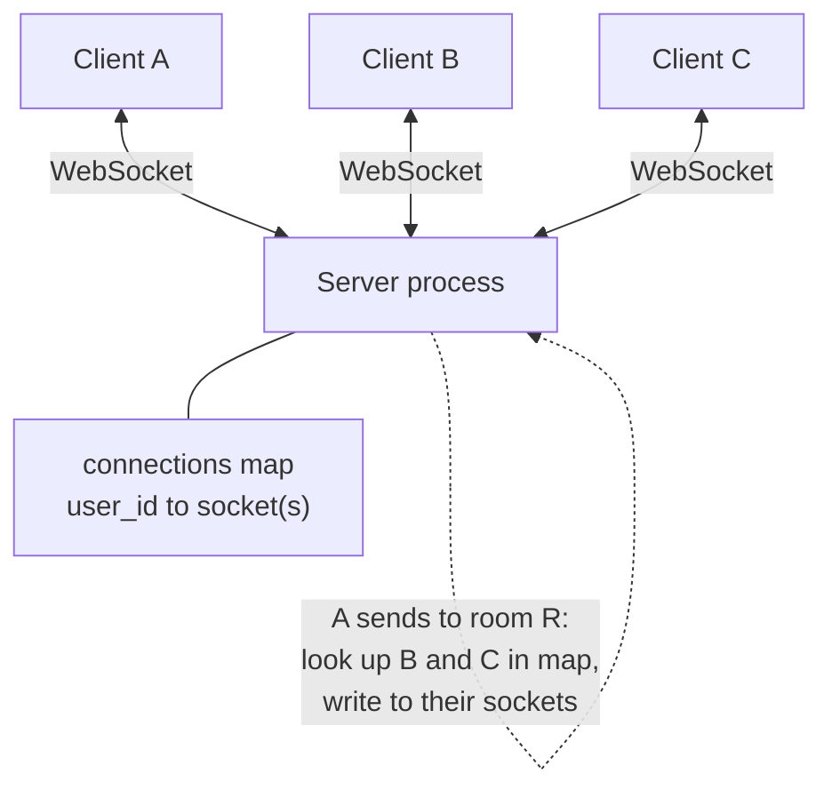
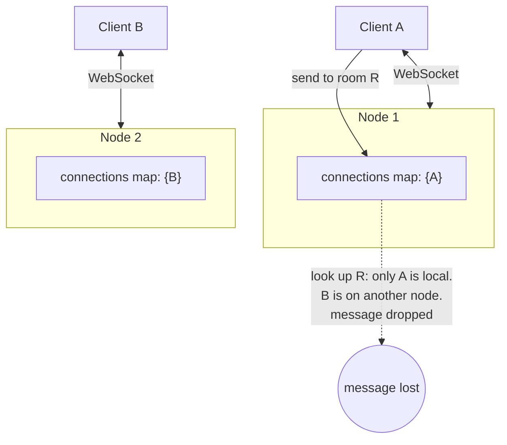
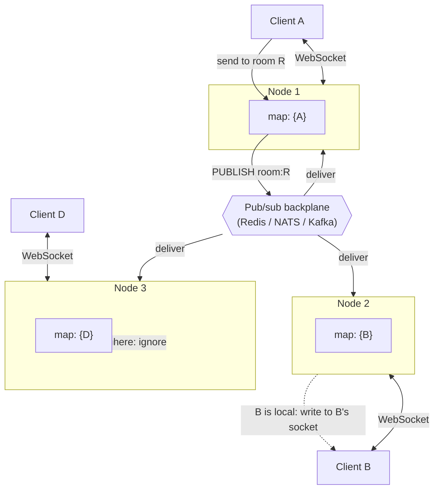
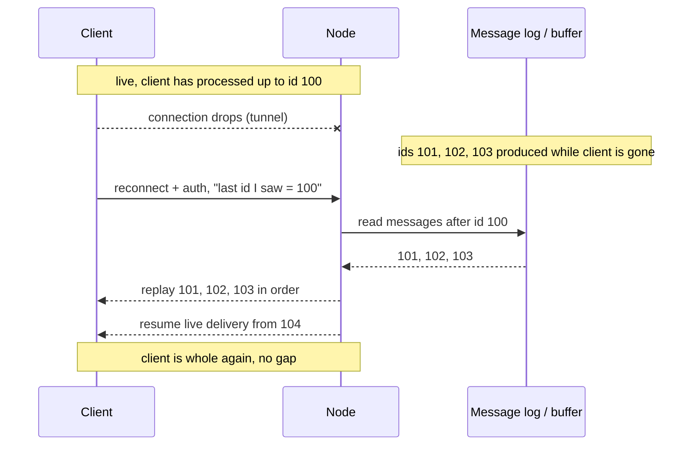

If you have built a streaming chat interface, you have already felt the first half of this. One server, some open connections, tokens flowing out to the browser. It works, it demos well, and then you put a second server behind a load balancer and messages start disappearing. Not crashing, disappearing. User A sends a message, user B never sees it, and nothing in your logs looks wrong. This post is about why that happens and the small number of patterns that fix it.

I will build it up the way the problem actually arrives: start with one node where everything is easy, add a second node and watch it break, then fix the break and deal with the bill that keeping connections open hands you.

## Why a connection that never closes is a different problem

Ordinary HTTP is stateless request-response. The browser asks, the server answers, the connection is done, and the server remembers nothing. That statelessness is the reason HTTP scales so casually: any server can answer any request, because no request depends on the last one. You can put ten identical servers behind a load balancer, spray requests across them at random, and it just works. The server holds nothing between requests, so there is nothing to get out of sync.

A WebSocket is the opposite of that, and the opposite in exactly the property that made HTTP easy. The connection opens once, with an HTTP request carrying an `Upgrade: websocket` header, and then it stays open. From that point the server is holding state: a live, stateful, bidirectional pipe to one specific client, sitting in the memory of one specific process. The connection is the state. Messages flow both ways over it for as long as it lives, which might be hours.

Two consequences fall out of that, and the whole rest of the post is downstream of them.

- **A server now holds N things in memory just by existing.** With HTTP, an idle server costs almost nothing. With WebSockets, a server holding 50,000 connections is using memory for 50,000 connections whether or not anyone is talking. The connections are the load, even at zero messages per second.
- **Where a client is connected now matters.** Under HTTP, "which server" is a non-question. Under WebSockets, the answer "user B is connected to node 3" is a fact your system has to know and act on, because user B's socket lives only on node 3 and nowhere else.

The real-world analogy that makes this stick: HTTP is the postal system. You drop a letter in any mailbox, any post office can route it, and the system holds no memory of you between letters. A WebSocket is a phone call. The line is open, it is tied to one specific handset, and it costs you something to keep it open even when nobody is speaking. You scale a postal system and a phone network with different machinery, and for the same reasons.

## One node: the version that is genuinely easy

Start where it is easy, because the easy version is correct and you want to know exactly which property breaks when you grow.

On a single server, a realtime chat is almost trivial. Each client opens a WebSocket. The server keeps a map from user id to that user's open socket(s). When user A sends a message to room R, the server looks up everyone in R, finds their sockets in the local map, and writes the message to each one. Delivery is a memory lookup and a socket write. There is no network in the middle, no coordination, no "which server" question, because there is only one server and every socket lives in this process.

This is worth dwelling on because it is the mental model people carry, correctly, right up until it stops working. Everything is local. The recipient's socket is a value in a dictionary this process owns. Presence ("who is online") is just the set of keys in that dictionary. A room is a set of user ids you intersect with the map. None of it needs a database or a message broker, because the single process is the source of truth for every connection it holds.

The single node has exactly one scaling axis, and it is a hard ceiling rather than a gentle slope.

## The single-node ceiling: file descriptors, memory, and the load balancer

A single server cannot hold unlimited connections, and the limits are concrete numbers you can hit, not abstractions.

- **File descriptors.** On Linux, every socket is a file descriptor, and a process has a cap on how many it can hold (`ulimit -n`, often defaulting to 1024). Hit it and new connections fail with `EMFILE`, "too many open files," while everything already connected keeps working, which makes it a confusing failure the first time. You raise it deliberately, both the per-process limit and the system-wide `fs.file-max`, before you need it.
- **Memory per connection.** Each open connection costs memory: kernel send and receive buffers, plus whatever your application holds per socket (the user id, room membership, any per-connection state, the runtime's bookkeeping). Call it low tens of kilobytes per idle connection in a tuned setup, more if you buffer. At 100,000 connections that is gigabytes before a single message moves. The send buffer matters most under load, which is its own section below.
- **The load balancer in front.** Your LB holds its own connection state and has its own ceilings. A managed L7 load balancer caps concurrent connections and new-connections-per-second, and it terminates idle connections on a timeout that is often shorter than you want for a long-lived socket. If the LB closes a connection it considers idle, your client sees a drop it did not cause, which is one more reason heartbeats matter.

You can push a single, well-tuned node a long way, into the hundreds of thousands of connections for light traffic. But "a long way" is still a single number, and a single node is also a single point of failure: when it restarts to deploy, every connection it holds drops at once. So you add nodes. And adding nodes is where the interesting problem lives.

## Two nodes: the message that vanishes

Put two servers behind a load balancer. The LB spreads new connections across them. User A's browser connects and lands on node 1. User B's browser connects and lands on node 2. They are in the same chat room. A sends a message.

Node 1 receives A's message, looks up the room's members in its local connections map, and finds, A. It does not find B, because B's socket lives in node 2's memory, in a different process, on a different machine. Node 1 has no way to reach B's socket. The message is delivered to nobody who needs it and quietly dropped. No error, no crash. B simply never sees it.

This is the core problem of scaling WebSockets, and it is worth stating plainly because everything else is a response to it: **a message can arrive on a server that does not hold the recipient's socket.** The local-map model that was correct on one node is now correct only for the slice of users who happen to be on the same node as the sender, which, with random load balancing, is a fraction that shrinks as you add nodes.

There are two ways to respond, and only one of them scales.

- **Make the recipient always reachable from the sender's node (connection affinity).** Pin related users to the same node so the local map keeps working. This is sticky sessions, and it helps a narrow case but does not solve the general one, more below.
- **Let any node deliver to any user regardless of where their socket lives.** Decouple "a message was produced" from "the socket that needs it." This is the backplane, and it is the real answer.

## Sticky sessions help, but they do not solve fan-out

Sticky sessions, also called session affinity, tell the load balancer to keep sending a given client to the same backend node, usually keyed on a cookie or a hash of the client. They are worth understanding because people reach for them first and then are surprised they are not enough.

What stickiness actually buys you is narrow but real. It guarantees that a single client's reconnects land back on the node that already knows them, which can save you re-fetching per-connection state. It does not put two different users on the same node. A and B are different clients; nothing about affinity makes the load balancer co-locate them. So the vanishing-message problem is untouched: A on node 1 still cannot see B on node 2.

You could try to force co-location, route everyone in room R to one node by hashing the room id. That works until a room gets popular and one node holds all of it, which reintroduces the single-node ceiling for your busiest rooms, exactly the rooms you least want capped. And it falls apart the moment a user is in many rooms that hash to many nodes.

The honest summary: affinity is a useful optimization for reconnect locality and for keeping per-connection setup cheap. It is not a fan-out mechanism. To deliver a message to a user wherever they are, you need every node to be able to reach every user, and no routing trick gives you that without recreating the ceiling somewhere. You need a backplane.

## The backplane: publish to all nodes, the right node delivers

The fix is to stop treating "the message was produced" and "the socket that needs the message" as the same step. Insert a message bus that every node subscribes to. When a node receives a message it cannot fully deliver locally, it publishes the message to the bus. Every node gets a copy. Each node checks its own local connections map and delivers to whichever recipients it holds. The node that holds B's socket delivers to B; the nodes that hold nobody relevant ignore it.

This is the pattern behind every horizontally scaled realtime system, and the libraries you have used hide it inside an "adapter." The choice of bus is a real tradeoff, not a detail.

- **`Redis` pub/sub.** The common starting point and what most chat tutorials graduate to. A node calls `PUBLISH room:R message`; every node that ran `SUBSCRIBE room:R` gets it. Setup is minimal and latency is low. The catch is that `Redis` pub/sub is fire-and-forget: it does not store messages. A node that is briefly disconnected from `Redis`, or a message published while a node is mid-restart, is simply missed. That is fine if your durability lives elsewhere (you persist messages to a database on the way in) and the pub/sub is only the live fan-out. It is not fine if you expected the bus to be your message log.
- **`NATS`.** A purpose-built messaging system. Core `NATS` is fast fire-and-forget like `Redis`; `NATS` JetStream adds persistence, replay, and acknowledgements when you want delivery guarantees and missed-message recovery from the bus itself.
- **Kafka.** A durable, ordered, replayable log. Heavier to run and higher latency per message than `Redis`, but every message is retained and re-readable by offset, which makes it the natural backbone when you also need missed-message replay, audit, and other consumers (analytics, search indexing) reading the same stream. You would not pick Kafka just to fan out chat to three nodes; you pick it when the message log is a first-class part of the system.

A useful way to hold the tradeoff: `Redis` pub/sub is a megaphone, whoever is in the room when you shout hears you, and the words are gone after. Kafka is a tape recorder, every word is on the tape and anyone can rewind. `NATS` lets you pick per stream. Realtime delivery wants the megaphone's latency; missed-message replay wants the tape. Many systems run both: a fast bus for live delivery and a durable store (a database, or Kafka) as the source of truth you replay from.

### Presence and rooms ride on the same bus

Two features people want next, presence and rooms, are the same backplane problem in different clothes.

A **room** (or channel) is just a topic on the bus. "Send to room R" means publish to channel `room:R`; a node subscribes to `room:R` only while it holds at least one member of R, so it does not receive traffic for rooms it has no one in. This keeps each node's bus traffic proportional to the rooms its connected users actually occupy, not to all rooms everywhere.

**Presence** ("who is online," "who is in this room") is the distributed version of "the set of keys in my local map," and the local map is now spread across every node. So presence needs shared state. The common shape is a key in `Redis` per online user (or a `Redis` set per room) with a TTL, refreshed by the user's heartbeat; if the heartbeats stop, the key expires and the user falls out of presence automatically. Presence changes (joined, left) are themselves published on the bus so every node can update the rosters it is showing. The thing to notice is that presence is only ever eventually consistent: there is always a window between a client vanishing and its TTL expiring where you will show them as online when they are not. You design the UI to tolerate that rather than trying to make it exact.

## The bill for keeping the connection open

The backplane solves delivery across nodes. The rest of the work comes from the connection itself staying open for hours, which introduces failure modes that request-response code never has to think about, because request-response connections do not live long enough to.

### Backpressure and slow consumers

Here is a failure that does not exist in request-response and surprises people. A WebSocket is bidirectional and the server pushes to the client whenever it wants. But the client consumes at its own pace, a phone on a weak signal, a browser tab throttled in the background, a client that just stopped reading. When the server produces messages faster than a given client drains them, the undelivered messages pile up in that connection's server-side send buffer. The buffer grows. Now picture this happening across thousands of slow connections at once: the buffers are real memory, and they can grow until the node runs out of it and falls over. One node dying drops every connection it held, which the load balancer reconnects onto the surviving nodes, whose buffers now grow faster. That is a cascade.

This is backpressure: the need for a fast producer to feel, and respond to, a slow consumer. The responses, roughly in order of preference:

- **Bound the buffer and drop or disconnect.** Set a max queued-bytes per connection. When a client exceeds it, you have decided it cannot keep up: drop messages it can recover later by other means, or close the socket and let it reconnect and resync. A bounded buffer that disconnects a slow client protects the node from the slow client. An unbounded buffer lets one slow client threaten everyone on the node.
- **Coalesce.** For state-like data (a cursor position, a presence list, a live count), only the latest value matters. Keep the newest and drop the superseded ones instead of queuing every intermediate. A slow client gets fewer updates, never stale total state.
- **Shed at the source.** For genuine firehoses, sample or aggregate server-side so no client is ever sent more than it can take. The wearables principle of bucketing on the server so clients never get the raw stream is the same idea applied here.

The rule under all three: never let an unbounded queue grow per connection. The producer must be able to feel the consumer, or memory becomes the thing that takes the node down.

### Heartbeats and dead-connection detection

A TCP connection can be dead without anyone telling you. The client's laptop slept, the phone walked into a tunnel, a NAT box or load balancer silently dropped the mapping. No FIN packet arrives, so the server's socket sits there looking perfectly alive. You can accumulate thousands of these half-open sockets, each holding memory and a slot in your connection count, none of them ever going to receive another byte. Worse, you will try to deliver messages to them and the writes will queue in send buffers that never drain, which feeds straight back into the backpressure problem above.

You cannot rely on the transport to tell you a client is gone, so you ask. WebSockets have built-in ping and pong control frames for exactly this. The server sends a ping on a timer, say every 30 seconds. A live client's runtime replies with a pong automatically. If no pong comes back within a timeout, the server declares the connection dead, closes it, and reclaims everything it held, the socket, the buffer, the presence key, the slot in the count. The heartbeat is also what keeps an intermediary's idle timer from killing a connection that is healthy but quiet: traffic every 30 seconds means the load balancer never sees it as idle. One mechanism, two jobs, detect the dead and keep the living from looking dead.

### Reconnection and resume: replaying what was missed

Mobile clients disconnect constantly, signal drops, networks switch from wifi to cellular, the OS suspends a backgrounded app. A connection dropping is not an error in a realtime system; it is the normal case, the way a webhook arriving twice is the normal case in ingestion. So reconnect and catch-up have to be designed, not bolted on.

The naive reconnect just opens a new socket and resumes live delivery. The problem is the gap: messages produced while the client was disconnected are gone, because live fan-out only reaches whoever is connected at the moment of the shout. The user comes back and silently has holes in their conversation.

Resume fixes the gap with two ingredients, and both have to exist.

- **A per-stream sequence number on every message.** Each message in a room carries a monotonically increasing id. The client remembers the last id it successfully processed.
- **A server-side buffer or log you can re-read.** On reconnect the client sends its last-seen id; the server replays everything after it, in order, then switches to live. The buffer can be a bounded recent-history list per room in `Redis`, or, if you need long catch-up windows, a durable log like Kafka read from the client's offset.

SSE standardizes the client half of this for free: the browser's `EventSource` remembers the id of the last event and sends it back as the `Last-Event-ID` header on reconnect, so all you implement server-side is "give me events after this id." With WebSockets there is no such convention, so you build the whole thing: stamp the ids, keep the buffer, and handle the resume handshake yourself. That extra work is one of the better reasons to ask whether you needed WebSockets at all, which is the last section.

### Auth on connect, and refresh on a socket that outlives its token

Authentication on a long-lived connection has a trap that short requests never hit. You authenticate once, on connect: the client opens the socket with a short-lived token (in the first message, or a query parameter, since browsers cannot set custom headers on a WebSocket handshake), and you verify it before accepting the connection. Good. But the socket then stays open for hours, and the token was minted to live for minutes. A connection you authorized at 9am is still streaming at noon on credentials that expired at 9:15. From the auth system's point of view, that user logged out or lost access long ago; from the socket's point of view, nothing happened, because nothing forces a re-check on an open connection.

So auth on a WebSocket is two steps, not one: verify on connect, then re-validate over the connection's life. Track each connection's token expiry server-side. Before it lapses, either push a "refresh your token" message to the client and have it send a fresh one over the existing socket, or close the socket and let the client reconnect with a new token (cleaner, and the reconnect path already exists because you built resume). The principle is that an open socket is not a permanent grant. Permissions can be revoked while the line is open, and the server, not the token, has to be the thing that enforces it.

## When you did not need a WebSocket

Everything above is the cost of a connection that never closes. The most useful scaling decision is often to not pay it. WebSockets are the right tool for genuinely bidirectional, low-latency traffic, chat with typing indicators, multiplayer cursors, collaborative editing. For a lot of "realtime" features, something simpler is the correct answer, and choosing it deletes most of this post.

- **Server-Sent Events (SSE) when the data flows one way, server to client.** SSE is a single long-lived HTTP response that streams events. Because it is just HTTP, it rides your existing auth, proxies, and load balancers with none of the upgrade-handshake special-casing, and it gives you reconnect-with-replay for free via `Last-Event-ID`. Streaming LLM tokens, a price ticker, a notifications feed, a progress stream, all SSE-shaped. You still need a backplane to fan out across nodes, the multi-node problem does not go away, but you shed the bidirectional, backpressure-from-the-client, and custom-resume complexity. (Its one real limit: browsers cap concurrent SSE connections per domain over HTTP/1.1, which HTTP/2 multiplexing removes.)
- **Plain polling when updates can lag a few seconds.** A request on an interval, or long-polling that holds the request open until there is news, is stateless, cache-friendly, and uses the HTTP stack you already operate and scale. If your product is fine with data that is a few seconds stale, polling is the cheapest correct answer and needs none of the connection-state machinery above. It is unfashionable and frequently right.
- **A managed realtime service when realtime is not your core differentiator.** Pusher, Ably, Supabase Realtime, and the cloud providers' API Gateway WebSocket offerings run the connection layer, the backplane, presence, and reconnect for you. You trade per-connection cost and some control for not operating any of this. If realtime is a feature of your product rather than the product, that is usually the right trade, the same way you would not build your own queue to send three emails.

The decision lens: do you actually need the client to push to the server with low latency? If not, SSE or polling, and you keep your stateless HTTP scaling properties. If yes, WebSockets, and you accept the backplane, the connection limits, backpressure, heartbeats, resume, and rolling auth as the price. Pay it deliberately, on the features that need it, not by default everywhere because chat happened to need it once.

## Key takeaways

- WebSockets are stateful and long-lived, the inverse of stateless HTTP request-response. A server holds N open connections in memory just by existing, and where a client is connected becomes a fact your system must track. Both properties flow from the connection never closing.
- One node is easy: delivery is a lookup in a local connections map. The single-node ceiling is concrete, file descriptors (`ulimit -n`), memory per connection, and load-balancer connection and idle-timeout limits, and it is also a single point of failure on deploy.
- The core multi-node problem: a message for user A can arrive on a node that does not hold A's socket. The local-map model is then correct only for users on the sender's node.
- Sticky sessions give you reconnect locality, not fan-out. They do not co-locate different users, and hashing rooms to nodes just recreates the single-node ceiling on your busiest rooms.
- The fix is a pub/sub backplane: publish every message to a channel all nodes subscribe to; the node holding the socket delivers it. `Redis` pub/sub is the fire-and-forget megaphone; Kafka is the durable tape recorder; `NATS` lets you choose per stream. Rooms are topics; presence is shared TTL state on the same bus, and is only eventually consistent.
- Keeping the connection open is the bill: bound per-connection send buffers or one slow consumer takes a node down (backpressure); heartbeat with ping/pong to detect half-open dead sockets and keep healthy ones from looking idle; design reconnect-with-resume using per-message sequence ids and a re-readable buffer or log; and re-validate auth over the socket's life because the token expires long before the connection does.
- If the data flows one way, use SSE and keep your HTTP scaling properties plus free `Last-Event-ID` replay. If staleness of a few seconds is fine, poll. If realtime is not your core product, use a managed service. Pay the WebSocket cost deliberately, only where bidirectional low latency is genuinely required.
