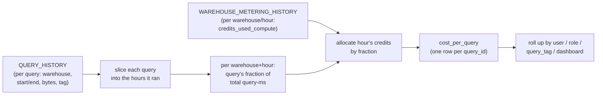
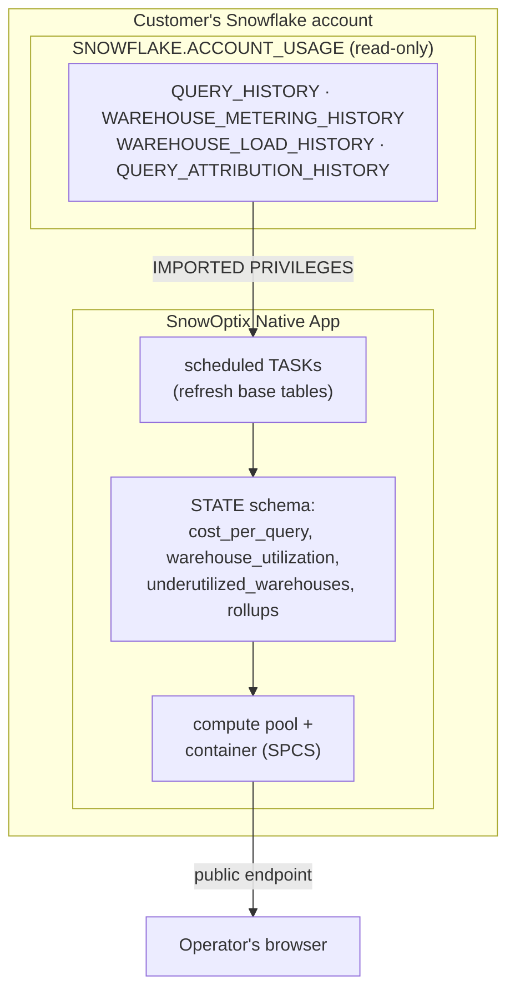

Snowflake bills compute by the second and tells you the total. It does not tell you which query, which dashboard, or which team spent it. That gap is where the bill grows quietly, because nobody can be handed a number they caused.

I ran into this at a previous company where the Snowflake bill kept climbing while the workload did not. So I built a tool to attribute cost down to the query, called SnowOptix. This is the engineering behind it: where the cost data lives, the apportionment math that reconstructs per-query cost from a system that only meters warehouses, the architecture that rolls it up to a team, and the numbers that came out.

SnowOptix went through the Snowflake Native App Accelerator, which came with Snowflake credits and support from the startup team. A global top-3 consulting firm became a design partner, and a US pharmacy-benefits company ran it in production. But the interesting part is the mechanism, so let me start there.

## Why the bill is opaque by default

Snowflake's billing unit is the credit, and credits are consumed by virtual warehouses while they run. An X-Small warehouse burns 1 credit per hour, and each size up roughly doubles that: Small is 2, Medium 4, Large 8. On-demand credits run about $2 to $4 each depending on edition, cloud, and region. So an X-Small left running around the clock is roughly 730 credits a month, on the order of $1,500 to $2,900 at those rates. A Medium is four times that.

Two facts make the bill hard to reason about. First, a warehouse bills while it is running, not only while a query executes; an idle warehouse with a generous suspend timeout costs real money doing nothing. Second, the warehouse is the billing unit, but many teams, dashboards, and pipelines share one. The native cost view tells you a warehouse cost X this month. It does not tell you that 60% of X came from ten queries behind one dashboard. To say that, you have to rebuild cost from the bottom up.

## The cost data lives in ACCOUNT_USAGE

Everything you need is in the `SNOWFLAKE.ACCOUNT_USAGE` schema. The views that matter for cost:

- **`WAREHOUSE_METERING_HISTORY`**: credits consumed per warehouse, per hour, split into `credits_used_compute` and `credits_used_cloud_services`. This is the source of truth for what you were billed.
- **`QUERY_HISTORY`**: every query, with its warehouse, start and end time, `bytes_scanned`, `query_tag`, `execution_status`, and the queueing and compilation timings. This is where behavior lives.
- **`WAREHOUSE_LOAD_HISTORY`**: `avg_running`, `avg_queued_load`, and related load signals per warehouse per hour. This is how you tell a busy warehouse from an idle one.
- **`QUERY_ATTRIBUTION_HISTORY`**: per-query compute credits, the view that did not exist when I started and changes the whole approach.

A caveat that bit me: this data is not real time. Latency on `QUERY_ATTRIBUTION_HISTORY` runs up to eight hours, and the other views lag by minutes to a couple of hours, so a cost dashboard built on them is a near-real-time view, not a live one. History goes back 365 days, which is plenty for finding patterns and nowhere near enough to be casual about retention if you want year-over-year.

## Reconstructing cost per query, two ways

The honest version of the story is that the right way to do this changed underneath me.

**The view that exists now.** `QUERY_ATTRIBUTION_HISTORY` exposes `credits_attributed_compute`: the warehouse credits used to execute a given query, including any resizing or multi-cluster autoscaling, attributed by the weighted average of resource consumption. That is exactly the apportionment problem you would otherwise have to solve yourself. If you are building this today, start here. It needs the `USAGE_VIEWER` or `GOVERNANCE_VIEWER` database role, and two limits matter: queries shorter than about 100ms are excluded because they are too brief to attribute, and the value explicitly excludes idle warehouse time, which is cost with no query attached at all.

**The way I had to do it first.** Before that view, you reconstructed per-query cost by joining `QUERY_HISTORY` to `WAREHOUSE_METERING_HISTORY` and apportioning each metered hour's credits across the queries that ran in that warehouse during that hour. This is the core of SnowOptix's `cost_per_query` table, and the math is worth seeing because it is the whole idea in four steps.

First, slice every query into the hours it touched, since a long query spans hour boundaries and the metering is hourly. Second, for each warehouse and hour, compute how many milliseconds each query ran inside that hour and what fraction of the hour's total query-milliseconds that is. Third, pull that hour's billed credits from metering. Fourth, hand each query its fraction of those credits:

```sql
-- per warehouse, per hour: each query's share of that hour's query time
fraction_of_total_query_time_in_hour =
    num_milliseconds_query_ran
  / SUM(num_milliseconds_query_ran)
      OVER (PARTITION BY warehouse_id, hour_start)

-- allocate that hour's metered credits by the fraction
allocated_compute_credits =
    credits_used_compute * fraction_of_total_query_time_in_hour
```

Sum a query's `allocated_compute_credits` across the hours it touched, multiply by the credit rate, and you have a cost per query. SnowOptix does the same for query-acceleration credits, weighted by `query_acceleration_bytes_scanned` instead of time, and apportions the daily cloud-services credits too, since cloud services are billed daily with a 10% free allowance against compute. The output is one row per `query_id` with a `query_cost`, joined back to every `QUERY_HISTORY` column so you keep the `user_name`, `role_name`, `query_tag`, and `warehouse_name` you need to roll it up.

It is an approximation. Weighting by wall-clock time treats a CPU-heavy query and an idle-waiting one the same when they overlap, which is the exact thing the new view handles properly by weighting on resource consumption. But it was close enough to rank queries by cost and find the expensive ones, which is all you need to act.



Either way, the move that matters is the rollup. Once cost is attached to a query, you roll it up by the dimensions people own: user, role, `query_tag`, or the dashboard a query belongs to. That is what turns "the warehouse cost X" into "your dashboard cost X," which is the sentence that changes behavior.

## What the numbers said

Two patterns produced almost all of the savings, and they are the two the native bill cannot show you.

**Idle warehouses, the bigger lever.** The largest single line item was warehouses running while idle. SnowOptix finds these by joining `WAREHOUSE_METERING_HISTORY` to `WAREHOUSE_LOAD_HISTORY` and looking at the utilization distribution per warehouse: the percentiles of `avg_running`, the credits per hour, and how much of that spend landed in hours where the warehouse was barely loaded. A warehouse set to suspend after 10 minutes of inactivity, queried in short bursts through the day, spends most of its metered time waiting. One warehouse idle the majority of an hour, at a Medium's 4 credits per hour, is most of $10 to $16 a day evaporating per warehouse, and there were many.

The fix is unglamorous:

```sql
ALTER WAREHOUSE bursty_pipeline_wh SET AUTO_SUSPEND = 60;
```

The tradeoff is real, since a suspended warehouse has a cold start and the first query after a resume is slower, so I left interactive BI warehouses with a longer timeout and tightened the pipeline warehouses that run in scheduled bursts. Auto-suspend, not query tuning, was the top of the savings list.

**A few queries, most of the compute.** The classic shape held: a small set of queries drove a large share of attributed compute. Roughly the top 10 queries by attributed cost accounted for well over half of it, usually full-table scans behind a dashboard that refreshed too often, or a join with no pruning. These are findable only once cost is per-query. The native view says the warehouse was busy. The attribution says it was busy doing the same expensive scan 200 times a day. The `bytes_spilled_to_remote_storage` and `partitions_scanned` columns on each enriched query row are the tells: a query spilling to remote storage or scanning every partition of a large table is the one to rewrite first.

Across idle-warehouse cleanup and the worst-offender query rewrites, a representative result was cutting compute spend on the order of 30 to 40% in the first month, most of it from auto-suspend. Treat that as representative rather than a promise; the exact figure depends entirely on how much idle time and how many runaway dashboards a given account has accumulated, and the accounts with the worst hygiene have the most to gain.

## The architecture: run the analysis where the data is

The detail that makes this practical: the analysis runs inside Snowflake rather than pulling `ACCOUNT_USAGE` out to an external system. SnowOptix ships as a Snowflake Native App with Snowpark Container Services. The app's setup script builds the cost tables in the consumer's own account, a containerized backend serves the dashboard from a compute pool, and a set of scheduled tasks refresh the base tables on a cadence.



Three architecture choices fall out of running native rather than external.

**Imported privileges, not data export.** The app requests `IMPORTED PRIVILEGES ON SNOWFLAKE DB` so it can read `ACCOUNT_USAGE`, plus `EXECUTE TASK` and `MANAGE WAREHOUSES` for the refresh jobs. The customer's cost and query metadata never leaves their account, which is the first question a security team asks. The alternative, shipping gigabytes of query history over the wire to grade it elsewhere, is both slower and a non-starter for a regulated customer.

**Scheduled tasks do the heavy lifting on a schedule.** The cost-per-query reconstruction is not cheap to compute, so it runs as background tasks that materialize the `STATE` tables (`cost_per_query`, `warehouse_utilization`, `underutilized_warehouses`, and the per-team rollups), and the dashboard reads those tables. The analysis is itself a workload with a Snowflake bill, so it runs on a small dedicated warehouse and the tasks are sized to refresh, not to run continuously.

**The container suspends like everything else.** The backend runs in a container on a compute pool, and the compute pool honors `AUTO_SUSPEND_SECS` exactly the way a warehouse honors `auto_suspend`: a suspended pool incurs no compute cost. So the cost tool is subject to its own advice. Going through the Native App Accelerator forced this architecture to be real rather than a prototype, and the credits covered the compute the analysis itself consumed. A cost tool has a Snowflake bill, and the first thing it has to get right is its own.

Cortex covers the in-database AI work, turning a ranked list of expensive queries and idle warehouses into plain-language recommendations without sending query text to an external model. The same principle holds: the analysis sits next to the data instead of shipping it out to grade it.

## Key takeaways

Snowflake's cost model is simple to state and hard to manage: you pay for warehouse seconds, and the warehouse is too coarse a unit to assign blame. The whole game is getting from the warehouse down to the query and back up to the team.

- Cost data lives in `ACCOUNT_USAGE`. Start from `QUERY_ATTRIBUTION_HISTORY` for per-query credits and `WAREHOUSE_METERING_HISTORY` for the billed total; use `WAREHOUSE_LOAD_HISTORY` to separate busy from idle.
- If you reconstruct cost yourself, the math is an hourly apportionment: split each warehouse-hour's metered credits across its queries by each query's fraction of execution time in that hour.
- Attribute idle time separately. It is not in the per-query view and it is often the largest line item.
- Auto-suspend before query tuning. `ALTER WAREHOUSE ... SET AUTO_SUSPEND = 60` on idle warehouses is the cheapest large saving, with a cold-start tradeoff you tune per workload.
- Run the analysis where the data is. A Native App on Snowpark Container Services keeps `ACCOUNT_USAGE` in the customer's account and makes the cost tool subject to its own advice.
- Roll cost up to a dimension someone owns. A number nobody caused never gets fixed.

If you are staring at a Snowflake bill that grows faster than your workload, that gap between the total and the cause is where to look first.
