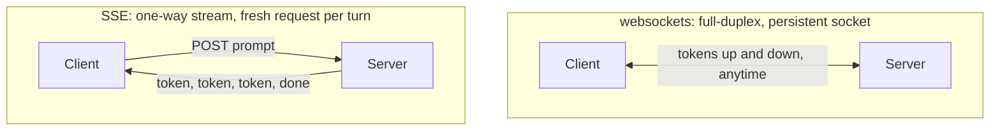
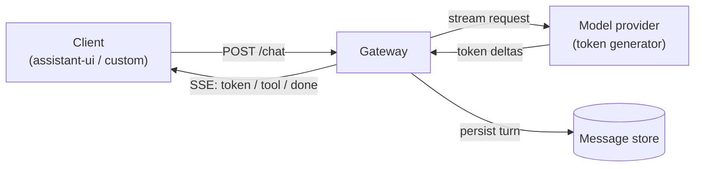
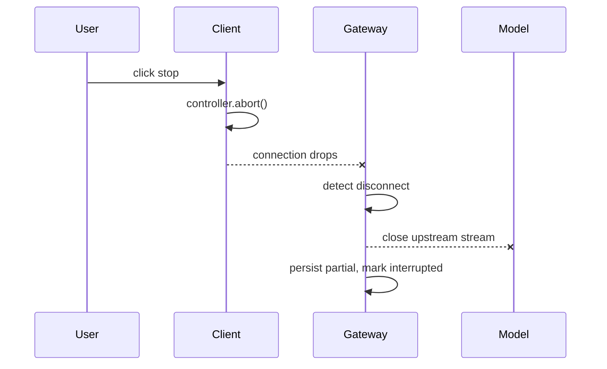

Two terms first, since the whole thing rests on them.

- A **token** is the unit a language model generates. Not a word and not a character, but a chunk of text the model emits one at a time, like `" stream"` or `"ing"`. A model does not write a sentence and hand it over. It produces token, then next token, then next, each conditioned on everything before it.
- **Streaming** means forwarding each token to the reader the instant it is produced, instead of buffering the whole answer and sending it at the end.

That is the entire idea. Everything below is the engineering around it.

I will build this up the way I would explain it to someone who has used ChatGPT and now has to build the thing. Start with why streaming matters at all, then the transport, then the state on each side, then the parts that bite: cancellation, partial rendering, and tool calls. Concrete code is from `alfred-os` (`github.com/luminik-io/alfred-os`), an open-source agent fleet whose web UI streams a live transcript over SSE.

## Why streaming matters

A model emits tokens at some rate, say 30 to 80 per second. A 600-token answer therefore takes 8 to 20 seconds to finish generating. You have two options for the reader:

- **Buffer.** Wait for all 600 tokens, then send the message. The reader sees a spinner for the full 8 to 20 seconds, then a wall of text appears at once.
- **Stream.** Send each token as it lands. The reader sees the first word in under a second and reads along as the rest arrives.

The model is exactly as fast either way. What changes is the number the reader feels, which is **time-to-first-token**, not total time.

Real-world version: a kitchen can plate a tasting menu course by course as each is ready, or hold everything in the pass until the last dish is done and run all six out cold together. Same total cook time. One feels like a meal, the other feels like waiting in an empty dining room. Streaming is coursing the meal.

There is a second, quieter reason. A streamed reply is **interruptible**. The reader can see the model heading the wrong way after two sentences and hit stop, instead of paying for and waiting on 600 tokens of wrong answer. Buffering forecloses that. Streaming makes the turn a live thing the reader can steer, and that is most of why a chat UI feels like a conversation rather than a form submission.

## The transport: SSE vs websockets

The token has to travel from server to browser. Two transports dominate, and for chat the choice is usually clear.

**Server-Sent Events (`SSE`)** is a long-lived HTTP response with `Content-Type: text/event-stream`. The server holds the response open and writes framed text events into it as they happen. The browser reads them with the built-in `EventSource`, or by reading the `fetch` response body as a stream. It is one-directional: server to client only.

**Websockets** upgrade a single HTTP connection into a full-duplex byte pipe. Both sides can send anytime, with low overhead per message. It is two-directional and persistent.

The shape of a chat turn decides the winner:

- The server sends **many** messages per turn (one per token).
- The client sends **one** message per turn (the user's prompt), as an ordinary request.

That is one-directional streaming with an occasional fresh request the other way, which is exactly what `SSE` is for. You get automatic reconnection, plain HTTP that any proxy and CDN already understand, and no special server runtime.



Use websockets when you genuinely have **two-way, low-latency** traffic on one connection: live multi-user editing, presence and cursors, voice or audio, a game. For a chat UI you do not, and a websocket buys you a stateful connection to manage, a heartbeat protocol to write, and reconnection logic you have to build yourself, in exchange for a direction you never use.

Alfred makes this call explicitly. Its live transcript tail is an open GET, so it rides `EventSource` directly. Its compose turn needs an auth header, and `EventSource` is GET-only and cannot set one, so that path streams `SSE` frames over a `fetch` POST instead. Same wire format, two ways to open it, websockets nowhere in sight. From the client comment:

```ts
// A minimal SSE parser over a fetch ReadableStream. Yields one frame per
// `event:`/`data:` block. Used for the converse POST stream (EventSource is
// GET-only and cannot send the token header); the log tail uses EventSource
// directly since it is an open GET.
```

### What an SSE frame looks like on the wire

The format is deliberately small. An event is a few `text` lines and a blank line to terminate it:

```
event: token
data: {"text": "Hello"}

event: token
data: {"text": " there"}

event: done
data: {"offset": 412, "reason": "complete"}

```

A line starting with `:` is a comment and is ignored by the client. That detail matters for keep-alives, which I will come back to. Alfred frames every event through one helper, so the format lives in one place:

```python
def _sse(event: str, data: Any) -> bytes:
    """Frame one Server-Sent Event. ``data`` is JSON-encoded on one line."""
    payload = json.dumps(data, ensure_ascii=False)
    return f"event: {event}\ndata: {payload}\n\n".encode()
```

## A clean architecture

Before the state details, the shape of the whole system. Four components, each with one job.



- **Client.** Sends the prompt, reads the `SSE` stream, appends deltas into one growing assistant message, and renders it. Can be hand-rolled or a library like `assistant-ui`, which gives you the message-list, the streaming renderer, and the stop button out of the box.
- **Gateway.** Your server. It owns auth, the message store, and the loop that pulls tokens from the model and re-frames them as `SSE` events for your client. It is the only stateful piece.
- **Model provider.** Generates tokens. You stream from it the same way the client streams from you, so the gateway is a translator with the provider's stream on one side and your `SSE` stream on the other.
- **Message store.** The durable record of the conversation. The stream is ephemeral; the store is the truth.

The single load-bearing idea: **the gateway translates one stream into another.** It does not buffer the model's full answer and then stream it to the client. It forwards each delta the moment it arrives, so the client's time-to-first-token is the model's time-to-first-token plus a few milliseconds. (This is the same impedance-matching shape as a [multi-model proxy](/blog/multi-model-proxy): two streams that almost agree, reconciled in the middle.)

## Server-side message state

The server holds three things during a turn, and conflating them is the most common early bug.

- **The model stream.** The live connection to the provider, producing deltas. Ephemeral. Gone when the turn ends.
- **The outbound `SSE` stream.** The framed events going to this one client. Also ephemeral, and tied to one HTTP response.
- **The persisted message.** The row in the store. Durable, and the only thing that survives.

The turn loop is small:

1. Append the user message to the store.
2. Open a streaming request to the model.
3. For each delta, frame it as an `SSE` event and write it to the response.
4. Accumulate the deltas server-side into the full assistant text.
5. On completion, persist the assistant message and send a terminal `done` event.

Step 4 is the one people skip. **The server must accumulate the full text even though it is also streaming it**, because the durable message is built from the accumulation, not reconstructed from what the client happened to receive. If the client drops at token 300, the store still gets all 600. Alfred does exactly this in its converse stream: a worker thread runs the turn and tees assistant text to a transcript, while the async generator tails that transcript and emits each new fragment as a `token` event. The persisted transcript is the truth; the stream is a view of it.

```python
async def stream_converse_turn(...) -> AsyncIterator[bytes]:
    # run_turn() runs the blocking model turn on a worker thread and tees
    # assistant text to transcript_path. This generator tails the transcript
    # and emits each newly seen fragment as a `token` SSE event.
    ...
    yield _sse("open", {})
    emitted = 0
    while not done_event.is_set():
        tokens = await run_in_threadpool(_safe_extract, extract_tokens, transcript_path)
        if len(tokens) > emitted:
            for fragment in tokens[emitted:]:
                yield _sse("token", {"text": fragment})
            emitted = len(tokens)
        await asyncio.sleep(poll_seconds)
```

Note the `emitted` counter. It is the byte-offset idea in miniature: track how much you have sent, send only what is new. That single integer is what makes the stream resumable and idempotent. Alfred's log tail generalizes it to a real byte `offset` into the transcript file, so a reconnecting client passes its last `offset` and gets only the bytes it missed.

### Keep the socket warm

A long turn has silent stretches: the model is thinking, no tokens for several seconds. An idle proxy or load balancer can reap a connection it thinks is dead, killing the stream mid-turn. The fix is a heartbeat: an `SSE` comment line every so often, which a spec-compliant client ignores but which keeps bytes flowing through the proxy.

```python
def _sse_comment() -> bytes:
    """A Server-Sent-Events comment line (keep-alive).

    Comment lines start with ``:`` and carry no ``data:`` field, so a spec
    compliant client ignores them. They exist solely to push bytes through
    idle proxies so the connection is not reaped mid-turn.
    """
    return b": keep-alive\n\n"
```

Alfred emits one every `ALFRED_SSE_HEARTBEAT_SECONDS` (default 15) when there is no new content. I underestimated this until a stream died silently behind a proxy with a 60-second idle timeout. The heartbeat is five lines and it is the difference between a stream that survives a thinking model and one that does not.

## Client-side message state

The client's job is the inverse, and simpler than it looks. It holds **one** assistant message object whose `text` grows. Each `token` event appends to it. The renderer re-renders that one message on each delta.

The whole list is something like:

```ts
type Message = { id: string; role: "user" | "assistant"; text: string };
```

A token arrives, you append to the last assistant message's `text`, React (or whatever) re-renders. That is it. The mistake is creating a new message per token, or appending to the array instead of mutating the last element's text. One message, growing.

Alfred's `SSE` reader shows the parsing loop. It reads the `fetch` body as a stream, decodes bytes, and splits on the blank-line frame separator:

```ts
const reader = body.getReader();
const decoder = new TextDecoder();
let buffer = "";
for (;;) {
  if (signal?.aborted) return;            // cancellation, see below
  const { value, done } = await reader.read();
  if (done) break;
  buffer += decoder.decode(value, { stream: true });
  let sep = buffer.indexOf("\n\n");        // frames end on a blank line
  while (sep !== -1) {
    const block = buffer.slice(0, sep);
    buffer = buffer.slice(sep + 2);
    const frame = parseSseBlock(block);    // -> { event, data }
    if (frame) yield frame;
    sep = buffer.indexOf("\n\n");
  }
}
```

Two details worth naming:

- **Decode with `{ stream: true }`.** A multi-byte UTF-8 character (an emoji, a non-Latin glyph) can land split across two network chunks. Streaming-mode decoding holds the partial bytes until the rest arrives, so you never render a mojibake half-character.
- **Buffer until you see a full frame.** A frame can arrive split across reads. You accumulate into `buffer` and only parse once you find the `\n\n` separator. A half-frame is held, not dropped.

## Rendering partial tokens

Appending text is easy. Rendering it well, while it is still half-written, is where chat UIs feel cheap or polished.

- **Markdown mid-stream is malformed.** A token stream produces `` ```pyth `` before it produces the closing fence. A naive markdown renderer sees an unterminated code block and paints the rest of the message as code. Either render the streaming text as plain text and re-render as markdown on `done`, or use a streaming-tolerant markdown parser that handles open constructs. `assistant-ui` handles this for you, which is a real reason to reach for it.
- **Do not re-layout the world per token.** At 60 tokens a second you get a render every 16ms. Keep the per-delta work to appending into one text node. Avoid re-parsing the entire message on every token if you can append instead.
- **Autoscroll, but yield to the reader.** Stick to the bottom as tokens arrive, but the moment the reader scrolls up, stop forcing them down. Nothing feels worse than fighting the scroll while trying to read what already streamed.
- **Show the turn is live.** A cursor or a subtle pulse at the tail tells the reader tokens are still coming. When `done` lands, drop it.

## Cancellation

The stop button is not optional, and doing it right means both ends cooperate.

**Client side.** Hold an `AbortController`. Wire its `signal` into the `fetch`. On stop, call `abort()`. The reader loop checks `signal.aborted` and returns, the `fetch` tears down, and you stop appending. Alfred's reader checks the signal at the top of every iteration (the `if (signal?.aborted) return;` above) and on every `reader.read()`.

**Server side.** This is the half people forget. When the client aborts, the HTTP connection drops, but the model generation does not stop on its own. **An abandoned generation keeps producing tokens you are paying for.** The server has to notice the dropped connection and stop pulling from the model. In an async server you detect the client disconnect and break the turn loop, which closes the upstream model stream.

**Persist the partial.** A cancelled turn still happened. Whatever text arrived before the abort is a real assistant message and should be saved as one, marked interrupted. If you throw it away, the reader hits stop and watches their conversation lose a turn, which reads as a bug. Save the partial, mark it, move on. This mirrors Alfred's never-lose-work rule from running [unattended agents](/blog/loops-harnesses-memory): a run that did real work and then failed to commit should still leave the work recoverable.



## Streaming tool calls

This is the part that separates a chat toy from an agent, and it is genuinely harder than streaming text. The reason is structural.

- **Text deltas are independent.** Each fragment (`"Hel"`, `"lo"`) is printable on its own. Append on arrival. Stateless.
- **Tool-call deltas are not.** A tool call streams as a name, an index, and then a run of fragments of a JSON arguments string: `'{"ci'`, `'ty": "Ber'`, `'lin"}'`. None of those fragments is valid JSON. They mean nothing until the last one lands and the whole string parses. Stateful.

So a streamed tool call has to be **accumulated per call index** and only acted on once complete:

1. A start event names the tool and assigns an index.
2. A run of argument-delta events each carry a fragment of the JSON string. Append each to a per-index buffer.
3. A stop event for that index. Now parse the accumulated buffer as JSON. If it parses, you have the full call: run the tool.

You cannot execute a tool on half its arguments, so unlike text, you cannot act on the fly. You buffer until the call is whole. Alfred hit the exact same wall in its OpenAI-to-Anthropic bridge and documented it as a hard limitation rather than half-solving it:

```python
# Limitation: streaming tool calls are not translated. Anthropic streams tool
# use as content_block_start + input_json_delta events, which require stateful
# accumulation the stateless line translator does not do; those events are
# skipped. Non-streaming requests return tool calls correctly.
```

That is the honest version of the tradeoff. A stateless line-by-line translator cannot reassemble a tool call, because reassembly is stateful by definition. If your translator is stateless, streamed tool calls are off the table and you fall back to a non-streaming request for tool turns, where the whole response is available to parse in one pass. If you want streamed tool calls, you accept the per-index accumulation state. Pick one on purpose; do not discover it in production.

A related trap from the same bridge: the **terminal event must be emitted exactly once**. OpenAI marks the end of a turn with a single chunk carrying a non-null `finish_reason`. Anthropic spreads it across a `message_delta` (the stop reason) and a separate `message_stop`. Map both to a finish and you emit two terminals, and the client hangs or truncates because a second `finish_reason` is not something it expects. One terminal event, exactly once. In Alfred's own `SSE` vocabulary this is the single `done` event that closes the stream.

## The full event vocabulary

Pulling it together, a clean chat stream needs a small, fixed set of event types. Alfred's converse stream uses almost exactly this set:

| Event | Meaning | Client action |
|---|---|---|
| `open` | Stream is live | Create the empty assistant message |
| `token` | A text delta | Append to the current message's text |
| `tool` | A tool-call delta | Accumulate per index; run on complete |
| `result` | Reconciled final payload | Replace streamed text with canonical text |
| `done` | Turn finished, exactly once | Stop the cursor, finalize the message |
| `error` | The turn failed | Surface it; keep any partial text |

Keep the vocabulary this small. The runner emits a known token and the client follows a known branch, the same discipline as a [sentinel taxonomy](/blog/loops-harnesses-memory) for unattended runs: never parse freeform output, always switch on a known event type.

## Putting it on a page with assistant-ui

You can hand-roll the client, and the reader loop above is most of it. But the rendering details (streaming-tolerant markdown, autoscroll that yields, a stop button wired to an `AbortController`, a message list that grows one message in place) are the same on every project and easy to get subtly wrong.

`assistant-ui` is an open-source React component set built for exactly this. It gives you the message list, the streaming renderer, the composer, and the stop button, and you wire it to a runtime that calls your gateway and yields deltas. The win is that the parts most likely to feel cheap (mid-stream markdown, scroll behavior, cancellation) are already handled, and you keep ownership of the gateway, the model calls, and the store, which is where your actual product logic lives.

A reasonable split:

- **`assistant-ui`** owns the rendering, the message-state-in-place, and the stop button.
- **Your gateway** owns auth, the model stream, the `SSE` framing, and the persisted store.

You can always drop to a custom client later. The wire format does not change, because the wire format is just `SSE` frames.

## Key takeaways

- Streaming does not make the model faster. It moves the perceived wait from total answer length to time-to-first-token, and it makes a turn interruptible, which is most of why chat feels like a conversation.
- Use `SSE` for chat. The traffic is one-directional streaming plus a fresh request per turn, which is exactly `SSE`'s shape. Reach for websockets only for true two-way low-latency traffic.
- The gateway translates one stream into another. Forward each delta the instant it arrives; do not buffer the full answer first.
- The server must accumulate the full text while streaming it, because the durable message is built from the accumulation, not from what the client happened to receive. Track an `offset` or counter so reconnects send only what is new, and emit a heartbeat comment so idle proxies do not reap the socket.
- The client holds one growing assistant message, decodes with `{ stream: true }`, and buffers until it sees a full frame. Render streaming text plainly and re-render markdown on `done`.
- Cancellation is two-sided: `AbortController` on the client, disconnect detection on the server so an abandoned generation stops costing tokens, and persist the partial so a cancelled turn is still a real message.
- Streamed tool calls need stateful per-index accumulation because argument fragments are meaningless until the whole JSON parses. Emit the terminal event exactly once. Keep the event vocabulary small and switch on known types.
