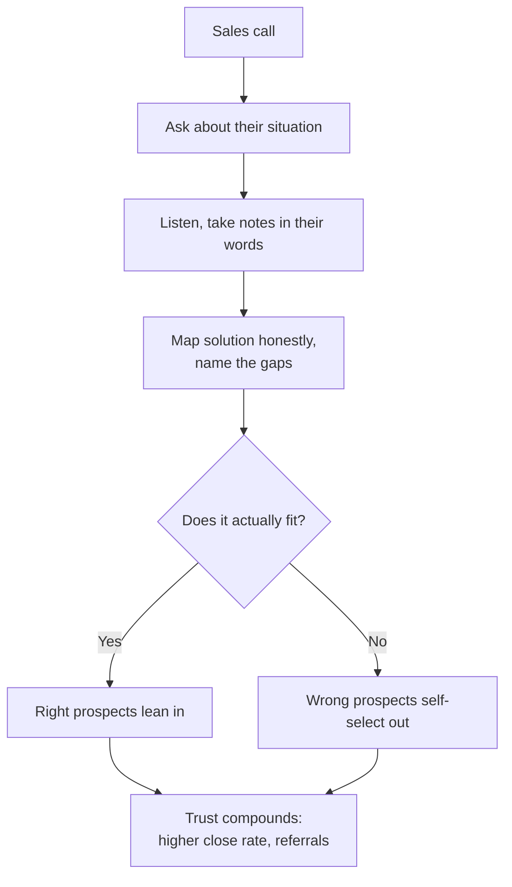
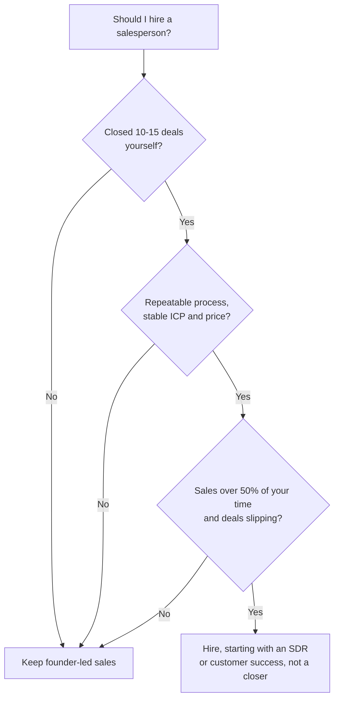

There is a persistent belief in startups that engineers cannot sell. Too introverted, too technical, too focused on features instead of benefits, so hire a "real salesperson" as soon as you can afford one.

I believed it for years. Then, at Mainteny, I had to sell, because early-stage startups do not have a clean division of labor where one person builds and another sells. Everyone sells. So I started taking calls, running demos, and talking to prospects, and I was decent at it. Not because of charisma or memorized closing techniques. I was decent because I understood the product, the problem it solved, and the technical world our customers lived in. That understanding turned out to be the advantage, and this post is about why, reasoned from first principles, and how to use it.

## Why the myth is now backwards

The belief that engineers cannot sell comes partly from the Hollywood stereotype of the socially awkward engineer, and partly from a real observation: many technical people are uncomfortable with traditional sales tactics. The pushy close, the artificial scarcity, the "always be closing" script. That discomfort is real. What changed is that those tactics stopped working.

Modern B2B buyers are hard to manipulate. They have search, they have peers in LinkedIn and Slack communities, and they compare notes. They do not need a salesperson to tell them what your product does. They need someone who can help them figure out whether it fits their specific situation. That is not a sales skill in the old sense. It is a problem-understanding skill, which is exactly what engineers have.

> "The best salespeople don't sell. They help people buy."\
> Josh Braun

When I was at Bain building Aura, the internal sales that worked were never the flashy presentations. They were someone understanding a partner's problem, showing exactly how the tool worked, and being honest about what it could and could not do. The partners who adopted Aura most enthusiastically were the ones who felt helped, not sold to.

## First principles: what a B2B buyer is actually buying

A buyer of B2B software is not buying software. They are buying a solution to a problem they own, usually a problem with real consequences for their quarter or their career. That reframes the whole interaction. The person best positioned to help is the one who understands the problem and the solution most deeply. For your product, that is you.

Here is the moment it became concrete. On a call at Mainteny, a prospect who was evaluating us against two competitors asked a detailed technical question about how our system would handle a specific edge case in their workflow. It was the kind of question that usually gets a "let me get back to you on that." But I had built that part of the system, so I walked him through how it worked, why we designed it that way, and the tradeoffs, and then I pointed out a limitation he had not asked about but would hit given his use case, and suggested a workaround. He signed that week. Later he told me the competitors' reps could not answer his technical questions and had to check with their product team, and that delay and uncertainty cost them the deal.

That is the structural advantage. You do not have to check with anyone. You are the product team. You can go deeper on the technical question than any rep working from a feature list, and in B2B software that question is often the one that decides the deal.

### Selling the design before the product exists

The sharpest version of this for me was the first real contract I closed. The customer was a roughly 200-person identity-verification (IDV) company headquartered in New York, the kind of buyer with engineers of their own who ask hard questions and expect real answers. The contract was around \$48K, and I signed it before the product was finished.

That sounds reckless until you see why it worked. I was not selling a finished thing. I was selling a credible account of exactly how the thing would work, and I could give that account because I was the one building it. When their technical people pushed on integration details and edge cases, I answered from inside the design rather than deflecting, and I was honest about what existed and what did not yet. You can sell the design before the product exists, but only if you are the builder. That is the advantage stated in its strongest form.

## The mental shift: help, don't pitch

The shift that changed things for me is small to state and hard to do: stop treating a sales call as a chance to pitch, and treat it as a chance to help.

Josh Braun calls this selling without being salesy. Your job is not to convince someone to buy. It is to help them figure out whether what you have fits what they need. If it does, good. If it does not, that is useful information for both of you, and saying so early is what makes them trust you when you say the fit is good.

I think about cold outreach the same way: genuinely useful, no expectation, get into the buyer's world, their pains and their workflows, and never treat it as a transaction. Rob Snyder's framing stuck with me: look at what is on the buyer's Kanban board for the quarter, the half, the year, and work together to hit those outcomes. The sale follows from that. Patience and no expectations are the price of entry.

Here is what it looks like in practice. This is a LinkedIn message I sent a marketing leader. Almost every line is about her, not us: it opens on her spend, names the specific way her kind of team gets stuck, and asks a real question.

Hi \[Name\], you put real budget into conferences, and if your team is like most B2B teams, events drive 30 to 40% of pipeline. The hard part is proving it. Three things usually break: picking the conferences where your target accounts actually show up, getting meetings booked before you land, and tracking ROI and follow-ups so the spend holds up when finance asks.

Which of those three is the messiest for you right now?

For context, I am taking on a few design partners to fix exactly this. As a venture CTO at Bain I saw PE-backed teams 3 to 5x their event ROI once they got it right.

What made it land is what is missing from it: no product name, no calendar link, no "quick 15 minutes," and almost no "I." It opens on her spend, names the problem in her words, and asks which part hurts most. She replied, and the reply is the tell that it worked.

We are a small team, around 100 people, with a focused 2025 marketing budget. We have already picked our 6 conferences and are planning private networking dinners around them. Would we even be a fit for what you do? And which of these activities would you actually take off our plate?

That is not a polite brush-off. She gave me her team size, her budget posture, and her exact plan, then asked two real questions. She was doing discovery on me. From there it is not a pitch, it is a working session: we walk her real plan, I am honest about which parts I can help with and which I cannot, and if the match, timing, and budget line up, we keep going. That whole exchange happened because the first message tried to be useful, not to sell.

Before one enterprise marketing team started working with us, I had several conversations with their senior marketing director, all about how they invest in events, what they were seeing, and the specific outcomes they wanted. None of those calls was a pitch. For that person it was a project they were driving, possibly tied to their own promotion, and my job was to be positioned to help them hit it. Match, timing, and budget all have to line up. I would not even call it a sale. It is someone deciding to bring you onto their team to reach a goal.

This feels natural to engineers because it is how we already approach problems. Understand the problem, consider solutions, weigh tradeoffs, recommend based on the specific context. On a sales call that means asking genuine questions, listening, and honestly mapping your solution to their needs, gaps included.

Giving people a genuine way to say no has a counterintuitive effect: it raises your close rate. When you are honest about a limitation, they believe you about the strengths. When you focus on helping rather than closing, the right prospects lean in and the wrong ones self-select out, which saves everyone time.

## Engineers do discovery well

Discovery is understanding a prospect's situation before proposing anything, and it is where most sales processes break. Traditional reps rush it to get to the pitch, asking a few token questions before launching into a demo script. Engineers are almost pathologically inclined the other way: we want to understand the problem before suggesting a solution, we are uncomfortable recommending without context, and we ask follow-ups because we care about the edge cases. That instinct is an asset here, not a liability.

Good discovery questions from a technical founder:

- "Walk me through how you're handling this today."
- "What does your current tech stack look like?"
- "Where does the process break down?"
- "What have you tried that didn't work?"
- "If you could wave a magic wand, what would the ideal solution look like?"
- "Who else is involved in making this decision?"
- "What's driving the timeline on this?"

Ask these with real curiosity, not as a checklist. The best sales conversations feel like technical design discussions: both sides trying to figure out the right solution to a real problem. Sometimes the solution is your product and sometimes it is not, and either way you have had a useful conversation that the prospect remembers.

## Handle objections with honesty

Traditional sales training teaches you to overcome objections with clever rebuttals. Engineers struggle with this because it feels manipulative, and it feels manipulative because it is. You do not need the tricks. Honesty works better and is easier to sustain.

An objection is information. The prospect is telling you something about their needs or concerns, and dismissing it or spinning it away is the worst response. If the objection is valid, if your product genuinely has the limitation they are worried about, acknowledge it directly, then do three things: explain why the limitation exists, describe what you are doing about it if anything, and help them judge whether it is a dealbreaker for their situation. Prospects do not trust a seller who has an answer for everything. They trust the one who is honest about tradeoffs, and as the builder you can be specific about exactly which tradeoff and why.

At Luminik I have had calls where prospects asked about features we do not have yet. Instead of "we're working on it," I tell them where it sits on the roadmap and why other things are ahead of it. Sometimes they are fine waiting and sometimes it is a dealbreaker. Both beat setting a false expectation you will have to walk back later.

The strongest move in this category took me a while to learn: saying "I don't know" helps your credibility rather than hurting it. When you pretend to know something you do not, people can usually tell, and if they cannot tell now they will find out later, and then they stop trusting everything else you said. "That's a great question, I'm not sure, let me find out and get back to you," followed by actually following through within 24 hours with more detail than they expected, turns a gap into a trust-building moment. As a technical founder you will still hit the edges of your own knowledge: an unusual integration, an untested edge case, an odd pricing configuration. "I don't know, but I'll find out" is the right answer in all of them, and the follow-through is the whole point.

## Practical tactics

The specifics that have worked for me.

- **Structure the call, loosely.** Opening to build rapport and set the agenda, discovery to understand the situation, a targeted demo or discussion, and clear next steps. The structure keeps you on track while leaving room for a real conversation.
- **Demo less, talk more.** Engineers love showing what they built. Resist it. A targeted 10-minute demo of the parts that fit their use case beats a 45-minute feature tour every time.
- **Take notes in their words.** Not for the CRM, but so you can say "earlier you mentioned X was a problem, here's how we handle that," which lands harder than any generic feature description.
- **Send a summary after every call, within 24 hours.** What you discussed, what you understood their needs to be, and the agreed next steps. It shows professionalism, creates accountability, and gives them something to forward to other stakeholders.
- **Use the negative close.** Instead of pushing for a commitment, offer an easy out: "Based on what we discussed, is this worth continuing, or not the right fit?" Removing the pressure makes a genuinely interested prospect more likely to say yes.
- **Follow up without being annoying.** Many engineers are so afraid of being pushy that they do not follow up at all, which is its own mistake. Set a cadence, maybe day 3, day 7, day 14, and a simple "checking in, any other questions?" until they respond either way.
- **Get comfortable with silence.** After you ask a question, wait. Do not fill the gap. Silence often prompts a prospect to share more than they planned.
- **Record your calls, with permission, and review them.** You will notice the patterns: questions you ask poorly, moments you talked too much, objections you could have handled better. That is how the skill improves.

## When to keep selling, and when to hire

The question every technical founder eventually hits: when do I stop doing sales myself and hire someone? The conventional answer is "as soon as possible," and I think that is wrong. The reason is first-principles: you cannot hire someone to execute a sales playbook that does not exist yet, and until you have sold enough yourself, the playbook does not exist.

Founder-led sales pays off early in ways a rep cannot replicate. You learn objections firsthand, you make product decisions from what you hear on calls, and you build relationships with early customers that pay off for years. And you have not yet answered the questions a playbook needs: what is the [ideal customer profile](https://en.wikipedia.org/wiki/Ideal_customer_profile), what messaging resonates, what is the right price, which objections recur, how long is the cycle. Keep selling yourself until you have.

Keep doing sales yourself if you have not closed roughly 10 to 15 customers, you cannot yet articulate a repeatable process, your ICP or pricing is still moving, your cycles need deep technical credibility, or you are simply not yet overwhelmed by the workload. Consider hiring when you have a documented, repeatable process, sales is eating more than half your time, the product needs attention more than sales does, deals are slipping through the cracks, and you can afford to pay a good person properly and measure them.

Even then, your first hire probably should not be a quota-carrying closer. An SDR who handles outbound and qualification, or a customer-success person who takes the post-sale work, extends your capacity without replacing the thing that is working, which is you in the room. When you do hire a seller, look for someone who matches the consultative approach. The "always be closing" type will feel wrong to you and alienate the customers you spent months earning trust with.

This is how I built the team at Mainteny. I kept doing the selling while I brought in a trusted former colleague, Dapeng, part-time to extend engineering capacity, then hired my first full-time engineer, Ayobami, who relocated from Nigeria to Oslo to join us. Over time the team grew to about fifteen people, and I was managing engineers across Norway, Germany, India, Croatia, and Nigeria. None of that replaced founder-led sales. It freed me to keep doing it.

## The advantage, stated plainly

Being uncomfortable with the old sales tactics is aligned with how modern B2B sales actually works. Buyers do not want to be sold to. They want to be helped by someone who understands their problem and will have an honest conversation about solutions, and they will take technical credibility over charisma. As a technical founder you have all of that already. The work is to stop trying to be something else.

The engineer who understands the product, asks thoughtful questions, gives honest answers, and follows up reliably will outsell the smooth rep working from a script, because of trust rather than technique. And trust compounds. The prospect you helped today, even if they did not buy, remembers it. They come back when the timing is right, they refer a colleague, they buy at their next company. Sales is building relationships with people who have problems you can solve, and solving problems is the thing engineers are already good at. It turns out we can be good at the relationships too.

## Key takeaways

- Product depth beats sales technique. The founder who built the system can answer the edge-case question on the spot, and that answer is often what decides the deal.
- A buyer is buying a solution to a problem they own, not software. Help them decide if you fit, and give them a real way to say no, and your close rate goes up because the honesty makes them believe you about the strengths.
- You can sell the design before the product exists, but only if you are the builder. That is how I signed a roughly \$48K contract with a 200-person IDV company in New York before the product was finished.
- "I don't know, but I'll find out," plus fast follow-through, builds more trust than pretending to have every answer.
- Demo less, talk more. A targeted 10-minute demo of the parts that fit their use case beats a 45-minute feature tour.
- Do not rush to hire a rep. You cannot hand off a playbook that does not exist yet, so keep founder-led sales until you have a repeatable process, a stable ICP and price, and roughly 10 to 15 closed deals of your own.

These lessons come from Mainteny, Bain, and now Luminik. If you are a technical founder figuring out sales for the first time, I am happy to share what I have learned. Not a pitch, just a conversation between founders.
