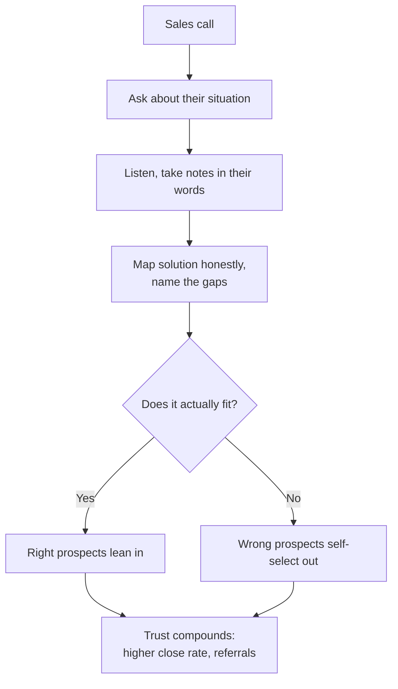
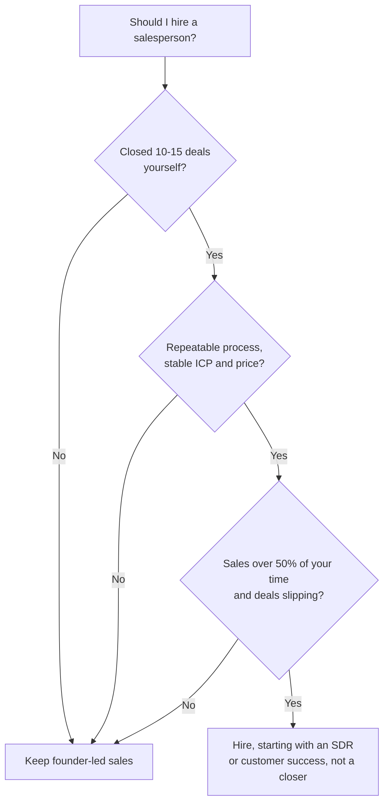

There's a persistent myth in startups that engineers can't sell. That we're too introverted, too technical, too focused on features instead of benefits. That we need to hire a "real salesperson" as soon as possible.

I believed this for years. Then I tried selling.

At Mainteny I was the technical co-founder. I was supposed to build the product while someone else figured out how to sell it. But early-stage startups don't work that way. Everyone sells. So I started taking calls, doing demos, and talking to prospects.

Something surprising happened. I was pretty good at it. Not because I had natural charisma or had memorized clever closing techniques. I was good at it because I understood the product, the problem it solved, and the technical world our customers operated in.

That understanding turned out to be a real advantage.

## Where the myth comes from

Partly Hollywood stereotypes of socially awkward engineers. Partly the real observation that many technical people are uncomfortable with traditional sales tactics.

But the traditional sales tactics work less and less anyway.

The pushy closer. The artificial scarcity. The manipulation techniques. The "always be closing" mentality. These are uncomfortable for engineers, and they're increasingly ineffective for everyone. Modern B2B buyers are sophisticated. They recognize manipulation quickly. They have Google. They talk to each other on LinkedIn and in Slack communities. They don't need a salesperson to tell them about your product. They need someone to help them figure out if it's right for their situation.

That's what engineers are good at.

> "The best salespeople don't sell. They help people buy."\
> Josh Braun

When I was at Bain building Aura, I watched how the most successful internal sales happened. It wasn't flashy presentations or clever persuasion. It was understanding someone's problem, showing them exactly how the solution worked, and being honest about what it could and couldn't do. The partners who adopted Aura most enthusiastically were the ones who felt helped, not sold to.

## Why product knowledge beats sales techniques

Let me tell you about a call I had at Mainteny. The prospect was evaluating us against two competitors. He'd already seen their polished demos with all the usual bells and whistles.

During our call he asked a technical question about how our system would handle a specific edge case in their workflow. It was detailed, the kind that usually gets a "Let me get back to you on that."

But I built that part of the system. So I walked him through how it worked, why we designed it that way, and the tradeoffs. I also pointed out a limitation he hadn't asked about but would hit given his use case. Then I suggested a workaround.

He signed the contract that week. Later he told me the competitors' reps couldn't answer his technical questions and had to "check with the product team." That delay and uncertainty cost them the deal.

This is the advantage technical founders have. You don't need to check with anyone. You ARE the product team. You can go deeper on technical questions than any salesperson memorizing feature lists.

The clearest version of this for me was the first real contract I closed. The customer was a roughly 200-employee IDV company headquartered in NY, the kind of buyer with engineers of their own who ask hard questions and expect real answers. The contract was around \$48K, and I signed it before the product was finished. That sounds reckless until you see why it worked. I was not selling a finished thing, I was selling a credible account of exactly how the thing would work, because I was the one building it. When their technical people pushed on integration details and edge cases, I could answer from inside the design rather than deflect, and I was honest about what existed and what did not yet. Selling the design before the product exists is only possible when the seller is the builder. That is the advantage.

You can also have real conversations about architecture, integrations, and implementation. In B2B software, those conversations often decide the deal. Your buyer isn't buying software. They're buying a solution to a technical problem. Having someone who understands that problem on the other side of the table changes the conversation.

## Help, don't pitch

Here's the mental shift that changed things for me. Stop thinking of sales calls as chances to pitch. Start thinking of them as chances to help.

Josh Braun calls this "selling without being salesy." The idea is simple. Your job isn't to convince people to buy. Your job is to help them figure out whether what you have fits what they need. If it does, great. If it doesn't, that's useful information for both of you.

I think about cold outreach the same way: genuinely helpful and useful without expectation, getting into the customer's shoes, their pains, their workflows, and never treating it as a transaction. Josh Braun and Rob Snyder both teach this. Rob Snyder's framing stuck with me: look at what is on the buyer's Kanban board for the quarter, the half, the year, and work together to hit those outcomes. The sale follows from that. Patience and no expectations matter.

What this looks like in practice: here is a LinkedIn message I sent a marketing leader. It is not a pitch. Almost every line is about them: it opens on their spend, names the specific way their kind of team gets stuck, and asks a real question.

Hi \[Name\], you put real budget into conferences, and if your team is like most B2B teams, events drive 30 to 40% of pipeline. The hard part is proving it. Three things usually break: picking the conferences where your target accounts actually show up, getting meetings booked before you land, and tracking ROI and follow-ups so the spend holds up when finance asks.

Which of those three is the messiest for you right now?

For context, I am taking on a few design partners to fix exactly this. As a venture CTO at Bain I saw PE-backed teams 3 to 5x their event ROI once they got it right.

What made it land is what is missing from it: no product name, no calendar link, no "quick 15 minutes," and almost no "I." It opens on her spend, names the problem in her words, and asks which part hurts most. She replied, and the reply is the tell that it worked:

We are a small team, around 100 people, with a focused 2025 marketing budget. We have already picked our 6 conferences and are planning private networking dinners around them. Would we even be a fit for what you do? And which of these activities would you actually take off our plate?

That is not a polite brush-off. She told me her team size, her budget posture, her exact plan, and then asked two real questions. She was doing discovery on me. From there it is not a pitch, it is a working session: we walk her real plan, I am honest about which parts I can help with and which I cannot, and if the match, timing, and budget line up, we keep going. That whole exchange happened because the first message tried to be useful, not to sell.

Before one enterprise marketing team started working with us, I had several conversations with their senior marketing director, all about how they invest in events, what they were seeing, their actual workflows, and the specific outcomes they wanted. None of those calls was a pitch. It is someone's career and possibly their promotion. For them it is a specific project they are driving, and you have to be positioned to help them hit it. Match, timing, and budget all have to line up. I would not even call it a sale. It is someone deciding to believe in you and bring you onto their team to reach a goal.

Cracking cold messages and cold emails took a real learning curve, and every founder goes through it. The better mindset is the one Rob Snyder points at: find whoever actually has a project running on the problem you solve.

This feels natural to engineers because it's how we approach problem-solving anyway. Understand the problem. Consider different solutions. Weigh tradeoffs. Make a recommendation based on the specific context.

On a sales call, this means asking genuine questions about their situation, listening to the answers, and honestly mapping your solution to their needs, including being upfront about gaps.

#### The consultative mindset

- **Instead of** "let me show you our features," **try** "tell me about what you're trying to accomplish."
- **Instead of** "our product does X, Y, and Z," **try** "based on what you've described, here's how we could help with X. Y might not be the right fit, and let me explain why."
- **Instead of** "what would it take to close this deal today," **try** "does it make sense to keep talking, or is this not a priority right now?"

This has a counterintuitive benefit. It increases your close rate. When you give people permission to say no, they trust you more. When you're honest about limitations, they believe you about strengths. When you focus on helping rather than closing, the right prospects lean in and the wrong ones self-select out.

## Engineers do discovery well

Discovery is the process of understanding a prospect's situation before proposing a solution. It's where most sales processes break down. Traditional salespeople rush through it to get to the pitch. They ask a few token questions, then launch into their demo script.

Engineers are almost pathologically inclined toward thorough discovery. We want to understand the problem before suggesting solutions. We're uncomfortable making recommendations without enough context. We ask follow-up questions because we want to understand the edge cases.

That instinct is an advantage here, not a liability.

Good discovery questions from a technical founder:

- "Walk me through how you're handling this today"
- "What does your current tech stack look like?"
- "Where does the process break down?"
- "What have you tried that didn't work?"
- "If you could wave a magic wand, what would the ideal solution look like?"
- "Who else is involved in making this decision?"
- "What's driving the timeline on this?"

Ask these with genuine curiosity, not as a checklist. When someone describes their workflow, you should be interested in understanding it deeply. That interest comes through and builds trust.

The best sales conversations feel like technical design discussions. You're both trying to figure out the right solution to a real problem. Sometimes that solution is your product. Sometimes it's something else. Either way, you've had a useful conversation.

## Handling objections with honesty

Traditional sales training teaches you to "overcome" objections with clever rebuttals. Engineers struggle with this because it feels manipulative. We can see through our own tricks.

You don't need tricks. Honesty works better.

When a prospect raises an objection, they're telling you something about their needs or concerns. Dismissing it or spinning it away is the worst thing you can do. Take it seriously.

If the objection is valid, if your product genuinely has a limitation they're worried about, acknowledge it directly. Then do three things: explain why the limitation exists, describe what you're doing about it if anything, and help them evaluate whether it's a dealbreaker for their situation.

Prospects do not trust a salesperson who has an answer for everything. They trust the one who is honest about tradeoffs, and as the builder you can be specific about exactly which tradeoff and why.

At Luminik I've had calls where prospects asked about features we don't have yet. Instead of pretending we're "working on it," I tell them exactly where it is on our roadmap and why other things are prioritized higher. Sometimes they're fine waiting. Sometimes it's a dealbreaker. Either outcome beats setting false expectations.

Technical founders are well-positioned for this kind of honesty because we understand the engineering tradeoffs behind product decisions. We can explain what the product does and why it does it that way. That depth builds credibility no sales technique can replicate.

## "I don't know, but I'll find out"

Something that took me a while to learn: saying "I don't know" doesn't hurt your credibility. It helps it.

When you pretend to know something you don't, people can usually tell. Even if they can't tell immediately, they'll find out eventually. Then they won't trust anything else you've told them.

When you say "That's a great question, and I'm not sure about the answer. Let me find out and get back to you," and then follow through, you demonstrate integrity. You've shown you won't make things up to close a deal. That's rare.

As a technical founder, you'll know more about your product than any salesperson could. You still won't know everything. You might not know the specifics of a particular integration. You might not know whether your system can handle an edge case until you test it. You might not know the exact pricing for an unusual configuration.

In all these cases, "I don't know, but I'll find out" is the right answer. The follow-through matters. Send them the answer within 24 hours, ideally with more detail than they expected. This becomes a trust-building moment instead of a credibility gap.

## Practical tactics

Let's get practical. The specific tactics that have worked for me.

### Structure your calls

Don't wing it. Have a loose structure: opening (build rapport, set agenda), discovery (understand their situation), demo/discussion (show relevant parts of your solution), and next steps (agree on what happens next). The structure keeps you on track while leaving room for real conversation.

### Demo less, talk more

Engineers love showing off what they've built. Resist this. Spend more time in discovery and less in demo. When you do demo, only show the parts relevant to their use case. A targeted 10-minute demo beats a 45-minute feature tour every time.

### Take detailed notes

Write down what they tell you during discovery. Not for your CRM, but so you can reference their exact words later. "Earlier you mentioned that X was a problem, here's how we handle that" is far more powerful than generic feature descriptions.

### Send a summary after every call

Within 24 hours, email a summary of what you discussed, what you understood their needs to be, and the agreed next steps. This shows professionalism and creates accountability. It also gives them something to share with other stakeholders.

### Use the "negative close"

Instead of pushing for a commitment, give them an easy out: "Based on what we've discussed, do you think this is worth continuing, or is it not the right fit?" This removes pressure and makes them more likely to say yes if they're genuinely interested.

### Follow up without being annoying

Many engineers are so afraid of being pushy that they don't follow up at all. That's a mistake. People are busy, they forget. A simple "Just checking in, did you have any other questions?" after a week is helpful. Set a cadence (maybe day 3, day 7, day 14) and stick to it until they respond either way.

### Get comfortable with silence

After you ask a question, wait for the answer. Don't fill the silence. This is hard for many people, but silence often prompts prospects to share more than they planned to.

### Record your calls (with permission)

Review them later. You'll notice patterns: questions you ask poorly, moments where you talked too much, objections you could have handled better. This is how you improve.

## When to keep selling vs. when to hire

The question every technical founder eventually faces. When should I stop doing sales myself and hire someone?

The conventional wisdom says "as soon as possible." I think that's wrong. Here is the test I'd apply:

Founder-led sales has real advantages early on. You learn directly from customers. You understand objections firsthand. You can make product decisions based on what you're hearing in sales calls. You build relationships with early customers that pay off for years.

You also haven't figured out your sales motion yet. What's the [ideal customer profile](https://en.wikipedia.org/wiki/Ideal_customer_profile)? What messaging resonates? What's the right price point? What objections come up repeatedly? What's the typical sales cycle? You need to answer these before you can hire someone to execute a playbook that doesn't exist yet.

#### Keep doing sales yourself if:

- You haven't closed at least 10-15 customers yourself
- You can't articulate a repeatable sales process
- Your ICP is still evolving
- Your pricing isn't stable
- Sales cycles are long and require deep technical credibility
- You're not yet overwhelmed by the sales workload

#### Consider hiring when:

- You have a documented, repeatable sales process
- Sales is consuming more than 50% of your time
- The product needs more attention than sales does
- You have enough pipeline that deals are falling through the cracks
- You can afford to pay a good salesperson properly
- You have clear metrics to evaluate sales performance

Even then, your first sales hire probably shouldn't be a quota-carrying rep. Consider a sales development rep (SDR) who handles outbound and qualification, leaving you to do the selling. Or a customer success person who handles post-sale work, freeing you up for more prospects. The goal is to extend your capacity, not replace yourself.

When you do hire, look for someone who matches your consultative approach. The pushy "always be closing" types will feel wrong to you and will alienate the customers you've been building relationships with. Find someone who wants to help customers solve problems, not just hit quota.

This matched how I built the team at Mainteny. I kept doing the selling myself while I brought in a trusted former colleague, Dapeng, part-time to extend engineering capacity, then hired my first full-time engineer, Ayobami, who relocated from Nigeria to Oslo to join us. Over time the team grew to about fifteen people, and I was managing engineers across Norway, Germany, India, Croatia, and Nigeria. None of that replaced founder-led sales. It freed me to keep doing it.

## The advantage

Here's the truth that took me years to accept. Being uncomfortable with traditional sales tactics is aligned with how modern B2B sales should work.

Buyers don't want to be sold to. They want to be helped. They want to talk to someone who understands their problem deeply and can have an honest conversation about solutions. They want technical credibility over charisma.

As a technical founder, you have all of that. You just need to stop thinking you need to be something else.

The engineer who understands the product, asks thoughtful questions, gives honest answers, and follows up reliably will outsell the smooth-talking rep working from a script. Not because of sales skills, but because of trust.

Trust compounds. The prospect you helped today, even if they didn't buy, remembers that experience. They might come back later when the timing is right. They might refer a colleague. They might become a customer at their next company.

Sales is about building relationships with people who have problems you can solve. Engineers are good at solving problems. Turns out we can be good at building those relationships too.

You have to stop trying to be a salesperson and start being yourself: an engineer who wants to help.

## Key takeaways

- Product depth beats sales technique. The founder who built the system can answer the edge-case question on the spot, and that answer is often what decides the deal.
- Help, don't pitch. Give people permission to say no and your close rate goes up, because the honesty makes them believe you about the strengths too.
- You can sell the design before the product exists, but only if you are the builder. That is how I signed a roughly \$48K contract with a 200-employee IDV company in NY before the product was finished.
- "I don't know, but I'll find out" plus fast follow-through builds more trust than pretending to have every answer.
- Demo less, talk more. A targeted 10-minute demo of the parts that fit their use case beats a 45-minute feature tour.
- Don't rush to hire a rep. Keep founder-led sales until you have a repeatable process, a stable ICP and price, and roughly 10 to 15 closed deals of your own.

These lessons come from my time at Mainteny, Bain, and now Luminik. If you're a technical founder figuring out sales for the first time, I'm happy to share what I've learned. Not a pitch, just a conversation between founders.
