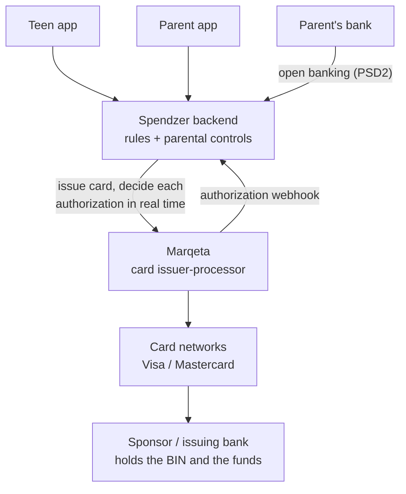
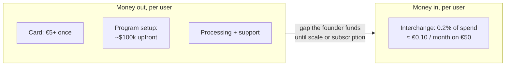
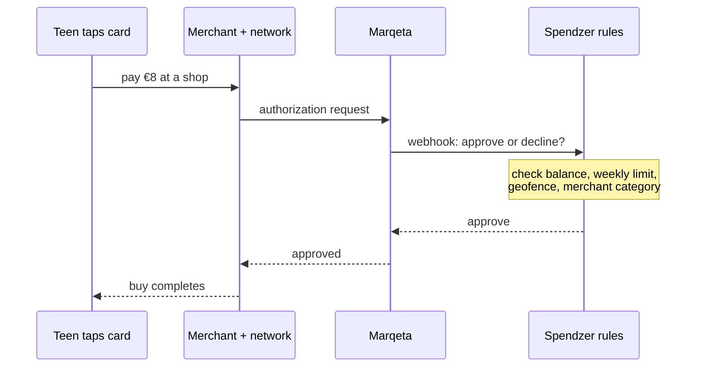

The first company I ever tried to build was called Spendzer. It was a banking app for teenagers, and I started it in Germany in 2018 with a friend and former colleague, Dapeng. It did not work. I put more than €10,000 of my own money into it and it still did not work, and almost everything I believe about how to build a company now, I believe because of what that failure taught me.

This is the story of it, and the two lessons underneath it: unit economics can kill a good idea long before the market does, and in a startup, being too early looks a lot like being wrong.

## What we were building

The idea was simple to describe. Give a teenager a real card of their own, and give their parents a way to stay in the loop without standing over their shoulder.

A parent could fund the card, see where the money went, set a weekly limit, and restrict where the card worked. We built controls around location and merchant type: you could geofence spending to a town, or block a category of store entirely. A kid got the independence of paying for their own things. A parent got pocket money that taught something, instead of a folded note that vanished with no trace.

Underneath, a card like this is not one system, it is several stitched together, and only one of them is the app you see.

- **Issuing and processing.** Someone has to put a real Visa or Mastercard into the world and decide, in the 200 milliseconds a card is dipped, whether each payment is allowed. In 2018 you did this without becoming a bank by building on a card issuer-processor. We used [Marqeta](https://en.wikipedia.org/wiki/Marqeta), which exposed issuing as an API: create a user, create a card, and, the part that made our product possible, receive a webhook on every single authorization and approve or decline it in real time. Our parental controls, the geofence and the merchant-category rules, were just code running inside that webhook.
- **The sponsor bank.** Marqeta processed the cards, but it did not hold the money or own the card program. That sat with a sponsor bank that held the [BIN](https://en.wikipedia.org/wiki/Payment_card_number) and the actual funds. You do not get a card program without one, and they do not sign lightly.
- **Money movement.** Marqeta in 2018 processed card transactions. It did not move money in. Funding a card, getting a parent's euros onto it, was a separate problem we had to solve on top, through the bank and payment rails, not something the card platform did for us. (Marqeta only launched its own banking and money-movement products years later, in 2022.)
- **Account data.** To let a parent fund the card and see the whole picture, we connected to their existing bank through the open-banking APIs that [PSD2](https://en.wikipedia.org/wiki/Payment_Services_Directive) was just beginning to force into existence. PSD2 applied from January 2018, but the bank APIs were raw, and the real compliance deadlines for them did not land until September 2019. We were building on a standard that existed on paper before it existed in practice.

Dapeng and I built the first working version ourselves. Not a mockup, a thing that issued a card and moved real money under real rules. I thought that was the hard part. It was not.

## The idea was not the problem

The first thing a good investor asks is how big this can get. And the honest fear with "an app for kids' pocket money" is that it sounds small and cute.

It is not, and I knew the numbers because I lived in the market. European teenagers get more money than people assume, and they get it regularly. Older teenagers in the Netherlands commonly get somewhere between €50 and €120 a month once you add up weekly allowance and extras, and the amounts run higher again in countries like Italy and Austria ([Statista, Netherlands](https://www.statista.com/statistics/862705/amount-of-pocket-money-received-by-children-in-the-netherlands-by-grade/); [Statista, Germany](https://www.statista.com/statistics/1095373/children-monthly-pocket-money-by-age-and-gender-germany/)). Multiply a recurring monthly float like that across the teenagers of Western Europe and you are not looking at a rounding error. You are looking at a real, recurring, underserved pool of money that no bank was designed to serve.

The second thing going for us was direction. In 2018, Germany still ran on cash to a degree that surprised every foreigner who moved there, but the direction was one way. Cash was leaving. A generation of teenagers was going to grow up expecting to pay with a phone or a card, and someone was going to teach them how to do it well. That is a good place to stand: a large recurring market moving in a direction you can see.

So the idea held up. The problem was never demand. The problem was what it cost us to serve one unit of that demand.

## Where the money went

Here is the thing about issuing physical cards that you do not feel until you try it: every card has a floor cost, the whole apparatus behind it wants money before you have a single customer, and the revenue per card is capped by law at almost nothing.

Three numbers broke us.

**Six figures to start.** To stand up a real card program, the sponsor bank and processor arrangement wanted money upfront, on the order of a hundred thousand dollars, before we had put one card in one teenager's hand. That is not a number you bootstrap past with €10,000 and evenings and weekends. For a funded company it is a line item. For two engineers paying out of pocket, it is a wall.

**More than €5 a card.** Every physical card we issued cost us more than €5 to produce and provision, before anyone spent a cent on it.

**About €0.10 a month back.** This is the one that actually decides it. The way a card issuer earns money on spending is [interchange](https://en.wikipedia.org/wiki/Interchange_fee), a small fee paid on each transaction. In the EU, interchange on consumer debit cards is [capped by regulation at 0.2%](https://eur-lex.europa.eu/legal-content/EN/TXT/PDF/?uri=CELEX:32015R0751) of the amount spent. That cap is good for the world. It is fatal for a business trying to live on teenagers' card spend. A teenager spending €50 a month earns the issuer 0.2% of that, about €0.10.

Put those together and the trap is obvious.

Spend €5 to make a card, earn €0.10 a month back on it, and you need that teenager to keep swiping for four years just to recover the plastic, before a single other cost. Every new user made our bank balance worse, not better. Growth, the thing you are supposed to want, was the thing bleeding us. You can only survive that two ways: raise enough to fund the gap until scale makes the per-unit cost tiny, or find revenue per user that does not depend on interchange. We had neither. We had a good idea sitting on top of a cost structure built for companies with a balance sheet.

This is the first lesson, and the one I now check for before I build anything: the idea can be right and the unit economics can still be fatal. Demand does not save you if it costs more to serve a customer than a bootstrapped team can carry until scale kicks in. Work that math before you fall in love with the product, not after.

## How a payment worked

The hard engineering did work. When a teenager tapped the card, the decision to allow it ran through our code in real time, and that is where every parental control lived.

Every rule a parent set was a branch in that webhook: is the card inside the allowed area, is this a blocked kind of store, is there money left this week. We answered in the few hundred milliseconds a payment terminal will wait. Building that was the part I knew how to do. The hard part was everything in the last section, and none of it was code.

## "Small TAM"

We did try to raise. I pitched [Earlybird](https://en.wikipedia.org/wiki/Earlybird_Venture_Capital), a serious European VC, and the feedback that came back was that the total addressable market was too small.

I remember disagreeing, and I still think, on the raw numbers, they were not right about the size. The market was there. But I have come to understand what feedback like that usually means, and it is rarely a literal claim about a spreadsheet. "Small TAM" from a good investor is often a polite version of a harder sentence: we do not yet believe this team, at this stage, with this capital intensity, can capture enough of the market fast enough to return our fund.

And on that, they had a point I could not see at the time. We were two technical founders with a working product, no clear go-to-market, and a business that needed a lot of money spent before the economics turned. A "no" there is not really about the idea. It is about whether the people in front of them can turn the idea into a company under the constraints they are showing up with. We had not yet proven we could.

The lesson is not "the VC was wrong and I was right." The lesson is to hear the real objection under the stated one, and to fix the thing they are actually worried about.

## Two engineers, and the thing we were slow to learn

Dapeng and I could build almost anything. Give us a spec and a hard technical problem, and we were happy and fast. That was exactly the trap.

When the hardest problem in front of you is engineering, you keep building, because that is where you feel strong. So we built. We polished the card controls, the geofencing, the rules. And we were slow, much too slow, to do the two things that actually decide whether a company like this lives: getting in front of parents and schools to prove people wanted it enough to change their habits, and building a fundraising story sharp enough to clear the capital wall in front of us.

I underestimated, for years, how much of building a company is selling and listening rather than coding. The engineering was the part I was sure of, so I over-invested in it. The harder skill, the one I did not respect yet, was sitting with a parent's real hesitation, or an investor's real objection, instead of retreating to the engineering I already knew how to do.

That is why "sell before you build" is the first principle I operate on now. It came from here. I would rather spend two weeks finding out a thing is wanted than six months building it beautifully and finding out after.

## The model was fine, the timing was not

Here is the part that took me longest to accept.

A few years after we gave up, the same basic idea, a card for young people with real controls for parents, became a genuine category. Well-funded companies built almost exactly what we had built, and some of them got real traction. I am not going to name them, because who won is not the point and I have no interest in the scoreboard.

The point is that the model was fine. What changed was not the insight. What changed was the ground underneath it. Issuing infrastructure got cheaper and easier. Open banking went from a fragile promise to something that actually worked. And, most importantly, the winners did not try to live on interchange at all. They charged parents a small monthly subscription, a few euros a month, which is real recurring revenue in a way €0.10 of interchange could never be. The fix to our fatal number was a business-model choice we did not make and they did. Capital covered the upfront, scale ground the per-card cost down, and subscription revenue replaced the interchange that regulation had capped to nothing.

We were not wrong about what to build. We were wrong about when, and about how to make a euro. In startups, being too early is indistinguishable from being wrong, because you run out of money before the world arrives. Timing is not a detail you get to ignore because your conviction is strong. It is a first-class variable, and it is mostly not in your control. What is in your control is noticing which way the ground is moving, and being honest about whether it will move fast enough to reach you before your runway ends. Ours would have. It just did not do it in time for us.

## What I took from it

I have started companies three times since Spendzer, and the way I work is a direct reaction to what that first one taught me.

- I prove demand before I build. Sell the idea, watch whether anyone leans in, and only then commit months of engineering. The €10,000 lesson was that building is the easy, seductive part, and the market does not care how good the code is.
- I check the unit economics before I fall for the product. What does it cost to serve one customer, how thin is the revenue per customer, and how long is the gap I have to fund before scale makes it work? If a bootstrapped team cannot carry that gap, the idea needs either a lot of capital or a different way to make money.
- I read the real objection, not the stated one. "Small TAM" was never about the market. It was about us. The useful move is to fix the thing the other person is actually worried about.
- I take timing seriously as a thing I can be wrong about even when the idea is right. I look for where the ground is already moving, so the world is arriving toward me while I build, not years after I have run out of money.

None of that is theory. I paid to learn it, and it shaped how I have built everything since.

## Key takeaways

- **Unit economics can kill a good idea before the market ever gets a vote.** Spendzer had real demand and a fatal cost structure: six figures to start, more than €5 a card, and EU-capped 0.2% interchange that earned about €0.10 a month on a €50 float. Do that math before you build, not after.
- **Revenue model beats revenue source.** The same idea worked later by charging parents a subscription instead of trying to live on interchange regulation had capped to nothing. When the per-transaction economics are fixed against you, change how you make money, not how hard you push.
- **A "small TAM" no from a good investor usually is not about the market.** It is a polite version of "we do not yet believe this team, at this capital intensity, can capture it fast enough." Fix the real objection.
- **Engineers default to building, because that is where they feel strong.** The harder, more valuable work early on is selling and listening. That is why I now sell before I build.
- **Being too early is indistinguishable from being wrong,** because you run out of money before the world arrives. Timing is a first-class variable, not a detail.

If you are building something you suspect the world is not quite ready for, I am happy to compare notes. I have been on the early side of a good idea, and I know exactly what it costs.
