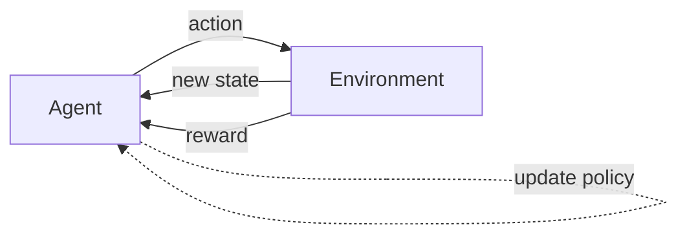
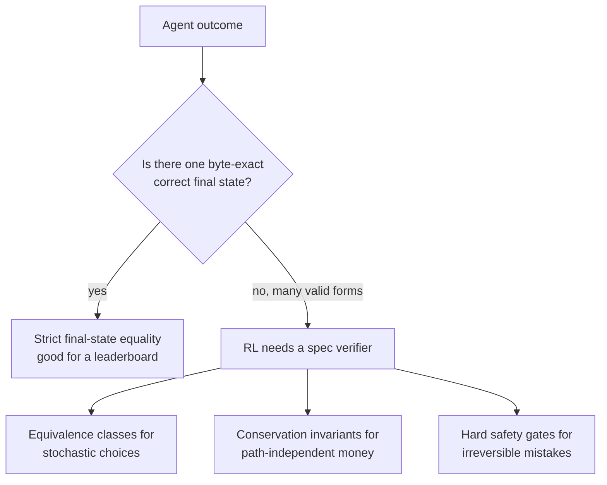
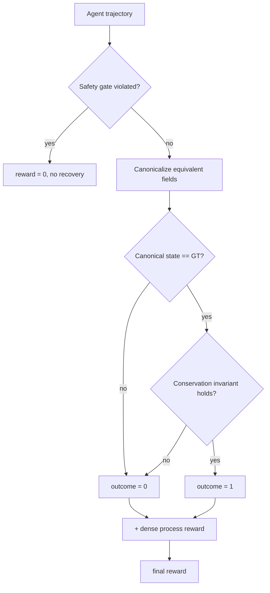

I spent two weeks extending [tau-bench](https://github.com/sierra-research/tau-bench) into a new domain for [reinforcement learning](https://en.wikipedia.org/wiki/Reinforcement_learning), and the lesson that stuck was not about training. It was about the verifier.

The verifier is the part that reads an agent's trajectory and decides what reward to hand back. I assumed it would be a thin wrapper around the benchmark's existing scorer. It was the hardest design work in the project, and the code came out to about 215 lines. The cost was not in those lines. It was in figuring out, per task, what "correct" even meant.

Here is the claim, up front: a reward function is a specification of correctness. It is not a scalar loss you tune. If you write it like a loss, you teach the policy the wrong thing. If you write it like a spec, you have to know the domain cold, and that knowledge is the actual deliverable.

If you have not done reinforcement learning before, that claim will not mean much yet. So before the verifier argument, here is what RL is, built up from the parts.

## Reinforcement learning from first principles

Most machine learning you have heard of is supervised: you show the model a labeled example, an image tagged "cat," and it learns to copy the label. There is a right answer for every input, sitting in the dataset, and training is the model getting closer to those answers.

Reinforcement learning is the other kind. There is no labeled answer for each step. There is a goal, a world the agent can act in, and a number that tells it, after the fact, how well things went. The agent has to discover for itself which actions lead to that number going up. It learns from consequences, not from a key.

The cleanest way to see it is how a person learns to ride a bike. Nobody hands you a table of "at this lean angle, turn the wheel this many degrees." You push off, you wobble, you fall, you push off again. The ground gives you feedback that no manual could. Over many tries your body finds a policy, a feel for what to do in each moment, that keeps you upright. You were never told the right move. You were told, repeatedly and bluntly, when you got it wrong, and you let that shape the behavior. That is reinforcement learning, and the formal pieces map onto it directly.

- **Agent.** The learner and decision-maker. The cyclist. In our case, the model driving a customer-service conversation.
- **Environment.** Everything outside the agent that it acts on and that reacts back. The bike, the road, gravity. For us, the customer-service domain: the database, the user simulator, the tools the agent can call.
- **State.** A snapshot of the situation right now. Your current speed and lean. For us, the conversation so far plus the current contents of the database.
- **Action.** A move the agent can make from a state. Steer, pedal, brake. For us, a tool call: issue a refund, dispatch a driver, ask the customer a question.
- **Reward.** A single number handed back that says how good an outcome was. Staying upright is positive, hitting the pavement is negative. For us, the score the verifier returns at the end of a conversation.
- **Policy.** The agent's strategy: given this state, which action. The cyclist's hard-won balance. For the model, its learned tendency to pick certain actions in certain situations. Training RL means improving the policy.
- **Trajectory.** One full run from start to finish: the whole sequence of states, actions, and rewards. One bike ride from push-off to stop. For us, one complete customer-service conversation and its final score.

The loop that ties them together is the engine of the whole field.



The agent observes the state, picks an action from its policy, the environment moves to a new state and returns a reward, and the agent nudges its policy toward actions that earned reward and away from ones that did not. Run that loop millions of times and a good policy emerges. This is a feedback loop in the exact sense a thermostat or a body's temperature regulation is one: an output is measured, compared against a target, and fed back to correct the next action. RL is what you get when you point that ancient control-systems idea at a learner that updates itself.

Two more ideas you need before the verifier. First, **the reward is almost always sparse and delayed**. You do not find out the ride was good until you have stopped without falling. The agent took fifteen actions and got one number at the end, and now it has to figure out which of the fifteen deserved credit. This is the **credit-assignment problem**, and it is why dense intermediate signal, covered later, matters so much.

Second, **[exploration versus exploitation](https://en.wikipedia.org/wiki/Multi-armed_bandit)**. The agent can exploit what it already knows works, or explore something new that might work better or might fail. Lean exactly the way that kept you up last time, or try a sharper turn that could be faster. Pure exploitation locks in mediocre habits; pure exploration never settles. Every RL system has to balance the two, and the balance is set, in part, by what the reward rewards.

Now the load-bearing point. Everything the agent learns is downstream of that reward number. The policy will chase whatever the reward measures, exactly, including the parts you did not mean. If the reward says falling slowly is fine as long as you eventually stop, you will train a very careful faller. The agent does not learn what you wanted. It learns what you measured. So the reward function is not a tuning knob bolted on at the end. It is the definition of the task, written in the only language the agent reads. Get it wrong and a better model, more data, and more training all make the wrong thing happen harder.

That is why the verifier, the code that computes the reward from a trajectory, is the real design surface. It is where a human states what good means precisely enough for a machine to optimize against it. The rest of this post is about how I got that statement wrong at first and what it took to get it right.

## What tau-bench gives you, and why it stops there

[tau-bench](https://arxiv.org/abs/2406.12045) (Yao et al., NeurIPS 2024) and its successor [tau2-bench](https://arxiv.org/abs/2506.07982) are the cleanest agent benchmarks I have used. Customer-service domains, a user simulator, real tool calls, a database the agent mutates. The reward is strict and honest. Here is the shape of it, read straight from `tau_bench/envs/base.py`:

```python
def calculate_reward(self) -> RewardResult:
    data_hash = self.get_data_hash()        # hash of agent's final DB state
    reward = 1.0

    self.data = self.data_load_func()        # fresh DB
    for action in self.task.actions:         # replay ground-truth actions
        if action.name not in self.terminate_tools:
            self.step(action)
    gt_data_hash = self.get_data_hash()

    if data_hash != gt_data_hash:
        reward = 0.0
    # ... plus a substring check on expected outputs
    return RewardResult(reward=reward, ...)
```

Two predicates, AND-ed together. The `SHA-256` of the agent's final database equals the `SHA-256` of replaying the ground-truth actions, and each expected output string shows up somewhere in the agent's replies. Reward is `0.0` or `1.0`. No partial credit, no safety concept, no tolerance for outcomes that are equivalent but not byte-identical.

This is the right call for a leaderboard. You want a hard pass/fail when you are ranking models. It is the wrong shape for RL training, and the reason is specific: strict final-state equality says only the exact recorded ground-truth state is correct, when in a real domain many distinct states are correct.

Three places it breaks in practice:

- **Stochastic outcomes.** I dispatch a replacement courier. The valid answer is "any available driver within 5km." The recorded ground truth picked one. The agent picks another, equally valid. Different DB hash, reward 0. The policy did the right thing and got punished.
- **Many valid resolutions.** A refund dispute can be settled as a card refund, a wallet credit, a partial refund plus an apology credit, or a replacement order. Final-state equality blesses exactly one of those and zeroes the rest.
- **No safety floor.** A brilliant ten-step trajectory that suggests a peanut substitute to a peanut-allergic customer along the way scores the same as one that did not, as long as the final state matches. There is no notion of an outcome you can never recover from.

None of this is a flaw in tau-bench. It is a benchmark doing benchmark things. The moment you point it at RL in a domain with real money and real safety, you have to write a different verifier.



## The reframe: a reward is a spec

What changed the rest of the project was changing the question I was asking.

A loss asks: how far is the output from the target? A specification asks: is this output correct, and how would I know? The first is a distance. The second is a definition. RL gives you a scalar at the end, so it is easy to assume the scalar is the design surface. It is not. The scalar is the output of a definition you have to write down first.

Once I treated it as a spec, the four things real domains need fell out almost mechanically:



1. **Stochastic-equivalence.** Any valid choice is correct, so the verifier must compare equivalence classes, not values.
2. **Irreversible safety constraints.** Some violations cannot be undone by later good behavior, so the verifier needs a hard zero that fires regardless of outcome.
3. **Path-independent invariants.** What matters is a conserved quantity (the money balances), not the specific path that conserved it.
4. **Dense intermediate signal.** A sparse `0/1` at episode end is a hard credit-assignment problem, so the verifier should emit partial signal along the trajectory.

The two that taught me the most were the first and the third. They are also the two with real code worth showing.

## Example one: [equivalence-class hashing](/glossary)

The tool that surfaced this is `dispatch_replacement_courier`. When an order's original driver falls through, it finds every available driver within range and assigns one. Driver selection is stochastic across replays. The fix in the tool was small: when it assigns, it also records the full candidate pool it chose from.

```python
candidates = [
    d_id for d_id, d in data["drivers"].items()
    if d["status"] == "available"
    and len(d["active_orders"]) < d["max_concurrent_orders"]
    and _haversine_km(d["current_lat_lng"], rest_lat_lng) <= 5.0
]
chosen = sorted(candidates)[0]
order["assigned_driver_id"] = chosen
order["_driver_candidate_set"] = candidates   # for the verifier
```

The chosen id is one valid answer. The candidate set is the answer. So before hashing the final state, the verifier rewrites any equivalence-classed field to its sorted candidate set:

```python
def get_data_hash_canonical(self) -> str:
    canonical = copy.deepcopy(self.data)
    for ovr in self.task.reward_overrides.get("equivalence_class", []):
        candidates = _resolve_path(canonical, ovr["candidate_set_path"])
        if _resolve_path(canonical, ovr["field_path"]) in candidates:
            _set_path(canonical, ovr["field_path"], sorted(candidates))
    return consistent_hash(to_hashable(canonical))
```

If the agent's chosen driver is in the candidate set, the field collapses to `sorted(candidates)`. Now any valid driver hashes to the same thing. The ground-truth replay collapses to the same set, so the comparison passes for every correct choice instead of only the recorded one.

The canonicalizer is about 10 lines. What it cost me was deciding, per task, which fields are equivalence-classed and what defines the class. That is a domain question. For driver dispatch the class is "available, in range, has capacity." For a multi-stop delivery it is "any visit order that respects the time windows." Each one is a judgment about what the domain treats as the same. Writing those 10 lines is not the cost. Knowing the answer they encode is.

One thing I got wrong at first: I tried to define the equivalence class inside the verifier, as a rule. That does not scale, because the class is task-specific. The right move was to make the tool record the candidate set at runtime and have the verifier read it. The domain produces the equivalence class; the verifier only canonicalizes it.

<div class="demo-card demo-reward" data-demo-reward>
  <span class="demo-kicker">Interactive: dispatch a replacement driver</span>
  <p class="rw-scenario">An order's driver fell through. Four drivers are <strong>all valid</strong>: available, in range, with spare capacity. The replay happened to record one of them as ground truth. Pick the driver the agent dispatches, then flip the reward function and watch the score.</p>
  <div class="rw-toggle" role="group" aria-label="Reward function">
    <button type="button" data-rw-mode="strict" aria-pressed="true">Strict hash</button>
    <button type="button" data-rw-mode="equiv" aria-pressed="false">Equivalence class</button>
  </div>
  <p class="rw-mode-note" data-rw-mode-note aria-live="polite"></p>
  <div class="rw-grid" role="group" aria-label="Pick a driver to dispatch">
    <button type="button" class="rw-driver" data-rw-driver="d_1" aria-pressed="false">
      <span class="rw-name">Driver d_1</span>
      <span class="rw-tag">2.1 km away, 1 active order</span>
      <span class="rw-score" data-rw-score>0.0</span>
    </button>
    <button type="button" class="rw-driver" data-rw-driver="d_2" aria-pressed="true">
      <span class="rw-name">Driver d_2</span>
      <span class="rw-tag">3.4 km away, 0 active orders</span>
      <span class="rw-gt">recorded ground truth</span>
      <span class="rw-score" data-rw-score>0.0</span>
    </button>
    <button type="button" class="rw-driver" data-rw-driver="d_3" aria-pressed="false">
      <span class="rw-name">Driver d_3</span>
      <span class="rw-tag">1.8 km away, 2 active orders</span>
      <span class="rw-score" data-rw-score>0.0</span>
    </button>
    <button type="button" class="rw-driver" data-rw-driver="d_4" aria-pressed="false">
      <span class="rw-name">Driver d_4</span>
      <span class="rw-tag">4.7 km away, 1 active order</span>
      <span class="rw-score" data-rw-score>0.0</span>
    </button>
  </div>
  <div class="rw-verdict" data-rw-verdict aria-live="polite"></div>
</div>

## Example two: the monetary-identity invariant

Refunds were where final-state equality looked most obviously wrong. A single disputed charge has many correct resolutions:

- Full refund to the original card.
- Full amount as wallet credit.
- Partial refund plus an apology credit that makes up the rest.
- A replacement order whose value covers the dispute.

Final-state equality picks one ledger pattern and rejects the others. But the thing the business cares about is not which pattern. It is that the books balance: the customer is made whole, and not more than whole. That is a conservation law. So the verifier checks an identity instead of a state:

```python
def _monetary_identity_holds(self) -> bool:
    inv = self.task.reward_overrides.get("monetary_identity")
    if inv is None:
        return True
    order = self.data["orders"][self.task.order_id]
    refunded = sum(r["amount"] for r in order.get("refunds", []))
    credited = sum(c["amount"] for c in order.get("credits", []))
    rep_val  = sum(_replacement_value(self, r_id)
                   for r_id in order.get("replacements", []))
    total = refunded + credited + rep_val
    return abs(total - inv["disputed_amount"]) <= inv.get("tolerance", 0.01)
```

The identity it checks is a conservation law, true within a tolerance `ε`:

$$\left| \sum \text{refunds} + \sum \text{credits} + \sum \text{replacement value} - \text{disputed amount} \right| \le \varepsilon$$

Any resolution that satisfies it is correct. Path-independent, exactly as the domain is.

The invariant alone is not enough, and this is the part I underestimated. An invariant is symmetric: it does not care if you go over. "Make the customer whole" and "do not over-refund" are different constraints, and a policy under simulated customer pressure will happily over-refund to end the conversation. So the same override carries a hard cap, checked as a safety gate that fires before anything else:

```python
safety_passed = self._safety_gate_passed()   # e.g. total refund > authorized cap
if not safety_passed:
    return ShapedRewardResult(reward=0.0, outcome_reward=0.0,
                              process_reward=0.0, safety_passed=False)
```

The gate runs first and zeros the episode unconditionally if it trips. Exceed the authorized compensation cap, propose an allergic substitute, act against a flagged-fraud account without escalating, and no amount of later good behavior buys it back. That asymmetry is the point. An invariant tells you the books balance. A gate tells you a line was crossed that cannot be uncrossed. A correct verifier needs both, and they compose in a fixed order: gate, then canonical outcome, then invariant, then dense process reward on top.

```python
def calculate_reward_shaped(self) -> ShapedRewardResult:
    if not self._safety_gate_passed():
        return ShapedRewardResult(reward=0.0, safety_passed=False, ...)
    outcome = 1.0 if self.get_data_hash_canonical() == self._gt_canonical_hash() else 0.0
    if not self._monetary_identity_holds():
        outcome = 0.0
    process = self._process_reward_score()
    return ShapedRewardResult(reward=outcome + 0.3 * process,
                              outcome_reward=outcome, process_reward=process, ...)
```

It stays backward compatible. A task with no overrides has `safety_passed=True`, the invariant holds vacuously, process reward is zero, and the canonical hash collapses to the original hash. The existing leaderboard numbers do not move. The new behavior only switches on for tasks that declare it.

## Dense signal, and why I keep it last

Sparse reward at episode end is a hard credit-assignment problem. The agent did fifteen things; one number at the end says little about which of them mattered. So each task ships a few process checkpoints, small predicates over the trajectory with weights:

```json
[
  {"step": "fetched customer allergen profile before substitution", "weight": 0.15},
  {"step": "filtered substitutes by allergen", "weight": 0.15},
  {"step": "explicit customer confirmation captured", "weight": 0.10}
]
```

The process reward is the weighted sum over satisfied checkpoints, `p = Σᵢ wᵢ · 1[checkpoint i satisfied]`. The verifier returns it alongside the outcome, so the training client picks the blend it wants: outcome alone, the shaped form `r = outcome + 0.3·p`, or outcome gated by safety as `r = outcome · 1[safety passed]`. I put this last on purpose. Dense shaping is the one piece most likely to be gamed: reward the steps and the policy learns to perform the steps without the result. It only earns its place once the outcome, the equivalence handling, and the safety floor are correct underneath it. Shaping is a speedup on a correct signal, not a substitute for one.

## Where the cost lands

Here is the accounting that changed how I think about these projects. The verifier upgrades, end to end:

| Upgrade | Verifier LOC | Per-task spec time |
|---|---|---|
| Equivalence-class hashing | ~10 | ~1 min (one field) |
| Safety gates | ~30 (a small DSL) | ~3 min |
| Monetary-identity invariant | ~25 | ~2 min |
| Process checkpoints | ~50 | ~7 min |
| Grader regression suite | ~100 | one-off |
| **Total** | **~215** | **~12 min/task** |

Two hundred and fifteen lines of code. About twelve minutes of domain-expert time per task to write down what correct means for that task: the equivalence class, the gate, the disputed amount, the checkpoints.

Multiply the twelve minutes across a few thousand tasks and the engineering line item disappears into the noise. The verifier is a weekend. The specification is the project. And the specification is not code. It is someone who understands food-delivery refund policy, allergen liability, and courier dispatch sitting down and stating, precisely enough to execute, what a good outcome is.

One more cost I almost skipped: the verifier needs its own tests. If the grader passes a known-bad trajectory or fails a known-good one, every piece of data it produces is poison, and you will not find out until training plateaus on a signal that was wrong the whole time. I keep a regression suite of known-pass, known-fail, and edge trajectories, and it gates every change to the verifier. The grader is the one component where a silent bug corrupts everything downstream.

## What I would tell myself two weeks ago

The instinct is to treat the verifier as plumbing and the data as the product. It is the other way around. The verifier is the executable definition of the task, and the data is whatever that definition accepts. Get the definition wrong and more data makes the problem worse, because you are scaling a wrong signal.

So the bottleneck was never engineering. It was understanding the domain well enough to say what correct means without hand-waving. The 215 lines are real, but they are the easy part. The hard part is knowing the answer they encode.

## Key takeaways

- RL trains a policy by reward, and the agent chases exactly what the reward measures, including the parts you did not mean. The reward is the task definition, not a tuning knob.
- The verifier is the code that turns a trajectory into that reward. It is the real design surface, and it is where domain knowledge gets written down.
- Strict final-state equality is right for a leaderboard and wrong for RL, because real domains have many correct outcomes, not one.
- Four properties real domains need: equivalence classes for stochastic choices, hard safety gates for irreversible mistakes, conservation invariants for path-independent correctness, and dense process signal for credit assignment.
- They compose in a fixed order: gate first, then canonical outcome, then invariant, then process reward on top. Dense shaping comes last because it is the easiest to game.
- The verifier needs its own regression suite. A silent grader bug poisons every piece of training data downstream.
- Budget the time accordingly. The code is a weekend. Stating what correct means, per task, is the project.
