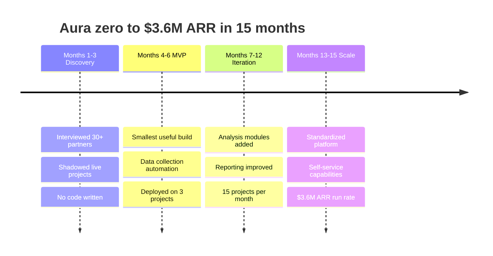
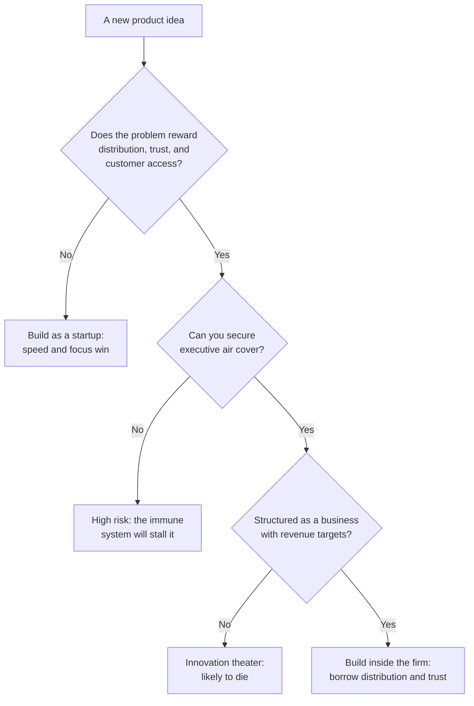

When people hear I built a product from zero to \$3.6M [ARR](https://en.wikipedia.org/wiki/Annual_recurring_revenue) inside Bain & Company, they react one of two ways.

The startup crowd asks: "How did you move fast inside a big consulting firm? Didn't bureaucracy kill you?"

The corporate crowd asks: "How did you convince leadership to fund something so risky? Consulting firms hate uncertainty."

Both questions assume the wrong frame. Building inside a large organization is a different game from a traditional startup, and the differences are what decide whether you succeed.

Aura was incubated in Bain's Founders Studio, the part of Bain's Engine 2 Ventures unit that turns consulting workflows into software businesses. Engine 1 is the consulting business; Engine 2 productizes it. Aura was one of four ventures in that first incubation, and I was its venture CTO. My job was the whole technical surface: architecture, the team I hired, and the data infrastructure, which I built myself because it was the load-bearing part of the product and I wanted my hands on it. Over 15 months we went from 4 people to 33 and from no revenue to a \$3.6M ARR run rate. Aura later spun out of Bain as its own entity. What follows is what I learned about why a setting like that helps and where it fights you.

## Why consulting firms build products

Some background. Consulting firms have built products for years, though they don't always talk about it. The logic is simple: consulting revenue is linear (more hours, more revenue), while product revenue can be exponential (build once, sell many times).

There's a deeper reason too. Consulting firms have something most startups lack on day one: **direct access to decision-makers at large companies**. They spend a large share of their billable hours understanding customer problems at the senior level, which is a form of continuous, well-funded market research.

The challenge is translating that insight into products. Most consulting firms do not convert it, for reasons I'll explain. When the conversion works, the result can be a standalone business, which is what happened with Aura.

## How Aura started

Aura was a workforce-analytics platform, used heavily in PE and growth-equity due diligence. The origin story is simple. Bain does hundreds of due diligence projects for private equity firms every year. Each one involves collecting data from dozens of sources, running analyses, and producing reports on a deal timeline measured in weeks.

The existing process was artisanal. Consultants manually gathered data from dozens of sources. They built one-off spreadsheets. They spent nights reformatting slides. Each project reinvented the wheel.

The insight was obvious. Build a platform that systematizes this. Automate data collection. Standardize analyses. Make the repeatable parts instant so consultants can focus on the parts that require thinking.

From first principles, a due diligence project is a data pipeline with a deadline. Pull data from many sources, clean and reconcile it, run a fixed set of analyses, and render the result under time pressure. Most of that work is mechanical and gets redone from scratch every project. The value a consultant adds is the judgment at the end, not the reformatting in the middle. So the product was really an argument about where the firm's time should go: stop paying expensive people to copy numbers between spreadsheets and let them spend the saved hours on the thinking.

That framing is also why I built the data infrastructure myself. The ingestion and reconciliation layer was the part everything else stood on. If the data was wrong or slow, no amount of polish on top would matter, and a due diligence number that is confidently wrong is worse than no number at all. So I owned that layer directly rather than delegating it early.

### What "the load-bearing layer" actually meant

I started the architecture deliberately simple so we could ship: Postgres, Django, and Celery on AWS, with dimensional modeling on top. That was the right call to get moving, and it was the wrong call to keep. As the data and the analytical load grew, Postgres was no longer the right fit for a warehouse workload, so we moved the analytics to Snowflake with [Cube.js](https://cube.dev/) as the semantic layer, and landed the large datasets in S3. The scale is what made it interesting: over a billion rows of profile data, hundreds of millions of job postings, S&P 500 financials, plus a set of API vendors feeding an enrichment waterfall. I built it as a medallion architecture, raw to refined to serving, so a number could always be traced back to its source.

The harder problem was making any of it comparable. We had more than 20 million raw skills and a sprawl of job titles, and you cannot compare two companies' workforces until those mean the same thing. We adopted the [Lightcast](https://lightcast.io/open-skills) skills and job-title taxonomies and the US [Bureau of Labor Statistics](https://www.bls.gov/oes/) occupational data as a common spine, then used LLMs, which we had been working with since GPT first launched, to clean and map the rest. On top of the BLS job-function data I built a way to estimate the AI exposure of a role, meaning how much of its actual work a model can do, which also fed back and improved the skill and role taxonomy.

Easy to say. Making it happen inside a consulting firm is hard for reasons that aren't obvious from the outside.

## The advantages of building inside a firm

Start with what made this easier than a traditional startup.

### 1. Distribution before product

In a startup, you build the product first, then figure out how to reach customers. At Bain we had the opposite. We had hundreds of partners with existing client relationships. Our go-to-market was: walk down the hall.

That sounds minor and it is not. Startups die from lack of distribution more often than from lack of product. Having distribution locked in from day one let us focus almost entirely on building the right thing.

### 2. Customer development without the access problem

When you're building a B2B product, the hardest part is getting time with decision-makers. They're busy. They don't take cold calls. They don't want to be guinea pigs for your MVP.

At Bain, I had direct access to the partners who ran PE due diligence. These are people who live the problem every day, who understand nuances a startup would take years to discover. Getting an hour of their time meant booking a meeting.

I could also watch them work. I sat in on actual due diligence projects and saw where the pain points really were, not where people said they were.

### 3. Funding without fundraising

We never did a Series A. We never pitched VCs. The company funded the development and owned the IP in return. For someone who'd rather build than pitch, this was ideal.

There's a real cost to fundraising that founders don't talk about. It's not the time, though it can eat 6 months. It's the mental overhead. You're always thinking about your next round, your runway, your valuation. That energy isn't going into the product.

Building inside Bain meant I could focus on one thing: making the product better. Revenue targets existed, but they were collaborative goals rather than existential threats.

### 4. Trust by association

When a random startup approaches a PE firm with a new due diligence tool, they hit a wall of skepticism. Due diligence is sensitive. Data is confidential. Why trust an unknown entity?

When Bain approaches the same firm with the same tool, the conversation is different. The trust is inherited. The relationships are already there. The brand does heavy lifting that would otherwise take years of credibility-building.

That inheritance showed up in who adopted it. Some of the largest names in crossover and growth-equity investing, funds running tens of billions, used it in their diligence. A new vendor does not get into those rooms in a year.

## The disadvantages, and where they bite

Now what made it harder.

### 1. Organizational immune system

Large organizations have evolved mechanisms for rejecting new things. This is self-preservation, not malice. Most new initiatives fail, and successful companies have learned to be skeptical of shiny objects.

The problem is that the immune system that protects against bad ideas also attacks good ones. You spend a real share of your time creating space to exist. Every meeting requires explaining why this matters. Every resource request requires justification.

In a startup, everyone is rowing in the same direction by definition. In a large org, alignment is a constant battle.

### 2. Conflicting incentives

Consulting firms make money selling partner time. A product that automates work competes with the core business. This creates weird dynamics.

Partners who championed Aura believed in it. They also had billable targets. Staffing a project with consultants generates revenue; using Aura requires investment. The short-term math often favored consultants.

We had to structure the economics so using Aura was clearly better for partners, not the firm. That took a lot of iteration.

### 3. Speed limits

Startups move fast because they have nothing to lose. They ship broken code, pivot weekly, apologize later. The cost of failure is low because no one knows who they are.

Building inside Bain meant building with the Bain brand. If Aura failed badly in front of a client, that reflected on the firm. This created a natural conservatism, sometimes appropriate and sometimes suffocating.

We learned to separate "risks that could embarrass the firm" (must avoid) from "risks that are normal product development" (must accept). The line wasn't always obvious, and defaulting to caution was always the safer career move.

### 4. Talent constraints

Consulting firms are optimized for hiring consultants. They know how to find, recruit, and develop people good at consulting. They're less set up for hiring engineers, designers, and product managers.

We needed a team with startup DNA inside an organization with consulting DNA. That meant competing for talent against actual startups, who could offer equity, flexibility, and culture that matched what these candidates wanted.

The people we did attract were exceptional. It was always harder than it needed to be.

## What made it work

Looking back, a few things were decisive.

### Executive air cover

We had senior partners who believed in the vision and protected us from organizational gravity. When committees wanted to add "oversight," they pushed back. When budgets were scrutinized, they advocated.

This was about giving us space to build. Without that cover, we would have spent all our energy on internal survival instead of product development.

### Revenue focus from day one

Many corporate venture projects fail because they're treated as R&D experiments. They get funded for "innovation" rather than revenue, which sounds nice but usually means no one cares if they succeed.

Aura was structured as a business from the start. We had revenue targets. We measured ARR. We tracked unit economics. This gave us credibility internally and forced us to build something people would pay for.

### Borrowed conviction

In the early days, before we had traction, we needed believers. The consultants who used early versions and gave feedback. The partners who introduced us to clients. The skeptics who asked hard questions and made the product better.

These people lent us their conviction when we didn't have enough of our own. Their credibility within the organization opened doors that would have been closed to outsiders.

### Coordination as much as code

The job was as much coordination as code. I was managing internal Bain people and stakeholders, external software-development consultancies, and consultants who rotated in through Bain's global program, all at once. When Aura spun out, I handled the org setup and the Bain-to-Aura separation itself: the contracts, the legal, and the requirements for standing the company up on its own.

## The 15-month timeline

People are surprised we went from zero to \$3.6M ARR in 15 months. Roughly how it happened:

**Months 1-3:** Discovery. Interviewed 30+ partners and managers. Shadowed actual due diligence projects. Mapped the workflow in excruciating detail. No code written.

**Months 4-6:** MVP. Built the smallest thing that could be useful. Focused on data collection automation, the most painful and least interesting part of the work. Deployed on 3 real projects.

**Months 7-12:** Iteration. Expanded functionality based on real usage. Added analysis modules. Improved the reporting layer. Grew to 15 projects per month.

**Months 13-15:** Scale. Standardized the platform. Built self-service capabilities. Expanded to multiple PE clients. Hit \$3.6M ARR run rate.

We never had a big launch. We grew one project at a time, with each success creating demand for the next. The team grew the same way, from 4 to 33 over those 15 months, hired against pull from real usage rather than ahead of it.

Aura spun out of Bain as its own company, and it has kept going. It is now an [official Claude connector](https://claude.com/connectors/aura), usable natively inside Claude through Anthropic's MCP, which is the kind of distribution that did not exist when we started. The clearest signal that an internal tool became a real business is that it now lives well outside the building it was born in.

## Lessons for both worlds

For people considering building inside large organizations:

- **Choose the right problem.** Not every problem suits corporate venture building. Look for problems where the organization's existing assets (distribution, trust, customer access) create genuine advantages.
- **Get air cover early.** Find executives who believe in the mission and will protect you from organizational antibodies. Without this, you're fighting with one hand tied behind your back.
- **Make revenue real.** Corporate ventures die when treated as innovation theater. Structure your initiative so success is measured the same way as any other business.
- **Move faster than feels comfortable.** The organizational default is caution. Push for speed while respecting real constraints.

For people building traditional startups who might be competing against corporate ventures:

- **Speed is your advantage.** You can move faster than any corporate competitor. Use it ruthlessly.
- **Focus beats resources.** Corporate ventures are always fighting for attention internally. You have the luxury of caring about one thing.
- **Distribution can be built.** Their existing relationships seem insurmountable, but markets expand. New buyers emerge. Your job is to find them before the big players notice.

## Conclusion

Building Aura inside Bain was one of the most educational experiences of my career. I learned things about product development, organizational dynamics, and enterprise sales that would have taken much longer elsewhere.

Would I do it again? It depends on the problem. For something like due diligence software, where distribution and trust are everything, the corporate setting made sense. For something that needs rapid iteration and pivoting, I'd choose the startup path.

There's no universally right answer. The question isn't "startup or corporate?" It's "what does this specific problem require, and which setting gives me the best chance of solving it?" Here is the decision the way I'd run it now:

## Key takeaways

- A consulting firm's real asset is access. Hundreds of partners with live client relationships meant our go-to-market was walking down the hall, and the trust was inherited rather than earned from scratch.
- The same immune system that rejects bad ideas attacks good ones. Budget the energy you will spend just earning the right to exist, and find executive air cover early.
- Structure the venture as a business with revenue targets from day one. Corporate ventures funded as innovation theater die because nobody is on the hook for them succeeding.
- Own the load-bearing layer yourself. I built Aura's data infrastructure directly because a due diligence number that is confidently wrong is worse than no number, and everything else stood on it.
- Grow against pull, not ahead of it. We went 4 to 33 people and \$0 to \$3.6M ARR in 15 months by adding one project, and the headcount for it, only once the last one created demand.
- Match the setting to the problem. Distribution-and-trust problems suit the corporate setting; rapid-pivot problems suit the startup. Aura spinning out of Bain showed the first kind can still become a standalone business.

I'm now building Luminik as an independent startup. The problems are different, but many lessons from Bain still apply. If you're navigating similar decisions about where to build, reach out. Happy to share more specific experiences.
