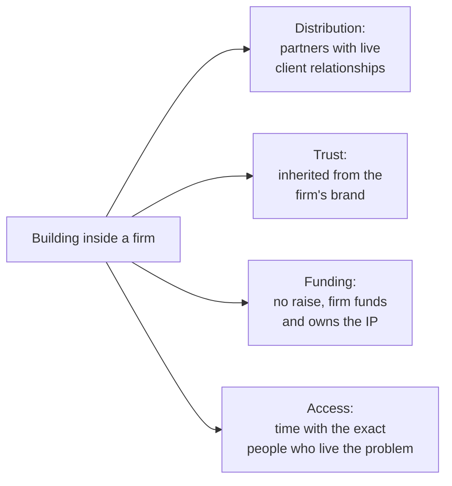
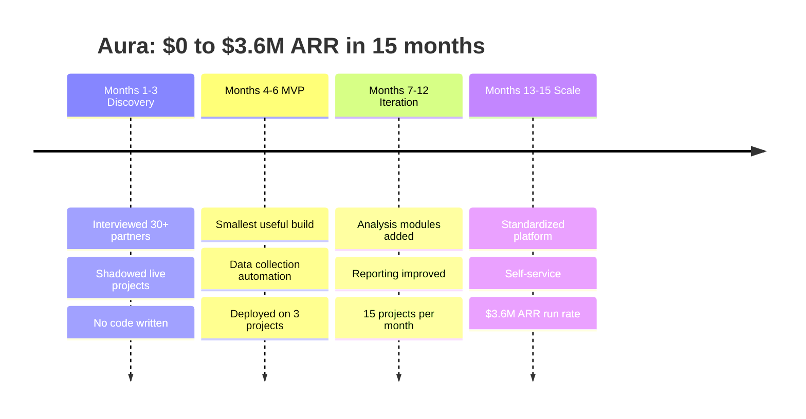
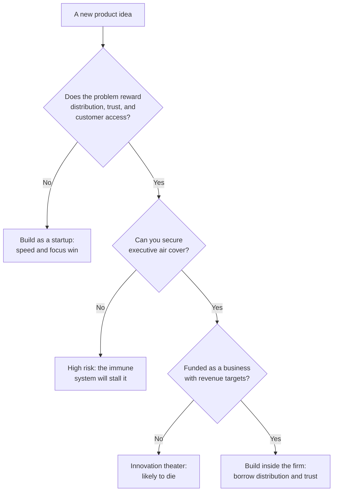

When people hear I built a product from \$0 to \$3.6M [ARR](https://en.wikipedia.org/wiki/Annual_recurring_revenue) inside Bain & Company, they ask one of two questions.

Founders ask how I moved fast inside a big consulting firm, and whether the bureaucracy killed me. People inside large firms ask how I got leadership to fund something so uncertain, since firms are supposed to hate uncertainty.

Both questions come from the same wrong frame: that building inside a firm is building a startup with worse conditions. It is a different game. The rules that decide whether you win are not the startup rules, and if you play by the startup rulebook inside a firm you lose on both counts. This post is the rulebook I wish I had going in, derived from first principles and from the 15 months it took to get Aura to a real revenue run rate.

## What Aura was, and what a firm is for

Aura is a workforce-analytics platform. It is used most heavily in private-equity and growth-equity due diligence: when an investor is deciding whether to buy a company, one thing they want to understand is that company's workforce. How many engineers, in which skills, where, at what cost, and how exposed the roles are to automation. Aura answers those questions with data instead of guesswork.

It was incubated in Bain's Founders Studio, the venture-building arm of the firm. The framing there is worth understanding because it explains why a consulting firm builds products at all. Consulting revenue is linear: one more hour of a consultant's time is one more unit of revenue, and you run out of hours. Product revenue can be non-linear: you build the thing once and sell it many times. A firm sitting on decades of repeated client work is sitting on a set of workflows that, if productized, break that linear ceiling.

The other thing a firm has, which a startup does not have on day one, is direct standing access to decision-makers at large companies. A firm spends a large share of its billable hours understanding senior-level problems at real companies. That is continuous, well-funded market research, paid for by clients. The hard part is not the insight. It is converting the insight into a product, and most firms never make that conversion. When it works, you get a standalone business. Aura is one that worked: it went from \$0 to \$3.6M ARR in 15 months and later spun out of Bain as its own company.

I was its venture CTO. That meant the whole technical surface: the architecture, the team I hired, and the data infrastructure, which I built myself because it was the load-bearing part and I wanted my hands on it. When Aura spun out I also handled the separation itself, the contracts and the legal and the work of standing a company up on its own.

## The product is an argument about where expensive people spend their time

Before the advantages and the politics, the product itself. If you strip a due diligence project down to first principles, it is a data pipeline with a deadline. You pull data from many sources, clean and reconcile it, run a fixed set of analyses, and render a result under time pressure measured in weeks. Bain runs hundreds of these a year for PE clients.

The old way was artisanal. Consultants gathered data from dozens of sources by hand, built one-off spreadsheets, and reformatted slides at night. Every project reinvented the wheel, and the wheel was the boring part. The judgment that actually earns the fee lives at the very end, in the interpretation, not in copying numbers between spreadsheets in the middle.

So the product was an argument: stop paying expensive people to do the mechanical middle, and give them the saved hours back for the thinking. Automate the data collection, standardize the analyses, make the repeatable parts instant. That framing is also why I owned the data layer directly. A due diligence number that is confidently wrong is worse than no number at all, because someone makes an investment decision on it. If the data underneath was wrong or slow, no polish on top would save the product. So I built the part everything else stood on rather than delegating it early.

### What the load-bearing layer actually meant

I started the architecture deliberately simple so we could ship: Postgres, Django, and Celery on AWS, with dimensional modeling on top. That was the right call to get moving and the wrong call to keep. As the data and the analytical load grew, Postgres stopped being the right fit for a warehouse workload, so I moved the analytics to Snowflake with [Cube.js](https://cube.dev/) as the semantic layer and landed the large datasets in S3.

The scale is what made it interesting. Over a billion rows of profile data, hundreds of millions of job postings, S&P 500 financials, plus a set of API vendors feeding an enrichment waterfall. I built it as a medallion architecture, raw to refined to serving, so any number in the product could be traced back to its source. In due diligence, traceability is not a nice-to-have. When a partner presents a workforce number to an investor, they have to be able to say where it came from.

The harder problem was comparability. We had more than 20 million raw skill strings and a sprawl of job titles, and you cannot compare two companies' workforces until those strings mean the same thing. "Sr. SWE II", "Software Engineer", and "développeur" have to collapse to one concept before a comparison is honest. We adopted the [Lightcast](https://lightcast.io/open-skills) skills and job-title taxonomies and the US [Bureau of Labor Statistics](https://www.bls.gov/oes/) occupational data as a common spine, then used LLMs, which we had been working with since GPT first launched, to clean and map the long tail. On top of the BLS job-function data I built a way to estimate the AI exposure of a role, meaning how much of its actual work a model can do, which fed back and improved the taxonomy in turn.

That is straightforward to describe and hard to do inside a firm, for reasons that are not obvious from the outside. The rest of this post is those reasons.

## The three things a firm gives you

A startup and a firm are optimizing under different constraints. A startup is short on distribution, trust, and money, and long on speed and focus. A firm is the mirror image. Start with what the firm hands you for free.

### Distribution before product

In a startup you build the product, then go find customers. That order is backwards from the thing that actually kills companies, which is far more often lack of distribution than lack of product. At Bain the order was reversed. We had hundreds of partners with existing client relationships, and our go-to-market was walking down the hall. That let us spend almost all our energy on building the right thing instead of on reaching anyone.

### Trust you did not earn

When an unknown startup approaches a PE firm with a new due diligence tool, it hits a wall. Diligence is sensitive, the data is confidential, and the honest question is why anyone should trust an unknown vendor with it. When Bain approaches the same firm with the same tool, the conversation starts from a different place. The trust is inherited. That inheritance showed up in who adopted Aura: some of the largest names in growth-equity and private-equity investing, funds running tens of billions, used it in their diligence. A brand-new vendor does not get into those rooms in a year.

### Funding without fundraising

We never did a Series A. We never pitched a VC. The firm funded the development and owned the IP in return. The cost of fundraising that founders underplay is not the months it eats, it is the mental overhead: once you raise, part of your head is always on the next round, the runway, the valuation, and that energy is not going into the product. Building inside Bain let me point all of it at one thing. Revenue targets existed, but they were collaborative goals, not existential threats.

### Access to the people who live the problem

The hardest part of B2B is time with the decision-maker. They are busy, they do not take cold calls, and they do not want to be your MVP's guinea pig. I had standing access to the partners who ran PE diligence, people who live the problem daily and understand nuances a startup would take years to find. Booking an hour of their time was booking a meeting. Better, I could sit in on live diligence projects and watch where the pain actually was, which is rarely where people say it is when you ask them in the abstract.

## What the firm charges you for it

None of that is free. The firm charges for distribution and trust with friction, and the friction is real.

### The organizational immune system

Large organizations evolve mechanisms for rejecting new things, the same way a body rejects what it does not recognize. This is self-preservation, not malice. Most new initiatives fail, and a firm that survived decades did so partly by being skeptical of shiny objects. The problem is that the immune system that rejects bad ideas also attacks good ones, because on day one they look identical from the outside. You spend a real share of your time earning the right to exist: every meeting starts with why this matters, every resource request needs a justification. In a startup, alignment is the default because there is nothing else. In a firm, alignment is a thing you rebuild every quarter.

### Incentives that point the other way

A firm makes money selling partner and consultant time. A product that automates that work competes with the core business, which creates genuinely conflicted incentives, not villains. A partner could believe in Aura and still have a billable target, and staffing a project with consultants books revenue today while using Aura is an investment against tomorrow. The short-term math often favored the consultants. We had to structure the economics so that using Aura was clearly better for the individual partner, not only for the firm in aggregate. That took real iteration to get right.

### Speed limits, some of them fair

Startups move fast partly because failure is cheap when no one knows who you are. You ship broken code, pivot weekly, and apologize later. Aura shipped with the Bain brand attached, so a bad failure in front of a client reflected on the firm. That produced a conservatism that was sometimes appropriate and sometimes suffocating. The useful move was to separate two kinds of risk explicitly: risks that could embarrass the firm, which you avoid, and risks that are normal product development, which you have to accept or you never ship anything. The line was not always obvious, and defaulting to caution was always the safer career move for everyone involved, which is exactly why you have to push against it on purpose.

### Talent built for a different job

Firms are optimized to hire, develop, and retain consultants. They are less set up to hire engineers, designers, and product managers. We needed a team with startup DNA sitting inside an organization with consulting DNA, competing for that talent against actual startups that could offer equity, flexibility, and a culture already tuned to what those candidates wanted. The people we did attract were exceptional. It was consistently harder than it needed to be.

## What actually made it work

Looking back, a few things were decisive, and they are the things I would insist on before doing this again.

**Executive air cover.** We had senior partners who believed in the vision and absorbed the organizational gravity for us. When committees wanted to layer on oversight, they pushed back. When budgets were scrutinized, they advocated. Without that cover we would have spent all our energy on internal survival instead of the product. This is the single input I would not start without.

**Revenue from day one, not innovation theater.** Most corporate ventures die because they are funded as R&D experiments, for "innovation" rather than revenue, which sounds enlightened and means no one is on the hook when it fails. Aura was a business from the start. We had revenue targets, we measured ARR, we tracked unit economics. That gave us internal credibility and forced us to build something people would actually pay for.

**Borrowed conviction.** Before we had traction, we needed believers: the consultants who used rough early versions and gave feedback, the partners who made introductions, the skeptics whose hard questions improved the product. Their credibility inside the firm opened doors that were closed to us as an unproven team. You run on borrowed conviction until you have generated enough of your own.

**Coordination as much as code.** The job was as much coordination as engineering. I was managing internal Bain stakeholders, external software consultancies, and consultants who rotated through Bain's global program, all at once, and later the spin-out itself. In a firm, a large fraction of the work is aligning people who do not report to you.

## The 15-month timeline

People are surprised by the pace, so here is the actual shape of it. The through-line is that we grew against pull, adding scope and headcount only after the last step created demand for it, never ahead.

**Months 1-3, discovery.** Interviewed 30+ partners and managers. Shadowed real due diligence projects. Mapped the workflow in detail. No code written, on purpose.

**Months 4-6, MVP.** Built the smallest thing that could be useful, focused on data-collection automation, the most painful and least glamorous part of the work. Deployed it on 3 real projects.

**Months 7-12, iteration.** Expanded from real usage, not a roadmap. Added analysis modules, improved the reporting layer, grew to 15 projects a month.

**Months 13-15, scale.** Standardized the platform, added self-service, expanded across PE clients, and hit the \$3.6M ARR run rate.

There was never a launch. We grew one project at a time, each success creating demand for the next, and the team grew the same way, hired against real usage rather than in anticipation of it.

Aura later spun out of Bain as its own company and has kept going. It is now an [official Claude connector](https://claude.com/connectors/aura), usable natively inside Claude through Anthropic's MCP, a distribution channel that did not exist when we started. The clearest signal that an internal tool became a real business is that it now lives well outside the building it was born in.

## How I would decide next time

The honest answer to "startup or firm" is that it depends on the problem, and there is a way to reason about it rather than guess. Aura suited the firm because due diligence software runs on distribution and trust, which is exactly what a firm hands you. A problem that needs rapid weekly pivots would suit a startup, where speed and focus are the whole edge. Here is the decision the way I would run it now.

## Key takeaways

- A firm's real asset is access. Hundreds of partners with live client relationships made our go-to-market walking down the hall, and the trust was inherited rather than earned from scratch.
- The immune system that rejects bad ideas attacks good ones, because early on they look the same. Budget the energy you will spend just earning the right to exist, and secure executive air cover before you start.
- Fund the venture as a business with revenue targets from day one. Corporate ventures funded as innovation theater die because no one is on the hook for them.
- Own the load-bearing layer yourself. I built Aura's data infrastructure directly because a due diligence number that is confidently wrong is worse than no number, and everything else stood on it.
- Grow against pull, not ahead of it. We went \$0 to \$3.6M ARR in 15 months by adding one project, and the headcount for it, only after the last one created demand.
- Match the setting to the problem. Distribution-and-trust problems suit a firm; rapid-pivot problems suit a startup. Aura spinning out of Bain showed the first kind can still become a standalone business.

I am now building Luminik as an independent startup. The problems are different, but the Bain lessons still apply. If you are weighing where to build something, reach out. Happy to compare notes.
